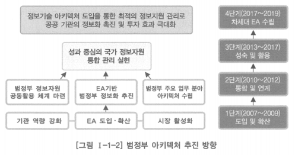
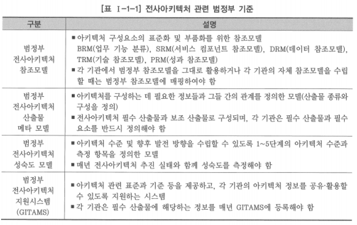
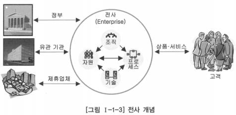
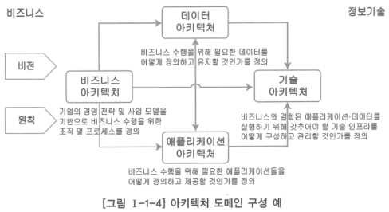
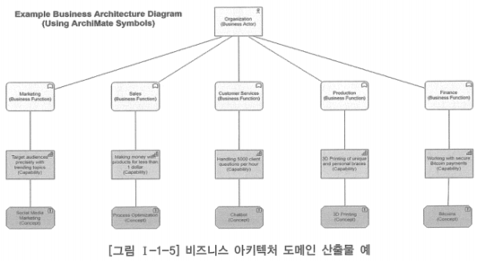
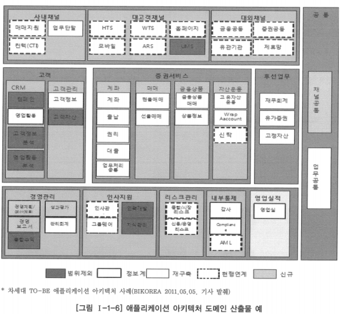
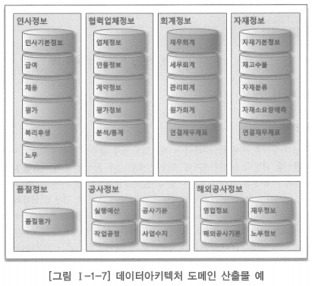
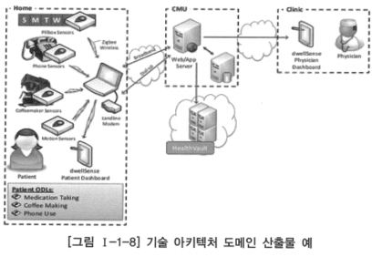

# 2. 전사아키텍처 개요

# 가. 전사아키텍처 도입 배경 및 추진 현황

## 전사아키텍처 도입 배경

- 정보시스템의 상호운용성 및 통합성 결여
- 조직의 경영계획과 목표를 효과적으로 달성하기 위한 정보시스템의 비전과 구축 전략 수립의 필요성 증대
- 비즈니스 환경 변화에 대한 IT 대응 체계 미흡
- 기업 활동의 정보기술에 대한 의존도 심화
- 정보시스템을 쉽게 파악할 수 있는 체계적 아키텍처 구축 미흡

## 전사아키텍처(EA)와 정보기술 아키텍처(ITA)

- 1996년 미국 정보기술관리혁신법에서 ITA(Information Technology Architecture)라는 용어 사용
- 2000년 OMB A-130 회람에서 아키텍처 관련 개념을 전사아키텍처(Enterprise Architecture)라 명명하였고, 이때부터 미국 연방 정부는 전사아키텍처라는 용어를 일반적으로 사용
- 전사아키텍처는 광의의 아키텍처 개념, 정보기술 아키텍처는 정보기술 중심의 아키텍처 개념
- 국내의 경우 정보기술 아키텍처라는 용어를 먼저 사용하였으나 이후 전사아키텍처로 통합해 사용함
- 전자정부법에서는 정보기술 아키텍처를 EA에 대응하는 용어로 정의하여 표기하고 있으며, 정부기관의 보도자료에서도 정보기술 아키텍처를 EA에 대한 명칭으로 사용

## 전사아키텍처 도입 추진 현황

- 정보기술 아키텍처 도입에 대한 법적 근거: 전자정부법 제45 ~ 47조 정보기술 아키텍처의 도입 및 활용

- 전사아키텍처 관련 범정부 기준

# 나. 전사아키텍처 정의

- 전사아키텍처는 다양한 정보기술의 혁신 활동과 관리 통제를 포함하며, 시스템의 도입과 구축뿐만 아니라 운영과 평가까지 통합적으로 관리하는 것을 의미함
- 기업이나 조직은 전사아키텍처를 통해 IT 자산을 평가하고 전사 관점에서 재설계하고 좀 더 합리적인 구조로 재배치하며, IT의 효율성과 투자 효과를 측정하는 기준으로 활용할 수 있음

### 미국 예산관리국(OMB, Office of Management and Budget)의 전사아키텍처 정의

- 전사아키텍처는 조직 및 업무 활동과 정보기술 간의 관계를 현재 모습과 향후 추구할 모습을 별도로 정의한 청사진
- 정보와의 목표인 IT와 업무 간의 연계, 현재 모습과 미래 모습을 포함하고 있음
- 전사아키텍처 구성
    - 업무 프로세스(Business Processes)
    - 정보 흐름 및 관계(Information Flow and Relationships)
    - 애플리케이션(Applications)
    - 데이터 명세 및 관계(Data Descriptions and Relationships)
    - 기술 하부 구조(Technology Infrastructure)
- 실무적 차원에서 구성요소
    - 비즈니스 아키텍처(위의 업무 프로세스와 정보 흐름 및 관계가 여기에 해당)
    - 애플리케이션 아키텍처
    - 데이터 아키텍처(위의 데이터 명세 및 관계가 여기에 해당)
    - 기술 아키텍처

### 미국 전자정부법의 전사아키텍처 정의

- 전사아키텍처는 조직의 임무가 정의한 전략적 정보 자산, 그 임무 수행에 필요한 정보, 그 임무 수행에 필요한 기술, 변화하는 요구에 대응하기 위해 신기술의 구현을 위한 전환 과정으로 구성됨
- 전사아키텍처 각 구성요소는 현행 아키텍처, 목표 아키텍처, 전환을 위한 계획을 포함

### 대한민국 EA/ITA 법의 EA 정의

- 일정한 기준과 절차에 따라 업무, 응용, 데이터, 기술, 보안 등 조직 전체의 구성요소들을 통합적으로 분석한 뒤 이들 간의 관계를 구조적으로 정리한 체계 및 이를 바탕으로 정보화 등을 통하여 구성요소들을 최적화하기 위한 방법 - 전자정부법 제2조(정보기술 아키텍처에 대한 정의)

# 다. 전사 개념

- 전사아키텍처란 전사에 대한 아키텍처를 정의, 관리하여 전사의 비즈니스 목표를 위해 아키텍처 정보를 활용하여 IT 인프라를 최적으로 구성하는 것

- 전사(Enterprise): 공동의 목표를 추구하기 위해 고객과 상품 또는 서비스가 존재하고, 이를 지원하기 위한 조직, 자원, 기술을 보유하며, 필요한 업무 프로세스를 수행하는 조직의 집합체
- 전사의 유형
    - 하나의 기업이나 기관과 정확히 일치하지 않을 수 있음
    - 기업의 규모가 큰 경우 하나의 기업이 여러 개의 전사로 구성될 수 있고, 각각의 전사는 독립적인 운영 주체로 구성됨
    - 전사는 구분 가능한 다수의 사업 영역으로 구성됨
- 전사아키텍처 수립을 위해서는 전사의 범위를 초기에 명확히 정의해야 하며, 이를 이해 당사자들이 충분히 공감할 수 있어야 함
- 전사아키텍처를 수립하는 모든 활동은 정의된 전사의 성과와 목표에 초점을 두고 아키텍처를 도출해야 함

# 라. 아키텍처 도메인 구성

- 도메인: 아키텍처 정보의 영역을 구분한 것
- 아키텍처 도메인의 구성은 기업이나 조직이 전사아키텍처의 정보를 체계적으로 분류한 아키텍처 매트릭스를 어떻게 정의하느냐에 따라 다름

## 1. 비즈니스 아키텍처

- 기업이나 조직의 경영 목표를 달성하기 위한 업무 구조를 정의한 아키텍처 영역
- 기업의 업무와 서비스의 실체를 명확히 하는 것
- 타 아키텍처(데이터, 애플리케이션, 기술)의 방향을 정의하고 검증하는 시발점
- 급변하는 비즈니스 환경에 대한 적응성을 높이기 위해서는 정보기술이 철저하게 비즈니스 전략과 연계되어야 함

## 2. 애플리케이션 아키텍처

- 기업의 업무를 지원하는 전체 애플리케이션을 식별하고 연관성을 정의
- 업무와 IT 특성을 고려하여 그룹화하고 범주화함으로써 전체 애플리케이션 구조를 체계화하는 것
- 애플리케이션 서비스는 애플리케이션이 지원하는 업무와 데이터의 특성을 고려하여 정의되며, 서비스 간의 상호 연관관계를 분석, 정의
- 향후 애플리케이션에 대한 배치, 통합, 포트폴리오 관리를 위한 시각을 제공

## 3. 데이터 아키텍처

- 기업의 업무 수행에 필요한 데이터의 구조를 체계적으로 정의하는 것
- 전사의 데이터 영역을 분류하는데, 업무 데이터와 메타 데이터를 구분하거나 업무 데이터를 운영계 데이터, 정보계 데이터 등으로 구분
- 이를 기준으로 전사 수준의 주제 영역 모델과 개념 데이터 모델을 정의하고, 다시 주제 영역별로 논리 데이터 모델과 물리 데이터 모델을 정의
- 데이터아키텍처 전문가가 다루는 데이터아키텍처의 범위는 데이터 구조뿐만 아니라 데이터 표준, 데이터 관리 체계 등을 포함하는 광의의 데이터아키텍처

## 4. 기술 아키텍처

- 비즈니스, 데이터, 애플리케이션 아키텍처에서 정의된 요건을 지원하는 전사의 기술 인프라 체계를 정의하는 것
- 기술 인프라는 하드웨어, 시스템 소프트웨어, 통신 네트워크, 시스템 개발도구, 시스템 관리도구, 최종 사용자 소프트웨어 등을 포함
- 기술 참조모델과 표준 프로파일 구축을 통해 애플리케이션의 이식성과 확장성을 강화하고, 벤더로부터의 독립성을 확보하여, 시스템 간의 상호운용성을 강화하는 등의 효과를 기대할 수 있음
- 기술 아키텍처의 경우 다른 아키텍처와 달리 개별 기업이나 조직 단위에서도 기술 참조모델을 정의하는 것이 일반적

