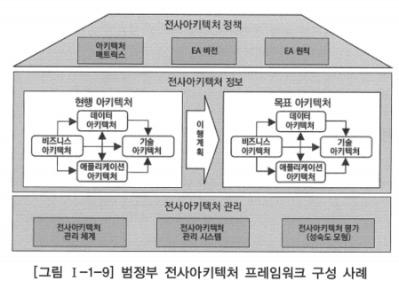
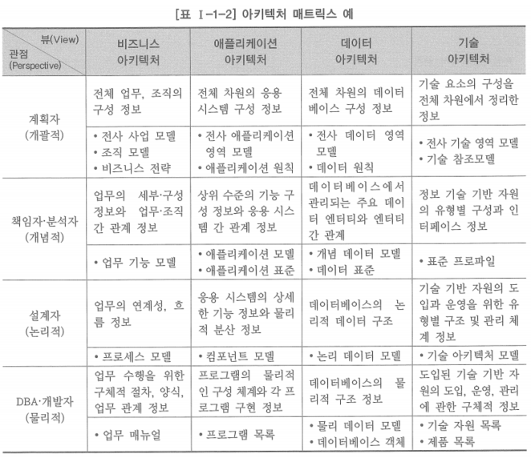
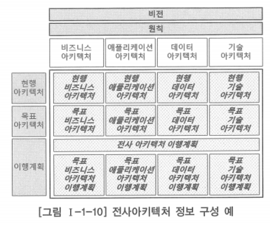

# 2. 전사아키텍처 프레임워크 구성

# 가. 전사아키텍처 정책

- 전사아키텍처를 구축하기 위해서는 먼저 기업이나 조직의 전사아키텍처 구축 목적과 방향을 정의해야 함

## 아키텍처 매트릭스

- 전사아키텍처의 정보를 체계적으로 분류한 틀로서, 기업이나 조직이 관리하려고 하는 전사아키텍처 정보의 수준과 활용 계층을 결정하는 수단

- 일반적으로 뷰(View)와 관점(Perspective)의 두 가지 차원으로 전사아키텍처 정보를 구분하고, 뷰와 관점이 교차하는 각 셀에는 전사아키텍처 정보의 실체가 되는 산출물을 정의하는 구조
- 뷰(View): 아키텍처 매트릭스에서 좌우로 바라보는 것
  - 아키텍처 도메인에 따라 비즈니스, 애플리케이션, 데이터, 기술 등으로 분류
- 관점(Perspective): 위에서 아래로 바라보는 것
  - 각 아키텍처 도메인에 관련된 이해관계자 계층(활용 계층) 구분에 따라 계획자, 책임자(또는 분석자), 설계자, 개발자 등으로 분류
  - 각 아키텍처 도메인을 구성하는 정보의 상세화 수준에 따라 개괄적, 개념적, 논리적, 물리적 단계로 분류
- 각 셀은 상하 좌우의 셀과 연관성을 가지며, 셀 간의 추적성이 확보되어야 함

## 전사아키텍처 비전

- 전사아키텍처 수립을 통하여 기업이나 조직이 궁극적으로 달성하고자 하는 모습
- 전사아키텍처 구축 목표와 그 목표를 효과적으로 달성하기 위한 전략 및 방향 등을 포함

## 전사아키텍처 원칙

- 전사아키텍처 정보를 효율적으로 구축하고, 기업이나 조직의 목적에 맞게 전사아키텍처 정보를 효과적으로 활용하기 위해서 조직 구성원이 공유해야 할 규범
- 전사아키텍처 대원칙, 아키텍처 원칙, 표준 등을 포함

# 나. 전사아키텍처 정보

- 전사아키텍처 구축을 위해서는 아키텍처 매트릭스에서 정의한 각 아키텍처 산출물에 대하여 현재 상태와 목표 상태의 정보를 구축해야 함
- 아키텍처 도메인(Architecture Domain)
  - 아키텍처 정보를 구축하기 위해서는 먼저 아키텍처 정보의 영역을 구분해야 하는데, 이런 아키텍처 영역을 구분한 것
  - 아키텍처 매트릭스 상에서 뷰의 관점으로 아키텍처 영역을 구분한 것
- 아키텍처 도메인별로 현재 상태의 정보를 정의한 현행 아키텍처와 목표 상태의 정보를 정의한 목표 아키텍처, 그리고 목표 아키텍처를 달성하기 위한 이행 계획을 작성하여 아키텍처 정보를 구축

- 현행 아키텍처: 아키텍처 도메인별로 정의된 산출물에 대하여 기업이나 조직의 현재 상태를 아키텍처 정보로 정의한 것
- 목표 아키텍처: 아키텍처 도메인별로 정의된 산출물에 대하여 기업이나 조직이 궁극적으로 달성하고자 하는 목표 아키텍처의 상태를 아키텍처 정보로 정의한 것
- 전사아키텍처 이행 계획: 아키텍처 도메인별로 현재 모습에서 바람직한 목표 모습으로 이행하기 위한 이행 전략과 이행 계획을 정의한 것

## 아키텍처 도메인

### 비즈니스 아키텍처

- 조직의 목적 및 임무를 지원하기 위해 수행하는 업무를 분석하고, 이를 업무 활동 단위로 분할하여 표현한 아키텍처

### 데이터아키텍처

- 효과적인 업무 처리 및 의사결정을 위해 어떤 정보가 사용되고 전달되어야 하는지를 표현한 아키텍처로서, 전사 데이터 구성을 분류하고 데이터 모델을 정의하는 것

### 애플리케이션 아키텍처

- 조직의 임무를 수행하는데 필요한 애플리케이션의 기능 및 이들 간의 관계 등을 정의한 것으로, 기업의 애플리케이션 단위를 분류하고 애플리케이션 간의 인터페이스를 정의한 아키텍처

### 기술 아키텍처

- 비즈니스 아키텍처, 데이터 아키텍처, 애플리케이션 아키텍처를 지원하는데 필요한 정보 기술 인프라 요소 및 구조, 이들 간의 관계를 표현한 아키텍처
- 전사의 기술 영역을 분류하고 표준 프로파일과 기술 아키텍처 모델을 정의한 것

# 다. 전사아키텍처 관리

## 전사아키텍처 관리 체계

- ‘전사아키텍처 거버넌스’라고 말하기도 함
- 구축된 전사아키텍처를 유지하고 개선하기 위한 제도적 기반을 수립하는 것
- 정의된 전사아키텍처 원칙을 준수하도록 확인하고 통제하기 위한 조직과 프로세스를 정의하는 것
- 전사아키텍처 활동을 관리하며, 전사아키텍처 정보 변경을 통제하고, IT 프로젝트가 전사아키텍처의 기본적인 원칙과 정책을 준수하도록 하기 위한 것

## 전사아키텍처 관리 시스템

- 전사아키텍처의 정보 관리 효율성을 제고하고 전사아키텍처 정보의 공유를 활성화하기 위해 구축하는 정보시스템
- 일반적으로 전사아키텍처 정보를 정의하는 모델링 도구와 전사아키텍처 정보를 저장하는 전사아키텍처 리포지터리(Repository), 전사아키텍처 정보를 사용자에게 배포하는 전사아키텍처 포털 등으로 구성

## 전사아키텍처 평가

- 전사아키텍처의 관리와 활용 수준의 제고를 위해서는 전사아키텍처에 대해 주기적으로 평가하고 개선점을 도출하여 반영해야 함
- 전사아키텍처의 수준을 객관적이고 정확하게 평가할 수 있는 전사아키텍처 성숙 모형이 필요함
