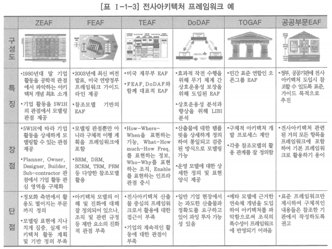

# 3. 전사아키텍처 프레임워크 사례

- 프페임워크를 정의할 때 이러한 선진 모델을 참조하되 기업의 특성에 맞는 것을 만들어야 하며, 경직된 사고보다는 유연성을 갖는 것이 중요함

# 자크만 프레임워크(ZEAF)

- 다섯 가지 관점 또는 상세화 수준과 각 관점에 이르는 아키텍처의 다양한 측면 혹은 아키텍처 뷰를 6하원칙에 근거하여 여섯가지 묘사 방법으로 정의
    - 다섯 가지 관점: Planner, Owner, Designer, Builder, Sub-contractor
    - 상세화 수준: Contextual, Conceptual, Logical, Physical, Out-Of-Context
    - 여섯 가지 묘사 방법: Data, Function, Network, People, Time, Motivation
- 1987년에 존자크만이 ‘IBM 시스템 저널’에 발표한 전사아키텍처 프레임워크
- 이후에 발표된 많은 전사아키텍처 프레임워크에 영향을 미침
- 다른 프레임워크와 기업, 기관들에서 참조되고 있는 전사아키텍처 프레임워크의 대표적인 예

# 미국 재무부 프레임워크(TEAF)

- 8개 구성요소로 이루어져 있고, 4단계에 걸쳐 점차적으로 진행하여 마지막 단계에 자크만 프레임워크의 모델 내용을 모두 관리
- 프레임워크에는 세그먼트별 접근법을 채택하여 현행과 목표의 갭 분석을 통한 이행 계획과 프로세스를 포함

# 오픈그룹 프레임워크(TOGAF)

- 오픈그룹 프레임워크는 아키텍처 개발 방법, 기술 참조모델, 표준정보기반으로 구성됨
    - 아키텍처 개발 방법(ADM, Architecture Development Method): 아키텍처를 정의하기 위하여 오픈그룹에서 개발한 아키텍처 개발에 대한 지침
    - 기술 참조모델: 정보기술을 체계적으로 분류
    - 표준정보기반(SIB, Standard Information Base): 표준 요약 정보를 모아놓은 데이터베이스
- 빌딩 블록 정의에 의한 접근 방식으로 구성 단위의 문제 해결 방식을 제안하고 있음