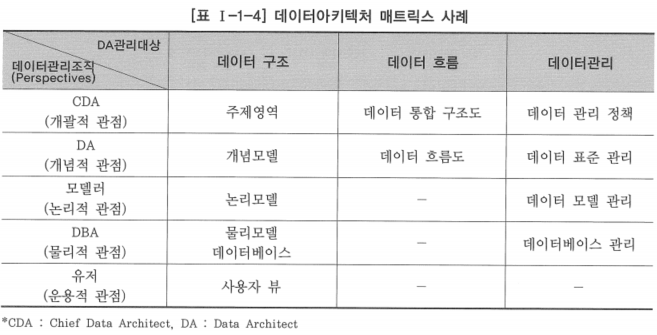

# 4. 데이터아키텍처 프레임워크 구성

- 데이터아키텍처 프레임워크는 데이터아키텍처를 구축하기 위한 기본 틀로 활용됨
- 국내에서는 자크만 프레임워크에 기반을 둔 데이터아키텍처 프레임워크가 많이 참조, 활용되고 있음
- 범정부 데이터아키텍처 프레임워크는 범정부 전사아키텍처 프레임워크에 기반을 두고 있음
- 전사아키텍처 프레임워크 구성과 얼라인먼트를 고려하여 데이터아키텍처 정책, 데이터아키텍처 정보, 데이터아키텍처 관리 등의 3가지 영역으로 구성
- 데이터아키텍처 프레임워크를 구성하는데 있어서 전사아키텍처 프레임워크와의 얼라인먼트를 고려하는 이유
    - 전사아키텍처를 구성하는 하나의 아키텍처 도메인으로서 다른 전사아키텍처 구성요소들과 유기적으로 연계될 수 있도록 하기 위함
    - 전사아키텍처 구축 여부와 상관없이 데이터아키텍처를 독립적으로 구축하는 경우라 하더라도 향후 전사아키텍처 구축 시 무리 없이 연계가 가능하도록 하기 위함

# 가. 데이터아키텍처 정책

- 데이터아키텍처를 구축하기 위해서는 먼저 기업이나 조직의 데이터아키텍처 구축 목적과 방향을 정의해야 함
- 데이터아키텍처의 목적과 방향은 기본적으로 전사아키텍처의 목적 및 방향과 얼라인먼트를 유지해야 함
- 전사아키텍처 없이 독립적으로 데이터아키텍처를 구축하는 경우라도 향후의 전사아키텍처 수립을 고려하여 전사아키텍처의 목적 및 방향을 고려하는 것이 바람직함

## 데이터아키텍처 매트릭스

- 데이터아키텍처의 정보를 체계적으로 분류한 틀
- 기업이나 조직이 관리하려는 데이터아키텍처 정보의 수준과 활용 계층을 결정하는 수단
- 일반적으로 자크만 프레임워크의 6가지 아키텍처 뷰 구분 중 Data 영역에 대해 상세화 수준 구분에 따라 분류한 계층적 결과물을 상세하게 정의하는 방식으로 구성

- 데이터아키텍처 매트릭스의 각 셀은 전후 좌우의 셀과 연관성을 가지며, 셀 간의 추적성이 확보되어야 함

## 데이터아키텍처 비전

- 데이터아키텍처 수립을 통하여 기업이나 조직이 궁극적으로 달성하고자 하는 모습
- 데이터아키텍처 구축 목표와 그 목표를 효과적으로 달성하기 위한 전략 및 방향 등을 포함

## 데이터아키텍처 원칙

- 데이터아키텍처 정보를 효율적으로 구축하고, 기업이나 조직의 목적에 맞게 데이터 아키텍처 정보를 효과적으로 활용하기 위해서 조직 구성원이 공유해야 할 규범
- 데이터아키텍처 대원칙, 데이터아키텍처 원칙, 표준 등을 포함

# 나. 데이터아키텍처 정보

- 데이터아키텍처 매트릭스에서 정의한 각 셀의 산출물에 대하여 현재 상태와 목표 상태의 정보를 구축하고 목표 아키텍처를 달성하기 위한 이행 계획을 수립
- 현행 데이터아키텍처와 목표 데이터아키텍처, 목표 데이터아키텍처를 달성하기 위한 이행 계획을 작성하여 데이터아키텍처 정보를 구축
- 현행 및 목표 데이터아키텍처에서 데이터아키텍처 매트릭스의 각 셀에 정의된 산출물 간에는 추적성이 유지되어야 함

## 현행 데이터아키텍처

- 데이터아키텍처 매트릭스의 각 셀별로 정의된 산출물에 대하여 기업이나 조직의 현재 상태를 아키텍처 정보로 정의한 것
    - 현행 주제영역 모델: 데이터 구조에 대한 상세화 계층 구성에 따라 최상위의 추상화 수준에서 데이터 분류를 정의
    - 현행 개념 모델(현행 개념 데이터 모델): 주제영역별로 핵심 데이터에 대한 구성을 정의
    - 현행 논리 모델(현행 논리 데이터 모델): 주제영역별로 현행 개념 모델을 상세화하여 데이터 구조에 대한 논리적인 모습을 구체적으로 정의
    - 현행 물리 모델(현행 물리 데이터 모델): 현행 논리모델이 데이터베이스 시스템에 구현될 수 있도록 테이블로 전환
- 현행 물리 모델은 현행 데이터베이스 시스템에 구축된 테이블 구성과 일치해야 함
- 현행 물리 모델로부터 현행 주제 영역 모델에 이르기까지 현행 데이터아키텍처를 구성하는 계층별 모델 간에는 상호 추적성이 유지되어야 함
- 개념 모델의 어떤 핵심 데이터가 논리 모델의 어떤 엔터티로 상세화되었는지, 그리고 논리 모델의 해당 엔터티는 물리 모델의 어떤 테이블로 전환되었는지 등 계층별 모델 구성요고 간의 매핑 정보가 관리되어야 함

## 목표 데이터아키텍처

- 데이터아키텍처 매트릭스의 각 셀별로 정의된 산출물에 대하여 기업이나 조직이 궁극적으로 달성하고자 하는 목표 데이터아키텍처의 상태를 아키텍처 정보로 정의한 것
    - 목표 주제영역 모델: 데이터 구조에 대한 상세화 계층 구성에 따라 최상위의 추상화 수준에서 데이터 분류를 정의
    - 목표 개념 모델(목표 개념 데이터 모델): 주제영역별로 핵심 데이터에 대한 구성을 정의
    - 목표 논리 모델(목표 논리 데이터 모델): 주제영역별로 목표 개념 모델을 상세화하여 데이터 구조에 대한 논리적인 모습을 구체적으로 정의
    - 목표 물리 모델(목표 물리 데이터 모델): 목표 논리 모델이 데이터베이스 시스템에 구현될 수 있도록 테이블로 전환
- 목표 데이터아키텍처는 미래의 모습이므로 목표 물리모델이 데이터베이스 시스템에 실제로 구현되지 않음
- 기업이나 조직의 여건에 따라 목표 데이터아키텍처의 상세화 수준은 목표 논리모델까지가 될 수도 있음
- 목표 주제영역 모델로부터 목표 물리모델에 이르기까지 목표 데이터아키텍처를 구성하는 계층별 모델 간에는 상호 추적성이 유지되어야 함

## 데이터아키텍처 이행 계획

- 현행 데이터아키텍처에 정의한 현재 모습으로부터 바람직한 목표 모습으로 이행하기 위한 이행 전략과 세부 이행 계획, 변화 관리 계획 등을 정의한 것

# 다. 데이터아키텍처 관리

## 데이터아키텍처 관리 체계

- ‘데이터아키텍처 거버넌스’라고 말하기도 하며, 좀 더 확장된 개념으로 ‘데이터 거버넌스’라고 하기도 함
- 구축된 데이터아키텍처를 유지하고 개선하기 위한 제도적 기반을 수립하는 것
- 정의된 데이터아키텍처 원칙을 준수하도록 확인하고 통제하기 위한 조직과 프로세스를 정의하는 것도 포함
- 데이터아키텍처 관리 체계의 목적
    - 데이터아키텍처 활동을 관리
    - 데이터아키텍처의 정보 변경을 통제
    - IT 프로젝트가 데이터아키텍처의 기본적인 원칙과 정책을 준수하도록 하기 위함

## 데이터아키텍처 관리 시스템

- 데이터아키텍처 관리 시스템의 목적
    - 데이터아키텍처의 정보 관리 효율성을 제고
    - 데이터아키텍처 정보의 공유를 활성화
    - 데이터아키텍처 원칙의 지속성을 담보하기 위함
- 데이터아키텍처 관리 시스템의 일반적인 구성
    - 데이터아키텍처 정보를 정의하는 데이터 모델링 도구와 연동
    - 데이터아키텍처 정보를 저장하는 데이터 아키텍처 리포지터리(Repository)
    - 데이터아키텍처 정보를 사용자에게 배포하는 데이터아키텍처 포털 등
- 도입하는 기업이나 조직의 요건에 따라 다양한 형태로 구성될 수 있음

## 데이터아키텍처 평가

- 데이터아키텍처의 관리와 활용 수준의 제고를 위해서는 데이터아키텍처에 대해 주기적으로 평가하고 개선점을 도출하여 반영해야 함
- 이를 위해서는 데이터아키텍처의 관리 및 활용 수준을 객관적이고 정확하게 평가할 수 있는 데이터아키텍처 성숙 모형이 필요함
- 일반적인 데이터아키텍처 성숙 모형
    - 매트릭스 형태로 정의하여 각 셀에 정의한 산출물을 검토하고 평가하는 매트릭스 방식
    - 체크리스트에 의한 평가 결과에 따라 성숙도를 평가하는 스코어카드 기법 등