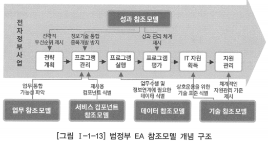

# 1. 참조모델 정의

# 가. 참조모델 개념

- 전사아키텍처에서 얘기하는 참조모델은 아키텍처 구성요소를 식별하여 표준화한 것
- 기관이나 기업의 전사아키텍처를 수립할 때 필요한 정보화 구성요소의 표준화한 분류체계와 형식에 대한 모범적 사례
- 양질의 전사아키텍처를 구축할 수 있도록 참조 가능한 기업이나 조직 내외부의 사례 및 표준 문서, 방법 등을 정의
- 다양한 관점을 충족시킬 수 있도록 시스템에 대한 개념적인 모델을 추상화하고, 구성요소를 재사용 가능한 방식으로 생성하여 여러 기업이나 조직이 사용할 수 있도록 한 것

## 참조모델 사용시 이점

- 전체 정보자원에 대한 구조적 관점 제공
- 조직의 정보자원에 대한 중복요소 파악
- 관련 기관 간 아키텍처 비교, 분석
- 정보 공동 활용을 위한 상호 운용성 확보
- 조직의 정보 자원 관리 표준화
- 조직 간 공통 서비스 발견

- 미국의 예산관리국은 2002년부터 정부 기관 간의 업무 프로세스를 단순화하고 통합하기 위해 연방정부의 아키텍처 정보화(FEA, Federal Enterprise Architecture) 개발을 시작함
- 미 연방정부 전체 최적화 관점에서 각 기관의 전사아키텍처 구축을 위한 ‘기준’을 제시하기 위해 아키텍처 영역별로 참조모델을 정의
- 성과 참조모델, 업무 참조모델, 데이터 참조모델, 서비스 요소 참조모델, 기술 참조모델 등을 정의

# 나. 범정부 EA 참조모델

- 국내에서 많이 참조하고 있는 것은 범정부 EA 참조모델로, 행정안전부에서 운영하는 범정부 EA 포털을 통해 확인할 수 있음
- 범정부 참조모델은 전사아키텍처의 일관성, 재사용성, 상호 운용성 등을 확보하기 위하여 전사아키텍처의 구성에 필요한 정보화 구성요소의 표준화한 분류체계와 형식을 정의한 것
- 공공 기관에서 공동으로 활용할 수 있는 전사아키텍처의 참조모델로 개발, 보급되고 있음
- 일반 기업의 전사아키텍처 프로젝트와 달리 범정부의 정보화 사업을 체계적으로 추진할 수 있는  참조모델과 지침을 만들어서 보급하는데 역점을 두고 있음

- 성과 참조모델: 정보화 성과 측정을 위한 항목과 지표 및 방법을 제시
- 업무 참조모델: 업무 아키텍처의 기준이 되며, 아키텍처 대상 기관의 사업 또는 업무 등을 전체적으로 분류하고 정의
- 서비스 참조모델: 응용 아키텍처의 기준이 되며, 응용 서비스의 기능을 분류하고 정의
- 데이터 참조모델: 데이터아키텍처의 기준이 되며, 기관 간에 교환되는 주요 데이터 요소를 분석하여 이를 정의하고 표준화
- 기술 참조모델: 기술 아키텍처의 기준이 되며, 정보기술을 분류 및 식별

# 다. 참조모델 구축 방법

1. 공통적인 특성을 추출하여 그 산업군에 맞게 범용적으로 만드는 것
    - 요소 간 경계가 불명확하고 하위 수준의 정의가 명확하지 않음
    - 이해하기 쉽고 산출물이 필요하지 않음
2. 복잡하고 대표적인 기업을 선정하여 그 기업의 아키텍처를 표본으로 삼아 비슷한 타 기업에서 재활용할 수 있도록 만드는 것
    - 각 산출물의 관계가 정확하고 하위 수준까지 참조할 수 있음
    - 기업의 보안상 대부분 공개가 되지 않음

- 범정부 EA 참조모델은 참조모델을 구축하고자 하는 기업이나 조직에 대해 의미 있는 본보기가 될 수 있음
    - 아키텍처별 참조모델의 구성 프레임을 그대로 인용
    - 기업이나 조직의 요건이나 비전, 전략 등을 고려하여 아키텍처별 참조모델의 구성 프레임을 수정, 보완해서 참조모델의 기본 프레임을 도출
- 참조모델의 기본 프레임이 도출되면, 각 구성요소에 대한 콘텐츠를 발굴하여 검토, 보완 후 참조모델을 완성하는 방식으로 범정부 EA 참조모델이 활용될 수 있음
- 참조모델의 기본 프레임이나 콘텐츠를 정의할 때, 동일 또는 유사 업종에서의 대표적인 기업의 아키텍처를 직접적으로 재활용하는 것은 보안상 매우 어려우므로 많은 경험과 전문 지식을 갖춘 외부 전문 인력을 활용하는 것도 좋은 방법

## 참조모델을 구축할 때 고려해야 할 사항

- 기업이나 조직의 아키텍처를 수립하는데 있어서 기준이나 표준 역할을 할 수 있고, 콘텐츠를 참조 또는 재활용할 수 있어야 함
- 참조모델은 기업이나 조직 내부에 축적된 아키텍처 지식과 콘텐츠, 내부 역량의 결집체여야 하지만, 필요하다면 외부에서 구입하여 커스터마이즈하거나 외부의 전문가가 참여할 수도 있음
- 참조모델은 관련 지식의 전달을 위한 수단으로 활용될 수 있어야 함
    
    → 참조모델을 통해 관련 이해관계자 및 IT 관련 구성원들이 필요한 지식을 확보하거나 방향을 이해할 수 있어야 함
    
- 이해관계자 간의 의사소통을 향상시킬 수 있어야 함
    
    → 참조모델의 구성과 내용을 이해관계자들이 정확히 이해할 수 있어야 하고, 이를 참조하는 아키텍처의 모습과 방향이 이해될 수 있어야 함
    
- 아키텍처를 수립하고 운영하기 위한 역할 및 책임이 제시되어야 함
    
    → 참조모델을 통해 아키텍처를 수립하고 운영하는데 어떤 역할이 필요하고, 그들이 어떤 책임을 수행해야 하는지가 명확하게 이해될 수 있어야 함
    
    → 역할과 책임에는 참조모델을 유지, 관리하기 위한 부분이 포함됨
    
- 유사한 다른 솔루션이나 타 기업 또는 조직의 아키텍처와 비교하여 이해할 수 있는 기준이 되어야 함
- 아키텍처 수립 결과에 대해 평가할 수 있는 기준을 제시해야 함
- 기업이나 조직이 처해 있는 환경과 각자의 요건에 맞아야 하며, 환경 및 요건 변화에 적절히 대응하여 아키텍처의 변화를 제어할 수 있도록 유지, 관리되어야 함