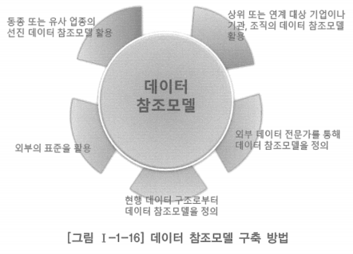

# 2. 데이터 참조모델

- 데이터아키텍처 구축 시 참조 및 재사용할 수 있도록 업무 수행에 필요한 데이터를 유형별로 분류하여 표준화하고 업무와 서비스 컴포넌트를 지원하는 데이터의 분류와 의미, 주요 데이터 요소, 관리체계 등을 정의한 것
- 업무와 서비스 컴포넌트를 지원하는 표준화한 데이터 구조 및 규칙, 데이터 모델을 위한 템플릿과 사례 등을 제공

# 데이터 참조모델에 대한 정의

- 전체 조직 차원의 표준화된 데이터 모델로서 기능 및 데이터 요구 사항을 정의하기 위한 개념 데이터 모델, 논리 데이터 모델
- 정보 요구 사항을 정의하고 구조화하는 기반으로서 데이터 참조모델을 이용하여, 정보체계 내에서 데이터 구조의 표준화 및 재사용을 보장
- 데이터 참조모델은 조직의 비즈니스를 해석하고 표현하기 위한 구조와 규칙을 종합적이고 표준화한 방법으로 표현한 것
- 이해 당사자간의 모델 이해도를 증진시키고 일정 수준 이상의 품질이 보장되는 데이터 구조 및 내용을 공유하여 재사용성과 생산성, 상호 운용성을 높여줌

# 데이터 구조 설계 관점에서 데이터 참조모델(DRM, Data Reference Model)

- 업무 영역별, 주제 영역별로 표준 데이터 집합과 관리 항목들을 분류하고 표준화하여 재사용이 가능한 데이터 모델
- 전사적 업무 혹은 범용적 데이터 모델 정의 시 기존에 검증된 데이터 모델을 참조함으로써 데이터 모델의 정확성과 재사용성을 높이고 새로운 데이터 모델 정의에 따른 시간과 비용 절감
- 새로운 데이터 모델 작성 시 참조모델을 활용함으로써 정보의 누락을 예방할 수 있으며, 기존에 검증된 데이터 참조모델을 이용하여 자사 데이터 모델의 오류를 확인하거나 보완할 수 있음
- 중앙 기관이나 상위 조직에서는 양질의 데이터 참조모델을 채택, 활용함으로써 단기간에 하부 기관이나 하위 조직 데이터 모델의 품질을 개선할 수 있음
- 기업을 대상으로 한 데이터 참조모델과 공공 기관을 대상으로 한 데이터 참조모델은 관리 및 활용 측면에서 서로 상이할 수 있음
    - 공공 기관의 경우 상위 기관이 하위 기관에게 데이터 참조모델의 공유화 활용을 제도화할 수 있음
    - 데이터 참조모델을 활용한 공공 기관 데이터 모델의 품질 표준화 및 데이터 품질 개선을 신속하게 추진할 수 있음
    - 국내에서 많이 참조되는 데이터 참조모델: 범정부 데이터 참조모델

# 기업이나 조직이 데이터 참조모델을 구축하는 방법

## 동종 또는 유사 업종의 선진 데이터 참조모델을 활용

- 단시간에 데이터 참조모델의 모범 사례를 적용할 수 있는 장점
- 데이터 참조모델이 거의 모든 기업이나 조직에서 기밀로 다루어지고 있기 때문에 확보하기 어려움
- 합당한 대가를 지불하고 구입할 수도 있겠으나 기업이나 조직이 갖고 있는 저마다의 문화와 요건들이 다를 수 있기 때문에 데이터 전문 인력을 통해 커스터마이즈 과정을 거쳐야 할 수 있음

## 상위 또는 연계 대상 기업이나 기관, 조직의 데이터 참조모델을 활용

- 전체 조직 내에서 데이터의 통합성이나 연계성을 확보하기 위해 상위 조직의 데이터아키텍처를 하위 조직에 적용하도록 할 수 있음
- 상위 조직은 데이터 참조모델을 정의할 때 하위 조직이 준수해야 할 부분을 명확히 정의하고, 하위 조직은 상위 조직이 정의한 참조 대상에 대해 적극적으로 준수하는 것이 바람직함
- 기업이나 기관, 조직 간에 데이터 연계나 상호운용이 필요한 경우 대상 조직 간에 데이터 참조모델을 공유하거나 공동으로 구축하여 활용하는 것도 좋은 방법

## 외부의 표준을 활용

- 데이터 연계나 상호운용이 필요한 기업이가 기관, 조직 간에 공동으로 활용할 수 있는 외부의 표준을 활용하는 것도 좋은 방법
    - IBM이나 오라클과 같은 데이터베이스 관련 글로벌 기업들이 보유하고 있는 표준화한 데이터 참조모델
    - 데이터 전문 기업이 구축하여 제공하고 있는 데이터 참조모델
    - 미국 연방정부의 전사아키텍처 모델(FEAM)에 포함된 데이터 참조모델
    - omg.org에서 제공하는 DRM 표준안이나 오픈 데이터의 상호운용성을 위한 데이터 카탈로그 표준으로  W3C 주도 하에 2014년에 표준으로 채택되어 많이 참조되고 있는 DCAT(Data Catalog Vocabulary)

## 현행 데이터 구조로부터 데이터 참조모델을 정의

- 기업이나 조직이 이미 보유하고 있는 현행 데이터 구조는 향후 신규 혹은 차세대 정보시스템을 구축할 때 기초가 되기 때문에 참조하거나 재사용이 가능한 데이터 참조모델을 구축하기 위한 훌륭한 자원이 됨
- 이미 현행화된 현행 데이터 모델을 보유하고 있거나 리버스 데이터 모델링을 통해 현행 데이터 모델을 확보했다면
    - 데이터 전문 인력과 관련 이해관계자나 참여하여 참조 또는 재사용을 위해 표준화할 데이터 요소를 선정
    - 전사적 일관성 유지를 위해 필요한 추가 데이터 요소 등을 정의
    - 데이터 요건을 반영하여 이를 보완 및 표준화하고 데이터 참조모델로 정의

## 외부 데이터 전문가를 통해 데이터 참조모델을 정의

- 앞서 제시한 방법들을 통해 데이터 참조모델을 정의할 때 기업이나 조직 내부에 충분한 역량이 축적되어 있지 못하거나, 내부에 데이터 전문 인력을 확보하고 있지 못하다면 외부의 데이터 전문 기업이나 데이터 전문가를 투입하여 데이터 참조모델을 정의하는 것도 좋은 방법

# 데이터 참조모델 유지 관리 기준

- 범용성: 데이터 참조모델은 특정 업무의 특정 데이터에 대한 정보로 범용적으로 다양한 업무 영역에서 참조할 수 있을 만한 것을 정의하여 관리
- 단순성: 비즈니스의 복잡성을 나타낸 데이터 모델은 특정 업무에 국한될 가능성이 높으므로 데이터 참조모델로의 효용은 떨어짐
- 표준성: 데이터 참조모델에서 표현되는 데이터 용어는 상식적이고 일반적인 수준에서 이해될 수 있는 것을 사용하여 데이터 모델의 참조 활용성을 높이도록 함
- 정확성: 참조의 성격을 가지므로 무엇보다 관리되는 정보가 정확해야 함
- 정보 이용성: 데이터 참조모델은 단순히 엔터티 간의 관계뿐만 아니라 엔터티의 정의, 엔터티의 데이터 관리 규칙, 속성 정의 등도 함께 저장하여 참조될 수 있도록 해야 함
- 분류성: 데이터 참조모델은 업무 영역과 업종은 물론이고 데이터 구조를 정의하는 각 단계와 데이터 참조모델의 범위 내에서도 분류될 수 있어야 함

# 데이터 참조모델 사용 기대 효과

- 데이터 표준화 및 데이터를 재사용 가능한 공유 환경 구축
- 데이터 구조의 표준화를 통한 이식성과 확장성의 향상
- 조직 및 여러 시스템 간 데이터 상호 운용성 향상
- 데이터 품질 향상 및 생산성 증대
- 중복 투자 방지 및 수명 주기 비용 절감