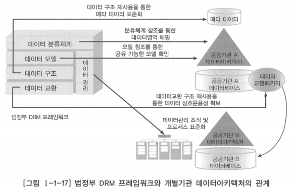
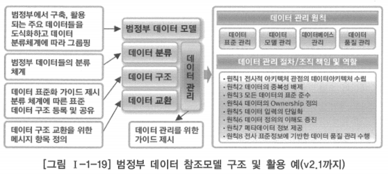
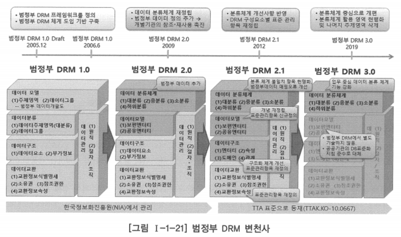
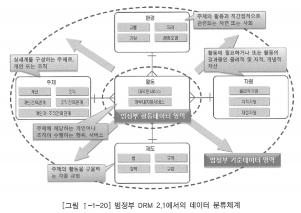

# 3. 데이터아키텍처 참조모델 사례

# 가. 범정부 데이터 참조모델 개요

- 기업은 각자의 요건에 맞게 데이터아키텍처 구축에 다양한 데이터 참조모델을 활용할 수 있겠지만, 공공기관을 중심으로 많은 활용 사례와 함께 지속적 관리, 개선이 이루어지고 있는 범정부 DRM은 공공기관을 비롯하여 많은 기업들에게 모범 사례가 되고 있음

- 범정부 데이터 참조모델은 기관 간의 공통 정보 파악과 활용을 지원하기 위한 모델
- 기관 간의 정보 공유 및 데이터의 표준화, 재사용을 지원하기 위한 범정부 데이터 분류 및 데이터 표준화와 관리를 위한 기준과 체계를 정의한 것

## 범정부 DRM의 목표와 특징

### 표준화

- 데이터 표준화를 위한 가이드 제시
- 표준화한 참조 가능한 데이터 모델 제공

### 참조

- 데이터아키텍처 구축에 필요한 표준 데이터 모델 사례들의 식별 및 참조 지원

### 재사용

- 식별 및 참조된 표준 데이터 모델 및 데이터의 재사용과 공유 촉진, 지원

## 범정부 데이터 참조모델 프레임워크

- 데이터의 표준화, 참조, 재사용을 위하여 필요한 구성요소와 구성요소 간의 관계를 정의한 것

### 범정부 데이터 참조모델 프레임워크 구성요소

- 데이터 분류 체계
    - 범정부 차원의 데이터 주제영역을 정의한 것으로 범정부 데이터에 대한 분류 기준을 보여줌
    - 분류 체계는 데이터 영역을 계층화하여 도식화 한 것
    - 범정부 데이터 및 데이터 모델은 데이터 분류체계에 따라 그루핑됨
    - 데이터 구조의 데이터 요소는 데이터 분류 체계에 매핑됨
    - 개별 기관은 데이터 분류 체계를 참조함으로써 주제영역 모델 또는 데이터 개괄 모델을 쉽게 도출해낼 수 있고 연관시킬 수 있음
    - 데이터 분류체계를 활용함으로써 좀 더 용이한 데이터 관리 및 검색 가능

- 범정부 데이터 모델
    - 범정부 차원에서 구축 및 활용하고 있음
    - 공유가 가능하거나 공유를 필요로 하는 데이터를 식별하고 논리적 수준에서 구조화하여 데이터 영역 간의 관계를 표현한 것
    - 데이터 분류 체계와 연결된 개별 범정부 데이터 단위로 데이터 모델을 엔터티 관계도(ERD, Entity Relationship Diagram)로 도식화하여 제시
    - 개별 기관은 범정부 데이터 모델을 참조함으로써 범정부에서 구축 및 운영되고  있는 데이터에 어떤 것이 있는지를 확인하고 재사용할 수 있음
    - 범정부 차원에서는 기관 간에 공유될 수 있는 데이터를 확인하고 기관 간의 시스템 중복성과 연계성을 파악할 수 있음
    
- 데이터 구조
    - 논리모델 수준에서 정의된 데이터 모델의 구성요소별로 표준화하고 구조화한 세부 정보를 정의한 것
    - 범정부 차원에서 데이터 아키텍처와 관련된 메타 모델을 보여줌
    - 엔터티 관계도(ERD)의 구성요소인 엔터티(Entity), 관계(Relationship), 속성(Attribute) 등의 표준화 방안 및 실제 참조, 재사용 가능한 데이터 제시
    - 개별기관은 제시된 범정부 데이터 구조를 재사용하여 표준화한 데이터아키텍처를 구축할 수 있음
    - 범정부 차원에서는 개별기관이 작성한 데이터 아키텍처 산출물을 쉽게 이해할 수 있음
    
- 데이터 교환
    - DRM 내 데이터 요소의 교환을 위하여 사전에 정의되어야 할 메시지 구조를 제시하고 필요에 따라서 교환 내역을 관리할 수 있음
    - 기관 간의 데이터 값 교환을 위한 사전 정의 대상, 교환 구조, 메시지 방식 정의, 교환 내역 관리 등을 포함
    - 데이터 교환 메시지의 참조, 재사용 목적을 충족시키기 위한 데이터 스키마에 대한 관련 파일 제공으로 재사용할 수 있음
    - 기관 간 공유 가능한 데이터 교환 내역을 확인할 수 있도록 보유기관 정보, 수요기관, 활용 업무, 데이터 교환 정보를 정의할 수 있음
    
- 데이터 관리
    - 범정부에서 제시하는 데이터 관리 원칙, 조직 및 절차 등을 제시한 것
    - 범정부 차원에서 데이터 거버넌스(Data Governance) 체계를 보여줌
    - 데이터 관리에 관련된 조직 및 프로세스를 보여주며, 이를 통한 데이터 관리 조직의 역할과 책임(R&R, Role & Responsibility) 사례 제공
    - 데이터 품질, 표준화, 보안 등의 유지를 위한 가이드도 제시
    - 개별기관은 제시된 범정부 데이터 관리 내용을 활용하여 표준화한 데이터 거버넌스 체계를 구축할 수 있음
    - 범정부 차원에서는 범정부 차원의 데이터 거버넌스 체계와 개별기관의 데이터 거버넌스 체계를 일관성 있게 추진할 수 있음

# 나. 범정부 데이터 참조모델 변천사

## 범정부 DRM 1.0

- 2005년에 처음 드래프트 버전이 소개된 이후 2006년 6월에 1.0버전이 제시됨
- 범정부 데이터 참조모델의 프레임워크를 정의
- 프레임워크의 5가지 구성요소인 데이터 모델, 데이터 분류, 데이터 구조, 데이터 교환, 데이터 관리에 대한 내용 기술
- 데이터 분류 체계를 주제 영역과 데이터 그룹으로 상세화하여 범정부 DRM 체계 도입의 기반을 구축하는 역할을 함

## 범정부 DRM 2.0

- 2009년에 범정부 DRM 1.0의 활용 과정과 범정부 EA 프로젝트 수행 과정에서 축적된 개선 사항을 바탕으로 데이터 분류체계 정립
- 분류체계에 범정부 데이터를 추가함으로써 개별기관이 공유 가능한 주요 엔터티를 참조하거나 재사용할 수 있게 됨
- 사용자들의 이해와 범정부 DRM의 올바른 참조를 위하여 범정부 DRM 2.0을 활용한 공공기관 및 공기업의 데이터 아키텍처 실제 구축 사례를 보여줌

## 범정부 DRM 2.1

- 2012년에 범정부 DRM 2.0의 운영 및 범정부 DRM 발전 로드맵 추진 일정에 따라 범정부 DRM 프레임워크 구성요소별로 실제 데이터의 공유 및 재사용이 가능하도록 오류 개선 및 구성항목 정제, 구체화 등을 추진
- 범정부 차원의 데이터에 대한 실질적인 공유 및 참조, 재사용이 가능하도록 함
- 1619개의 범정부 데이터 중 1종 데이터 모델에 대한 범정부 목표 제시
- 2013년에 TTA 표준으로 등재됨
- 범정부 DRM 프레임워크를 유지한 상태로 분류 체계 개선 및 현행화, 데이터 모델 표준화 방안 제시, 데이터 구조화 체계 개선, 데이터 교환 메시지 구조 재정의 등을 진행함

### 데이터 분류 체계

- 범정부 DRM 2.0의 대분류, 중분류, 소분류, 하위분류 등 4단계 분류 체계를 유지하되, 일부 분류 체계 불일치 항목 현행화, 분류 체계와 범정부 데이터 매핑 오류 개선을 추진

- 공공기관에서 관리하는 데이터를 변경 정도에 따라 구분
    - 코드데이터(Code Data): 행정표준코드 사용
    - 기준 데이터(Master Data)
        - 대분류(5개), 중분류(18개), 소분류(65개), 하위분류(141개)로 계층화
    - 활동 데이터(Event Data or Transaction Data)
        - 대분류(5개), 중분류(18개), 소분류(65개), 하위분류(141개)로 계층화
        - 공공부문은 사람, 조직과 같은 주체가 환경과 제도 하에서 자원을 이용하여 특정한 활동을 함
        - 실세계를 구성하는 데이터를 크게 주체, 자원, 활동, 제도, 환경의 총 5개 영역으로 분류하고, 대분류로 정의
    - 임시 데이터(Temporary Data)

### 데이터 모델

- 개념적 수준에 머물던 데이터 모델은 참조, 재사용을 위한 데이터 모델에 대한 명확한 개념 정립 및 표준 관리 항목을 신규로 정의

### 데이터 구조

- DRM 2.0에서 데이터 요소와 부가 정보로 구분하던 것을 하위 구성요소 간 통합, 보완 등을 통해 DRM  2.1에서는 4개 요소(엔터티, 속성, 도메인, 관계)로 단순화하고 표준 관리항목을 재정의
- 행정안전부에서 관리하는 ‘행정표준 용어사전’을 참조, 활용토록 일원화함

### 데이터 교환

- 데이터 교환의 목적인 참조, 재사용 및 실제 인스턴스 교환을 충족시키는 데이터 교환 메시지 구조가 정의되도록 표준 관리항목을 개선

## 범정부 DRM 3.0

- 그동안 지속적으로 변경되던 분류체계의 중요성, 정확성, 활용성, 실용성을 향상시키기 위해 범정부 DRM 2.1에서 서비스 참조모형(SRM) 기준으로 분류하던 체계를 업무 중심(BRM)의 데이터 분류 체계로 대폭 개정
- 분류 체계의 대, 중, 소, 하위 4단계 계층은 유지
- 5개 대분류 중 활동 영역 이외에 활동이 저조하고 복잡하며, 이해하기 어려운 주체, 환경, 자원, 제도 대분류는 모두 삭제
- 활동 영역에 정부업무기능분류체계(BRM) 최신 내용을 반영하여 공공부문 정보화 담당자 입장에서 이해하기 쉽고 일관된 업무 관점의 분류 체계로 현행화
- 데이터 분류체계 각 계층은 정책 분야, 정책 영역, 업무 분야, 업무대기능을 가리킴
    - 데이터를 업무 단위로 분류하기 위한 기준으로 활용
    - 대분류(19개), 중분류(75개), 소분류(235개), 하위분류(556개) 총 4개 레벨로 계층화
    - 최종 하위분류 레벨이 업무대기능 분류명을 가리킴
- 데이터 분류 체계 외의 데이터 모델, 데이터 구조, 데이터 교환, 데이터 관리 등의 요소는 DRM에 정의하지 않음
- 전자정부법 제50조 및 같은 법 시행령 제59조, 공공데이터의 제공 및 이용활성화에 관한 법률 제23조 등에 따른 공공기관의 데이터베이스 표준화 지침을 준수하여 적용하도록 함