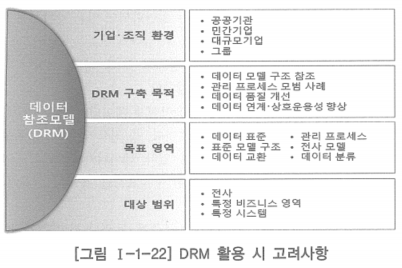

# 4. 데이터 참조모델의 활용

- 참조모델은 다양한 용도로 활용될 수 있으며, 용도에 따라 효과도 달라짐
    - 정부기관과 같이 중앙 부처가 산하기관에 참조모델을 적용
    - 기업군의 성격을 가지는 기업의 지주회사나 계열사가 하위 기업에 적용
    - 일반 기업의 업무에 적용되는 것은 아직 흔하지 않음
- 데이터아키텍처는 전사아키텍처와 별개로 독립적인 추진이 가능한 만큼 데이터 참조모델을 활용하는 것은 데이터 아키텍처의 수립과 데이터 품질 확보에 크게 영향을 미칠 수 있음

## 데이터 참조모델의 활용 방안

- 개선 대상이 되는 관련 데이터를 데이터 참조모델을 참조하여 파악
- 데이터 참조모델을 참조하여 일관성 있는 데이터 아키텍처를 정의
- 데이터 표준 준수에 대한 검증 기준의 하나로 활용
- 주요 데이터 전략과 데이터 관련 조직 운영 방향 결정
- 정보의 상호운용성과 교환 촉진을 위한 근거

## 데이터 참조모델 활용에 따른 고려사항

- 데이터아키텍처를 수립할 때 전사아키텍처와의 통합성 및 연계성 고려
- 상위 기관 또는 산업별 데이터 참조모델을 참조하거나 독자적인 데이터 참조모델을 준비하여 적극 활용
- 기업, 기관 간 또는 기업이나 조직 내부에서 정보의 상호운용성과 교환을 촉진
- 데이터 중복 배제 및 재사용 증대 등의 데이터아키텍처 구축 효과를 얻도록 해야 함
- 데이터 참조모델을 구축할 때부터 가장 중요하게 고려해야 할 것은 기업이나 조직이 각자의 상황에 맞게 다양한 접근을 시도해야 함
- 데이터 참조모델을 통해 얻고자 하는 것이 무엇인지 명확하게 정의하고 접근해야 함