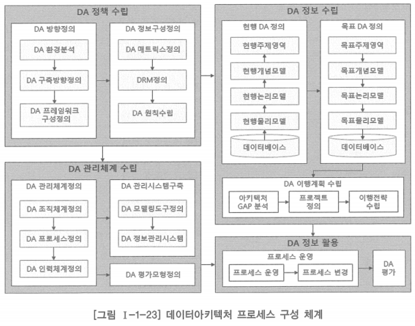
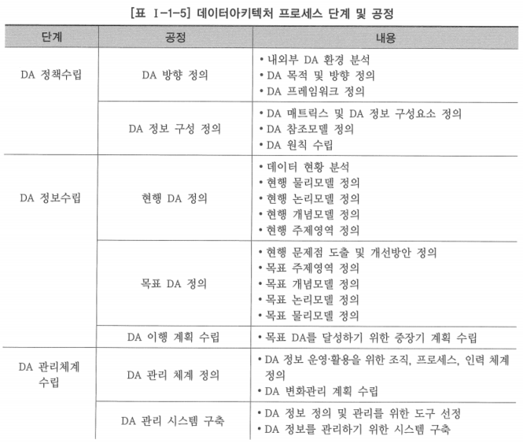
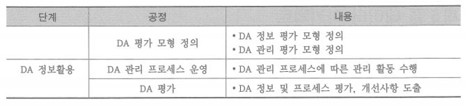

# 2. 데이터아키텍처 프로세스 구성

## 데이터아키텍처 정책 수립

- 기업이나 조직의 데이터 아키텍처 환경을 분석하고, 이를 바탕으로 기업이나 조직이 추구해야 할 데이터아키텍처의 방향 수립
- 이를 토대로 데이터아키텍처 프레임워크 정의
- 데이터아키텍처 정보를 어떻게 구성할 것인가를 매트릭스로 정의
- 데이터 참조모델과 데이터 표준 등을 포함한 데이터 원칙 정의

## 데이터아키텍처 정보 구축

- 데이터아키텍처 매트릭스에 따라 현행 데이터아키텍처와 목표 데이터아키텍처 정보 구축

## 데이터아키텍처 관리 체계 수립

- 데이터아키텍처를 효과적으로 관리 및 활용하기 위한 조직, 인력, 프로세스 체계를 정립
- 데이터아키텍처 관리 시스템 구축
- 데이터아키텍처에 대한 평가모형 구축

## 데이터아키텍처 활용 정의

- 목표 데이터아키텍처 달성을 위한 중장기 계획 수립

