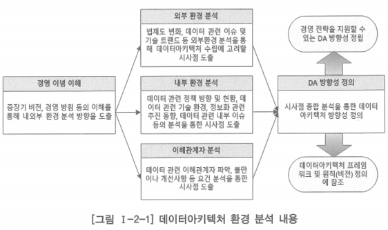

# 2. 데이터아키텍처 환경 분석

- 기업이나 조직의 내부 및 외부 환경에서 데이터 관련 변화 추이를 파악하고, 향후의 비즈니스에 미칠 수 있는 영향을 분석하는 일
- 전사아키텍처가 수립되어 있다면 기업이나 조직의 경영 환경과 사회적 이슈, 기술 변화 등에 기반한 전사아키텍처 환경 분석 결과를 토대로 중복 부분을 배제하고 데이터 관련 사안에 대한 분석 내요용을 추가할 수 있음
- 데이터아키텍처 환경 분석 시 전사아키텍처 환경 분석에 포함되는 거시적 분석을 반복할 필요 없이 데이터 관련 이슈에 집중할 수도 있음
- 데이터에 관련된 이해 관계자의 범위를 분석하고, 이들로부터 데이터아키텍처 수립을 위한 요건을 도출
- 데이터아키텍처 환경 분석은 데이터아키텍처 구축에 관련될 수 있는 환경 요인을 분석하는 일
    - 데이터 관련 이해관계자
    - 데이터 관련 기술 이슈 및 트렌드
    - 법제도 변화 등 외부 환경
    - 외부 환경에 대응하는 내부의 동향과 변화 계획 같은 내부 현황 등
- 여기에 더하여 여러 계층 사용자들의 불만, 요구, 기대 사항 등을 도출하여 구축을 위한 요건으로 정리
- 이밖에 현행 데이터 현황을 개괄적 수준에서 파악하고, 상위 수준에서 문제점 및 개선해야 할 사항들을 정리
- 데이터아키텍처 수립을 위한 전사의 범위를 명확히 설정하는 것도 이 단계에 포함됨

## 데이터아키텍처 환경 분석 수행 과제

- 비즈니스 내외부 환경 분석
- 데이터 관련 내외부 환경 분석
- 전사 범위 정의

