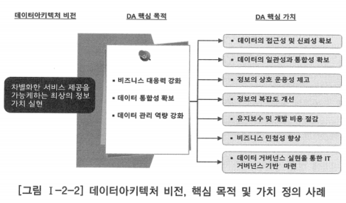

# 3. 데이터아키텍처 구축 방향 정의

# 가. 목적 및 범위 정의

- 데이터아키텍처의 일반적 목적과 데이터아키텍처 환경 분석 결과를 기반으로 기업이나 조직의 데이터아키텍처 구축 목적, 기업이나 조직의 데이터아키텍처에 대한 이해와 관리 역량을 고려하여 구축 범위를 지정하는 것
- 전사아키텍처의 도입 목적 및 범위 정의에 기반하여 데이터 관점에서 정의할 수 있음
- 목표하는 데이터아키텍처가 지향하는 가치·도입 목적의 근거·목적 달성 시 추구하는 효과 등의 정의 포함

## 데이터아키텍처 목적의 예

- 데이터 연계 및 상호운용성 증대
- 데이터 품질 재고
- 비즈니스 변화에 대한 신속한 대응 체계 구축
- 전사적 데이터 표준 체계 정립
- 마스터 데이터 기반 데이터 일관 체계 구축

## 데이터아키텍처 대상 범위를 정의하는 절차

- 먼저 기업 또는 조직의 미션과 업무 범위를 확인
- 이후 이에 필요한 정보와 영역이나 핵심적인 데이터 구성을 식별
- 해당 업무에 대한 반영 또는 지원 정도를 분석
- 이러한 분석을 바탕으로 데이터아키텍처 대상 영역을 정의

# 나. 데이터아키텍처 비전 수립

- 데이터아키텍처 비전은 기업이나 조직이 데이터아키텍처를 통해 실현하고자 하는 미래의 모습과 이를 확보하기 위해 기업이나 조직이 공유해야 할 가치로 표현됨
- 데이터아키텍처 비전은 전사아키텍처의 비전을 공유하거나 그 기반에서 데이터 관점으로 정의할 수 있음
- 데이터아키텍처 도입과 관련된 다양한 이해 관계자에게 명확한 도입 방향성을 제공하여 데이터아키텍처 도입의 궁극적 목표를 달성하도록 함
- 기업이나 조직의 목표에 대해 데이터아키텍처가 제공해야 할 가치를 정확히 일치시킴으로써 비즈니스의 방향에 부합하는 데이터 구성을 견인하고, 경영전략과 전사아키텍처 방향·데이터아키텍처 방향 사이에 일관성 유지 및 연결 고리를 구축할 수 있음

## 데이터아키텍처 비전의 구성요소

- 핵심 목표: 데이터아키텍처를 도입하여 궁극적으로 달성하고자 하는 기업이나 조직의 목표 또는 실현하고자 하는 모습
- 핵심 가치: 데이터아키텍처의 핵심 목표 달성을 위해 구성원들이 추구하거나 지켜야 하는 신념

## 데이터아키텍처 비전에 대한 사례

- 데이터아키텍처 비전을 수립할 때에는, 관련 이해 관계자가 명확하게 이해할 수 있고 즉각적으로 비전의 의미를 파악할 수 있도록 기업이나 조직에서 익숙한 용어로 정의해야 함
- 모든 데이터아키텍처 이해 관계자의 합의와 홍보를 바탕으로 수립해야 함
- 데이터아키텍처 비전은 데이터아키텍처의 목적, 원칙, 프레임워크의 방향성에 영향을 주는 가장 중요한 방향성 항목임
- 데이터아키텍처를 비롯한 각 아키텍처 영역은 전사아키텍처 비전과 방향성을 일치시켜야 하며, 조직 내에서 직접적으로 활용할 수 있도록 목표와도 연계해야 함