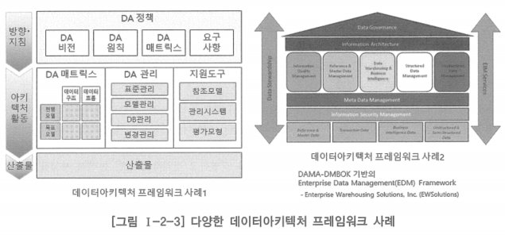

# 4. 데이터아키텍처 프레임워크 정의

- 데이터아키텍처 수립을 위해서는 먼저 데이터아키텍처 프레임워크가 정립되어야 함
- 전사아키텍처 프레임워크가 수립되어 있는 경우 이를 참조할 수 있음
    - 그렇지 않은 경우 외부의 많은 선진 프레임워크를 참조
    - 국내의 경우 정부에서 가이드로 제시하고 있는 범정부 전사아키텍처에 정의된 데이터아키텍처 프레임워크를 참조할 수도 있음
- 무조건적인 적용보다는 기업이나 조직의 특성에 따라 적합한 형태로 정의하여 적용하는 것이 바람직함

- 보통은 전사아키텍처나 데이터아키텍처 프로젝트를 기획하는 단계에서 어느 정도의 전사아키텍처 프레임워크 또는 데이터아키텍처 프레임워크가 도출되기도 함
- 데이터아키텍처 프레임워크의 구성요소 중 아키텍처 매트릭스는 데이터아키텍처 정보 구성 단계에서 별도로 정의함
- 따라서 이 단계에서의 데이터아키텍처 프레임워크 정의는
    - 먼저 정의된 대략적인 수준의 데이터아키텍처 프레임워크를 다듬어 상세화함
    - 참조하려는 외부 또는 내부의 데이터아키텍처 프레임워크를 적합하게 다듬고 조정함
    - 기업이나 조직의 특별한 변경 요구가 있을 경우 이를 반영함
- 데이터아키텍처 프레임워크에 대하여 관련자들이 공감대를 형성하고 이를 확인하는 과정이 반드시 필요함