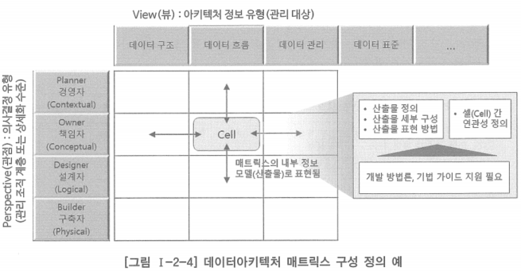
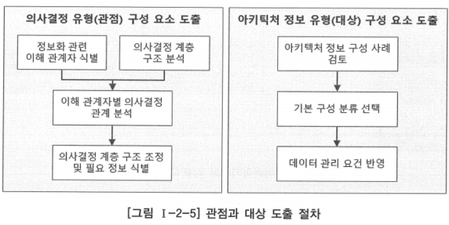
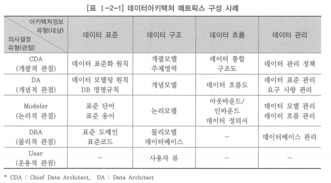
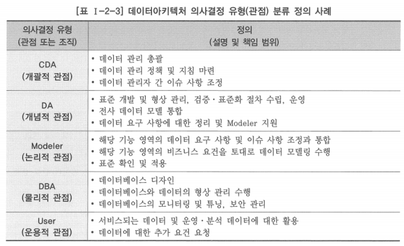
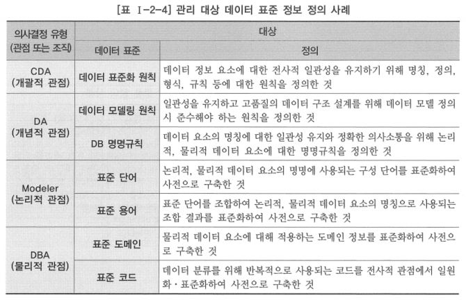
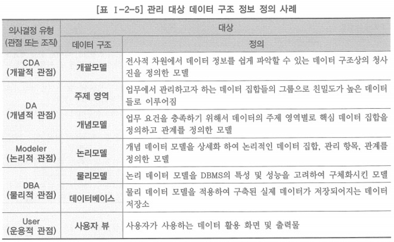
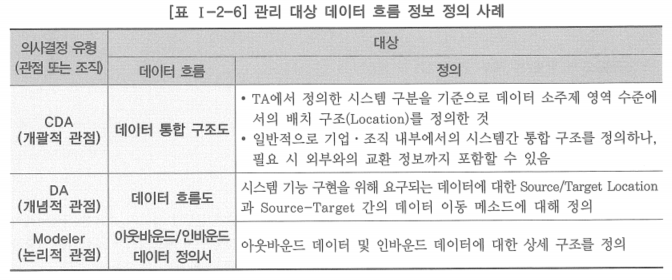
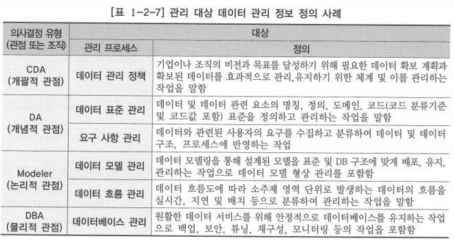

# 2. 데이터아키텍처 매트릭스 정의

# 가. 데이터아키텍처 매트릭스 개념

- 데이터아키텍처 매트릭스는 데이터아키텍처 프레임워크의 핵심 구성요소
- 전사적 아키텍처를 설명하는 모델과 원칙 정보를 통일된 시각으로 볼 수 있는 논리적 틀
- 데이터아키텍처 프레임워크: 데이터아키텍처 구축·운영에 필요한 모든 구성요소와 구성요소 간의 관계를 포함하는 것
- 데이터아키텍처 매트릭스: 협의의 프레임워크로 데이터아키텍처 도메인의 산출물을 식별하고 정의하기 위한 논리적 체계를 정의하는 것

# 나. 데이터아키텍처 매트릭스 구성

- 일반적으로 의사결정 유형(관점) 또는 상세화 계층과 아키텍처 정보 유형(대상)의 두 축을 기준으로 2차원의 매트릭스 형태로 구성함
- 의사결정 계층별로 어떠한 데이터아키텍처 구성 정보가 필요할 것인지에 대한 아키텍처 정보의 활용 방안을 토대로 의사결정유형과 아키텍처 정보 유형으로 구분한 각 항목에 필요한 산출물을 도출하여 배치함으로써 데이터아키텍처 매트릭스 정의

## 의사결정 유형

- 조직의 의사결정 유형을 계층적으로 구분한 것으로, 조직이 수행하는 업무의 의사결정 특성에 따라 단계를 정의함
- 업무와 IT 조직의 이해 관계자를 식별하거나 데이터를 활용하는 유형에 따라 이해 관계자를 식별
- 이를 바탕으로 데이터 또는 데이터 관리 관점에서 의사결정 계층의 구조를 분석하여 의사결정 유형을 정의
- 데이터아키텍처를 구축하는 목적에 따라 3~5단계로 나눌 수 있는데, 이는 데이터아키텍처 정보의 관리 수준과 범위에 영향을 줌
- 필요에 따라 데이터아키텍처 정보의 상세화 수준을 바탕으로 계층을 구성할 수도 있음
- 최상위의 가장 추상화 수준이 높은 개괄적 단계에서부터 단계적으로 상세화 정도를 구분하여 최하위의 상세화 수준이 가장 높은 단계까지 계층화함
- 의사결정 단계가 많을수록 좀 더 상세한 데이터아키텍처 정보가 관리되며, 이는 데이터아키텍처 정보 구축과 관리 비용에도 영향을 줌

## 아키텍처 정보 유형

- 데이터아키텍처 정보를 구성하려는 대상에 대해 특성이 비슷한 것들을 그룹화한 것
- 기업이나 조직이 관리하는 모든 데이터 관련 정보를 수집하여 분류함
- 일반적으로 데이터아키텍처를 구성하는 대상은 데이터 구조·데이터 흐름·데이터 관리에 관련된 정보로 분류하며, 데이터 포주에 관련된 정보를 추가적으로 분류하기도 함

### 의사결정 유형의 구성요소

- 기업의 정보화 관련 의사결정 계층 구조를 업무 분장이나 전결 규정, 면담 등을 통하여 파악
- 의사결정 범위, 주기, 간격에 따라서 또는 의사결정을 위해 어떤 수준의 데이터를 필요로 하는지, 어떠한 수준의 데이터에 대해 의사결정을 하는지 등을 파악해 이해 관계자별로 계층 구조 정의
- 선진 사례의 관리 대상 구성을 참조하거나, 자신이 속한 기업이나 조직에서 관리하고 있고, 관리해야 하는 데이터 유형에 대한 구분을 바탕으로 데이터 관리 요건을 반영하여 조직간 조정과 합의를 거쳐 결정

- 아키텍처 매트릭스 정의 시 선진 사례의 무조건적인 도입보다는 선진 사례에서 프레임워크를 참조하되 기업이나 조직의 현황을 고려하여 데이터아키텍처 목표 달성에 필요한 구조로 아키텍처 매트릭스를 정의하는 것이 바람직함

# 다. 산출물 정의

- 의사결정 유형과 아키텍처 정보 유형으로 구성된 매트릭스의 각 셀에 필요한 산출물을 정의
- 산출물 정의는 어떤 방법론을 사용하는가와 기업이나 조직의 업무 특성 또는 문화에 의하여 달라질 수 있음
- 일반적으로 많이 사용하는 데이터아키텍처 정보에 대한 산출물 구성은 아래와 같음

## 데이터아키텍처 매트릭스 구성 사례

| 아키텍처정보 유형(대상) / 의사결정 유형(관점) | 데이터 표준 | 데이터 구조 | 데이터 흐름 | 데이터 관리 |
| --- | --- | --- | --- | --- |
| Chief Data Architect(개괄적 관점) | 데이터 표준화 원칙 | 개괄모델, 주제영역 | 데이터 통합 구조도 | 데이터 관리 정책 |
| Data Architect(개념적 관점) | 데이터 모델링 원칙, DB 명명 규칙 | 개념모델 | 데이터 흐름도 | 데이터 표준 관리, 요구 사항 관리 |
| Modeler(논리적 관점) | 표준 단어, 표준 용어 | 논리모델 | 아웃바운드/인바운드, 데이터 정의서 | 데이터 모델 관리, 데이터 흐름 관리 |
| DBA(물리적 관점) | 표준 도메인, 표준코드 | 물리모델 | - | 데이터베이스 관리 |
| User(운용적 관점) | - | 사용자 뷰 | - | - |

<!--  -->

## 데이터아키텍처 정보 유형(관리 대상) 분류 정의 사례

| 아키텍처 정보유형(관리 대상) | 정의 |
| --- | --- |
| 데이터 표준 | 데이터 정보 요소에 대한 전사적 일관성을 유지하기 위해 명칭, 정의, 형식, 규칙 등에 대한 원칙을 수립한 것을 의미하며, 이를 위해 의사결정유형(관점)의 계층별로 필요한 산출물이 정의됨 |
| 데이터 구조 | 데이터가 담겨져 있는 모양·틀로서 데이터를 취급하는 관점(view)에 따라 데이터 구조의 상세화 수준이 달라지는데, 데이터 구조는 사용자 View(양식, 보고서, 화면, 장표 등), 모델(개괄, 개념, 참조, 논리, 물리), 데이터베이스 파일의 형태로 보여짐 |
| 데이터 흐름 | 전사적 데이터 통합 관점에서 업무별 데이터의 Master/Replication/Reference 관계를 정의하고, 시스템 기능 구현을 위한 데이터 이동에 대해 아웃바운드/인바운드 데이터를 정의함 |
| 데이터 관리 | 데이터아키텍처 정보의 유지 관리를 위한 관리 대상과 활동을 정의한 것으로 절차, 조직(역할), 인력 등을 포함 |

- 매트릭스를 통해 데이터아키텍처 정보를 구성하는 산출물을 정의했지만, 실질적으로 매트릭스의 활용도를 높이고 체계적으로 데이터아키텍처 정보를 구축하려면 매트릭스의 각 셀에 정의된 산출물에 대해 구체적인 산출물 작성 방법이나 가이드와 산출물 구성 내역을 정의해야 함
- 필요 사항 예시
    - 산출물 표현 방법 및 세부 구성 정의
    - 현행 데이터아키텍처 정보에 대한 산출물 정의
    - 목표 데이터아키텍처 정보에 대한 산출물 정의
    - 산출물 간 연관성 정의

# 라. 데이터아키텍처 매트릭스 정의 시 고려 사항

1. 데이터아키텍처 매트릭스에 정의되는 산출물은 업무와 IT, 관리자와 실무자 사이의 중요한 커뮤니케이션의 수단
    - 매트릭스를 정의할 때는 일반적인 데이터아키텍처 개념을 포함하면서 매트릭스에 포함되는 산출물이 범위와 목적에 적합하게 정의되었음을 조직 내 모든 계층의 구성원들이 확신할 수 있어야 함
    
2. 아무리 잘 정의된 모범 사례가 있더라도 무조건적인 도입과 적용은 좋지 않음
    - 조직적·정치적·지리적 특성, 조직의 편견, 구성원 성향 등 다양한 조직 문화와 의사결정 구조 혹은 의사결정 결과 등에 따라 산출물의 구성과 산출물이 정의되는 셀이 달라질 수 있음
    - 모범 사례가 있다면 최대한 참조하되 조직 문화와 의사결정 구조를 고려해서 테일러링(tailoring)을 해야 하며, 무엇보다도 이해관계자들의 이해와 공감대 형성이 필요함
    
3. 데이터아키텍처 매트릭스는 대상이 되는 전사 데이터에 대해 데이터아키텍처 원칙 및 표준에 대한 준수성을 높이고 조직별로 통일된 접근이 가능하도록 정의되어야 함
    - IT 조직의 역량이나 성숙도를 충분히 고려해야 하며, 하위 기업이나 조직에 대한 통일되고 일관성 있는 적용 가능성까지 고려해서 정의해야 함
    - 매트릭스는 추상화 수준에 따른 계층적 구성이 포함된 구조이기 때문에 서로 다른 개발 환경과 요건을 반영하는 동시에 통일성과 일관성을 유지할 수 있어야 함
    
    
4. 데이터아키텍처 외에 다른 아키텍처 도메인과의 상호 연계성을 고려해야 함
    - 데이터는 비즈니스 아키텍처 및 애플리케이션 아키텍처, 기술 아키텍처 등과도 상호연관성을 갖기 때문에 매트릭스에 정의된 산출물이 다른 아키텍처 도메인과의 상호연관성을 반영할 수 있도록 함
    - 어떠한 업무 기능에서의 변경이 어떠한 애플리케이션과 데이터 등에 영향을 미치는지, 어떠한 데이터에 대한 변경이 어떠한 애플리케이션과 업무 기능에 영향을 주게 되는지 등을 쉽게 파악할 수 있어야 함
    - 비즈니스-데이터-애플리케이션-기술 아키텍처 등에 반영하고 전사 차원에서 통합적인 아키텍처 관리가 이루어지도록 함