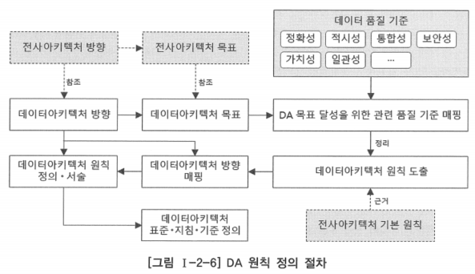
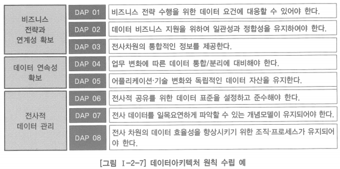

# 4. 데이터아키텍처 원칙 수립

- 데이터아키텍처 원칙 수립은 데이터아키텍처 비전 달성을 위해 구성원들이 공통적으로 지켜야 하는 규범을 정의하는 것

# 데이터아키텍처 원칙

- 데이터아키텍처 목표 달성을 위한 의사 결정의 객관적 기준을 제시함으로써 의사결정을 효과적으로 지원
- 업무 협조와 조정을 위한 의사소통 과정의 투명성 제공
- 비즈니스 전략과 정보화·데이터 전략의 연결성을 강화
- 구성원들의 개별적인 의사결정이 조직의 목표에 쉽게 정렬될 수 있도록 함
    
    → 데이터아키텍처를 구축하는 데 있어서 구성원들이 준수해야 하는 업무 지침이나 기준을 제시하여 전사적으로 통일성과 일관성을 유지할 수 있게 하는 것
    

# 데이터아키텍처 원칙 정의 절차

- 전사 데이터의 품질 수준을 가늠할 수 있는 기준을 도출
- 데이터아키텍처 목표에 부합하는 품질 기준을 파악
- 데이터아키텍처 원칙 도출
- 전사아키텍처를 추진하는 전사적 차원의 대원칙에 해당하는 전사아키텍처 기본 원칙을 근거로 하여 데이터아키텍처 원칙 정의

## 데이터아키텍처 원칙의 구성요소

- 원칙: 원칙의 내용을 간락하게 기술
- 의미: 원칙이 가지는 의미를 설명
- 근거: 원칙으로 채택된 원인 또는 배경
- 기대 효과: 원칙이 데이터아키텍처 수립에 미치는 영향 또는 준수 시의 기대 효과

## 전사아키텍처 기본 원칙 예

- 전사아키텍처 기본 원칙은 전사아키텍처 방향 수립 단계에서 정의될 수 있음

| 원칙 | 의미 |
| --- | --- |
| 업무 지향 | 기업의 정보화는 업무 개선과 상품 및 서비스 품질 개선에 기여할 수 있는 방향으로 추진되어야 함 |
| 성과 지향 | 기업의 정보화는 객관적인 성과 지표에 의해 관리되고 평가되어야 함 |
| 고객 지향 | 기업의 정보화는 고객의 만족도를 개선하는 방향으로 추진되어야 함 |
| 상호운용 | 기업의 정보화는 전사아키텍처에 정의된 원칙과 아키텍처를 준수하여 시스템 간의 연계성과 운영의 지속성을 확보할 수 있는 방향으로 추진되어야 함 |

## 데이터아키텍처 원칙 예

- 데이터아키텍처 원칙은 전사아키텍처 정보 구성 정의 단계가 수행되어 아키텍처 매트릭스가 결정된 수 이를 잠조하여 정의될 수 있음
- 데이터아키텍처 정보를 정의하고 관리하는 기준이 되는 원칙으로, 데이터아키텍처 정보 구축 시 준수되어야 함

| 원칙 | 의미 | 근거 |
| --- | --- | --- |
| 데이터 표준 준수 | 정의된 표준에 따라 생성·수정·활용되도록 함 | EA 기본 원칙 |
| 아키텍처 모델 관리 | 전사 차원의 아키텍처 데이터 모델을 관리하여 전사적 데이터 통합성을 유지함 | EA 기본 원칙 |

## 데이터아키텍처 원칙 수립 결과 예시

## 데이터아키텍처 원칙 수립시 고려 사항

- 원칙의 의도가 명확하게 제시되어 원칙 적용 시 혼돈의 발생을 최소화할 수 있어야 함
- 아키텍처 및 계획 수립과 관련된 의사결정을 효율적으로 할 수 있도록 가이드할 수 있어야 함
- 중대한 데이터 관련 의사결정 시 규범으로써 활용될 수 있어야 함
- 데이터아키텍처 조직의 모든 정보 관리 및 기술과 관련된 의사결정은 데이터아키텍처 원칙을 기반으로 수행해야 함
- 원칙 간에 서로 상반되는 지향점을 갖지 않도록 원칙 수립 시 사용되는 용어는 주의하여 선택해야 함