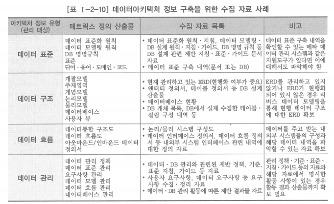

# 1. 데이터아키텍처 정보 구축 준비

# 가. 자료 수집

- 데이터아키텍처 정보를 구축하기 위해서는 먼저 기존에 작성된 자료를 수집해야 함
- 수집해야 할 자료는 데이터아키텍처 매트릭스 정의 결과에 따라 달라짐
- 정보시스템 구축 시 작성한 산출물이나 완료 보고서 등 특히 데이터에 관련된 분석 및 설계 단계의 산출물을 확인해야 함
- 필요한 자료가 매트릭스에서 정의한 산출물의 형식 그대로 존재하지 않을 경우, 유사한 산출물을 활용하거나 필요시 생성 또는 보완 작업을 수행할 수 있음

# 나. 데이터아키텍처 정보 구축 방식

- 데이터아키텍처 매트릭스는 상세화 수준에 따른 상위-하위 산출물과 계층별 연관 산출물 등이 정의되어 있음
    - 데이터아키텍처 매트릭스를 토대로 필요한 자료를 수집
    - 매트릭스 구성에 따라 상위/하위 자료의 존재 여부 및 누락 자료의 재작성 필요 여부 등을 확인
    - 상향식이나 하향식의 접근을 하거나 두 방법을 적절하게 혼용하는 등의 접근을 시도하기에 적합
    

## 상향식 정보 구축 방법

- 최하위에 있는 구성 요소를 조사 분석하여 구성요소들의 공통점을 파악하여 공통적인 구성요소들을 모아 상위 구성요소를 정의해 나가는 방식
- 장점: 조직의 모든 데이터가 포함되는 것을 보장할 수 있음
- 단점: 논리화·추상화를 거치면서 상위 계층의 데이터 구조 수준이 서로 다르게 나타날 수 있음

## 하향식 정보 구축 방법

- 최상위의 구성요소로부터 시작하여 분류 기준에 따라 하위 구성요소를 도출해 내는 방식
- 장점: 일반적인 분류 기준이나 목적에 따른 분류 기준을 따르기 때문에 관점이 명확함
- 단점: 일부 업무가 누락될 가능성이 있으며 어디에도 포함되지 않는 구성요소가 발생할 수 있음