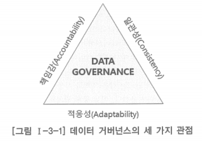
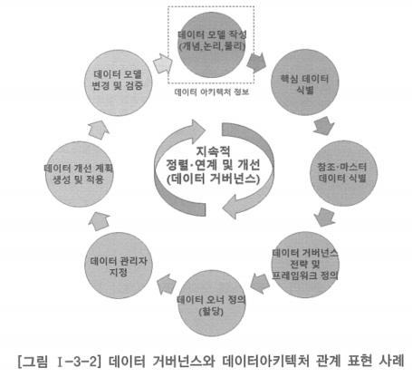
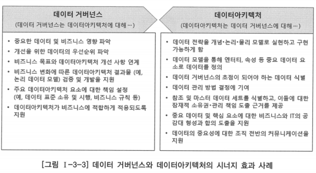

# 1. 데이터 거버넌스 개념

# 가. 등장 배경

- 4차 산업혁명시대에서 비즈니스의 중심에는 항상 데이터가 근간으로 자리 잡고 있음
- 나날이 증가하는 데이터 양은 모든 산업분야에서 디지털 비즈니스 트랜스포메이션이 당연시 되도록 하고 있으며, 비즈니스 활동을 위한 설계 기반의 정형/반정형 데이터와 함께 대규모의 비정형 데이터에 이르기까지 활용 범위가 넓어짐
- 이제 사용 빈도가 적은 ‘콜드(cold)’ 데이터는 더 이상 존재하지 않게 되고 항상 이용 가능한 데이터의 시대가 될 것으로 기대되고 있음
- 인공지능(AI)과 머신러닝 기술들은 데이터 레이크(Data Lake)와 같은 데이터 집적소에 수집된 대규모의 다양한 데이터에서 엄청난 가치와 통찰을 뽑아낼 수 있는 기회를 제공할 것
- 변화의 속도는 갈수록 빨라지고 있고, 기업이나 조직은 이러한 환경으로부터 데이터의 가치를 실현하고, 데이터를 최대한 활용할 수 있도록 체계적인 데이터 관리 기반을 확보하는 것이 시급한 당면 과제가 됨
- 기업이나 조직은 자신의 비즈니스를 위해 데이터를 체계적으로 구성하고, 보호하며, 신속하게 공유하고 활용할 수 있는 전략과 아키텍처가 필요하게 됨
- 이러한 필요성에 부응하는 최적의 해법으로서 데이터아키텍처와 데이터 거버넌스는 그 중요성이 날로 커지고 있음

- 거버넌스(Governance): 공공·행정 분야에서 시작된 용어로, 사회 내 다양한 기관과 행위자가 자율성을 지니면서 함께 통치에 참여·협력하는 변화 통치 방식을 말하며, ‘협치’라고도 함
- 오늘날의 행정이 시장화, 분권화, 네트워크화, 기업화, 국제화를 지향하게 되면서 기존의 행정 이외에 민간 부문과 시민 사회를 포함하는 다양한 구성원 사이의 소통과 네트워크를 강조하는 의미로 거버넌스라는 용어가 자주 사용됨
- 비유적 의미로 최초로 사용한 이는 고대 그리스 철학자 플라톤
- 오늘날과 비슷한 의미로 이 단어를 영어에서 최초로 사용한 것은 1885년 영국 역사가 찰스 플러머가 쓴 ⌈영국의 거버넌스(The Governance of England)⌋
- 1990년대에 UN, IMF, 세계 은행 등과 같은 국제기구들에 의해 본격적으로 유행

- 거버넌스는 이제 다양한 분야에서 다양한 의미로 쓰이고 있으며, governance의 모든 과정에 적용되는 원칙과 규범을 세우는 메타거버넌스(metagovernance)라는 말까지 등장함
- 전사아키텍처에서도 전사아키텍처에 대한 관리체계에 거버넌스라는 용어를 사용하여 IT 거버넌스라고 하기도 함
- 데이터아키텍처 분야에서도 현재는 데이터 관리체계에 대해 데이터 거버넌스라는 용어가 자주 사용됨

# 나. 데이터 거버넌스의 정의

- 데이터 거버넌스라는 용어가 사용되기 시작한 초기에는 데이터 품질 및 관리 영역을 일컫는 용어 정도로 여겨졌음
- 이 때문에 데이터아키텍처 프레임워크의 구성요소 중 데이터아키텍처 관리 부문에 대한 대체어 정도로 받아 들여졌음
- 현재는 다양한 의미 부여와 접근 방식을 통해 발전을 거듭하여 데이터아키텍처를 포괄하는 데이터 분야에서의 확장된 아키텍처의 하나처럼 인식되고 있음

## 데이터 거버넌스에 대한 정의

> 데이터 거버넌스는 데이터 관련 문제에 대한 의사결정 및 권한 사항의 적용 체계
이것은 정보 관련 프로세스에 대한 의사결정권과 책임 사항의 체계로서, 누가 어떤 정보를 가지고 어떤 행동을 취할 수 있는지를 기술하는 합의된 모델에 따라 실행됨
- Data Governance Institute, Gwen Thomas
> 

> 특정 데이터 자산에 대한 통제나 조치를 실행하기 위해 일련의 규칙, 도구, 관리 절차를 적용하는 것
- DATA Governance: perspectives and practices, Harkish Sen
> 

> 데이터 거버넌스는 모든 데이터 이해당사자의 이익을 위해 데이터를 개선하는 비즈니스 주도형 지속 프로세스
- Data Governance & Data Architecture: Alignment & Accountability, Nigel Turner
> 
- 데이터 자체에 대한 것보다 사람들이 데이터에 대해 어떻게 관리하고 결정을 내리는가에 대한 역할과 책임을 정하는데 더 집중하고 있음
- 관련 구성원들이 적절하게 조직되어, 궁극적으로 기업이나 조직의 목적에 적합하면서 높은 품질의 데이터를 사용할 수 있도록 하기 위한 바람직한 활동 체계를 정의하는 것
- 데이터 거버넌스는 전략, 정책, 운영 요소를 결합하는 역할을 함

## 데이터 거버넌스의 세 가지 관점

### 책임감(Accountability)

- 데이터의 활용과 이동에 대한 모든 부분에 대해 오너십(소유권)을 명확하게 정의하여 조직에서 데이터를 처리하는 방식에 대해 투명성을 보장하는 것
- 데이터 거버넌스는 조직의 모든 계층에서 실행되는 명확한 책임을 정의하도록 고려되어야 함

### 일관성(Consistency)

- 일관성은 데이터의 통합성과 활용 효율을 향상시키고, 조직이나 비즈니스별로 데이터가 격리(siloed)됨으로써 발생할 수 있는 비효율을 감소시킴
- 일관성 확립을 위해 데이터 거버넌스는 표준화된 절차를 고려해야 함
- 포괄적이거나 범용의 표준 규칙을 만드는 이점은 동일한 규칙 세트가 조직 전체에 적용될 수 있다는 것을 의미함
- 전체 조직이 하나의 규칙 세트를 따르도록 함으로써, 사용자는 동일한 방법으로 데이터를 처리할 수 있음
- 사용자가 합의된 표준 세트를 따르게 되면 이를 통해 조직은 모든 데이터 자산을 바람직한 방향(조직의 전략적 방향이나 비전)으로 이끌어 갈 수 있음

### 적응성(Adaptability)

- 데이터 거버넌스의 유연한 특성은 데이터 거버넌스를 큰 혼란 없이 기존 프로세스에 동화시키거나 수용할 수 있음을 의미함
- 데이터 거버넌스가 일상적 업무 수행에 적용되면 데이터 거버넌스 도구를 사용하여 기존의 업무 방식이나 조직별 또는 비즈니스별로 수행하던 데이터 관리 방식을 대체하도록 함으로써 조직의 전략적 방향에 맞게 표준과 도구를 신속하게 조정할 수 있으므로 모두가 공통적인 절차를 사용할 수 있음

# 다. 데이터아키텍처와 데이터 거버넌스의 관계

- 넓은 범위의 데이터아키텍처는 데이터아키텍처 정책과 데이터아키텍처 정보, 데이터아키텍처 관리 부문으로 구분해 볼 수 있음
- 여기서 데이터아키텍처 관리에 대한 부분을 달리 데이터 거버넌스라고 말하기도 함
- 데이터아키텍처 정보를 구축하기 위한 정책과 데이터아키텍처 정보를 관리하는 프로세스를 정의하고 이를 수행하는 것을 의미함

- 데이터의 자산 가치를 바라보는 시야와 대상·활용 범위의 확대 추세에 따라서 데이터 거버넌스는 좀 더 폭넓은 의미를 담게 되고 데이터 거버넌스라는 이름 하에 데이터에 관련된 여러가지 사항을 표괄하게 됨
- 데이터 거버넌스 정의는 더 일반화되어 데이터아키텍처를 데이터 거버넌스의 구성요소의 하나로 거론하기도 함
- 데이터 거버넌스 구성요소로서의 데이터아키텍처는 협의의 데이터아키텍처로 데이터아키텍처 정보를 의미함
- 데이터 거버넌스는 데이터아키텍처 정보를 포괄하는 데이터에 대한 전반적인 관리 체계를 구축하는 것

- 데이터아키텍처 관리 체계와 데이터 거버넌스는 같은 의미로 사용되었지만, 최근의 경향은 데이터 관리 체계 대신 데이터 거버넌스라는 용어를 더 자주 사용함
- 넓은 의미의 데이터아키텍처 구성요소의 하나로서가 아니라 독립적인 의미를 부여할 수 있는 더 확장된 종합적인 데이터 관리 체계의 의미를 담으려 하고 있음

- 데이터아키텍처는 데이터가 존재하는 위치와 데이터가 조직이나 전사 시스템을 대상으로 이동해야 할 위치와 변환에 대해 정의함
- 이러한 데이터 저장 위치와 데이터 흐름에 대한 정의는 원활한 데이터 이동과 활용상의 정확성을 보장하기 위한 데이터 정책과 표준이 필요함을 뜻함
- 이들을 적절하게 정의하고 적용 및 관리를 하기 위한 수행 체계를 수립할 수 있는 근거가 됨으로써 데이터 거버넌스의 중요한 관리 대상이 됨
- 데이터 저장 및 흐름에 대한 정의는 데이터 교환이 정확하게 수행되고 있는지를 측정할 수 있는 항목과 시기, 방법 등을 결정하는데 도움을 줌
- 데이터 생성 및 변경에 대한 표준 준수 여부와 이에 대한 관리 책임, 데이터 오너십(소유권) 등을 식별하는데 핵심적인 역할을 함
- 데이터 거버넌스는 이를 통해 데이터 품질을 보장할 수 있는 기초를 확립할 수 있음

- 데이터아키텍처는 데이터 거버넌스 수행 체계에 따라 업무 담당자가 제기하는 데이터 관련 이슈의 원인을 분석하고 해결하는데 도움이 됨
- 데이터아키텍처와 데이터 거버넌스는 서로에게 긴밀하게 영향을 주고 받고 있으며, 상호간에 유기적으로 조화를 이루어야만 전사적인 시너지를 발휘할 수 있음