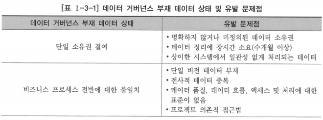
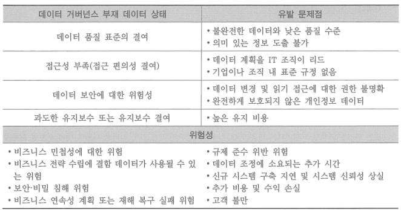

# 2. 데이터 거버넌스의 필요성

- 기업의 데이터 양은 매년 크게 증가하고 있고 그에 비례해서 수요도 계속 증가하고 있음
- 기업이나 조직들은 데이터 저장 및 유지를 위해 다양한 데이터베이스 시스템과 플랫폼을 갖고 있지만, 일반적으로 데이터를 관리하기 위한 조직 전반의 역량 및 관련 솔루션 구축은 뒤쳐져 있는 편
- 데이터 유지보수에 대한 중복 노력, 데이터 저장을 위한 불필요한 비용, 조직의 문제 등을 해결하거나 의사결정을 위한 통찰을 제공할 수 있는 데이터 구성이 미흡하기 때문
- 데이터의 활용도 또한 저하될 수 있음

## 데이터 거버넌스 부재 데이터 상태 및 유발 문제점

- 관리되지 않는 데이터로 인해 기업이나 조직이 떠안게 되는 부담과 손실, 위험성 등은 사안에 따라 신뢰도 저하·상실 또는 큰 재산적 손해와 경쟁력 저하 등으로까지 이어질 수 있음
- 기업이나 조직이 사용할 데이터에 대해 업무에 맞는 데이터 설계와 함께 체계적인 관리를 계획하고 구현하는 것이 데이터 거버넌스
- 데이터 거버넌스는 시간이 흐를수록 필수 요소로 자리 잡아가고 있음