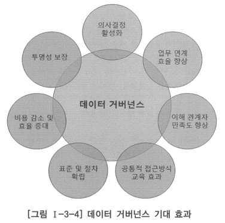

# 3. 데이터 거버넌스 구축 방향

- 전사아키텍처나 데이터아키텍처를 도입할 때 아키텍처 정보를 정확하게 구축하는 것도 중요하지만, 아키텍처 정보를 관리하고 활용할 수 있는 체계를 정립하는 것이 더욱 중요함
- 데이터 거버넌스의 핵심 요소로, 데이터아키텍처 정보를 유지·관리하기 위한 조직과 프로세스 측면의 기반을 구축하는 것을 포함
- 비즈니스 지원과 의사결정의 모든 과정에서 데이터아키텍처 정보가 활용될 수 있도록 함으로써 의사 결정의 일관성과 합리성이 증대되는 것을 목표로 전사아키텍처와의 통합성이 확보되어야 함
- 전사아키텍처와의 통합성이란 전사아키텍처의 적용 범위 내에 있는 기업이나 조직 내에서 전사아키텍처 영역 간에 통합적으로 아키텍처가 구축되는 것을 의미함
- 전사아키텍처를 구성하는 아키텍처 도메인 간의 유기적인 연계와 일체감이 유지되어야 함

# 통제 부재 상태의 데이터를 통제 상태의 데이터로 이행

- 데이터 거버넌스의 목적을 단적으로 말한다면 데이터를 통제되지 않은 상태에서 통제된 상태로 전환하는 것
- 데이터 관리가 수행되고 있지 않거나 데이터 관리를 수행하기 시작하는 초기 상태에서 나타나는 특징
    - 데이터에 대한 관리가 제대로 정의되어 있지 않음
    - 데이터 품질에 대한 개념이 희박하거나 품질 수준을 가늠하기 어려움
    - 데이터에 대한 비즈니스 규칙이 존재하지 않거나 서로 상충되는 경우가 많음
    - 데이터에 대한 책임 소재가 불분명하거나 정해져 있지 않음

- 통제의 데이터, 즉 거버넌스 데이터(governed data)는 신뢰할 수 있고 이해가 쉬우며, 데이터 자체와 데이터에 대한 문제를 해결할 책임이 명확하게 확립되어 있음

## 통제가 잘 이루어지고 있는 완전한 거버넌스 데이터의 충족 사항

### 데이터 요소에 대한 표준화된 명칭

- 엔터티, 속성, 테이블, 칼럼 등과 같은 데이터 요소에 대한 명칭이 기업이나 조직 내 어느 곳에서나 표준화가 되어 있고 명확한 업무적 의미를 표현하고 있음
- 명칭에 대한 이견이 있을 경우는 이를 조정하거나 반영하기 위한 표준화된 절차가 있고, 이에 따라 조치됨
- 특정 조직에서 다르게 명칭을 사용하고자 한다면 그에 대한 사항을 문서화하고, 표준과의 매핑을 관리해야 함

### 데이터 요소에 대한 표준화된 업무적 정의

- 데이터 요소가 하나의 표준화된 업무적 명칭을 갖는 것처럼 데이터 요소는 하나의 표준화한 업무적 정의를 가져야 함
- 데이터 요소에 대한 정의는 구체적이고 상세하며, 업무적 의미가 잘 표현되어 있어야 함
- 데이터 요소의 정의에 대해 이견이 있을 경우 데이터 오너(소유자)는 이를 검토하여 정의를 변경하거나 잘못된 데이터 요소를 명시하고 새로운 이름으로 다시 정의

### 계산·추출 속성에 대한 계산·추출 규칙 정의

- 수량이나 총금액과 같이 계산 값을 도출하는 방법에 대해 혼동이 없도록 구체적인 규칙을 관리
- 표준화된 업무적 정의와 마찬가지로 이견이 있을 경우 계산·추출 규칙을 변경하거나 새롭게 정의된 계산·추출 규칙을 갖는 새로운 데이터 요소를 정의

### 데이터베이스·시스템에서 업무 데이터 요소의 물리적 위치에 대한 정의

- 어떤 시스템의 데이터베이스 내에 어떤 테이블과 구성 칼럼이 존재하는지와 같이 테이블, 칼럼 등 물리적 데이터 요소의 위치를 관리하고 있음
- 엔터티, 속성 등 논리적 데이터 요소와의 매핑 및 그들에 대한 비즈니스 규칙이 함께 관리되어야 함

### 조직 여건을 고려한 데이터 품질 규칙

- 형식, 범위, 유효값, 패턴 등과 같이 고품질의 데이터를 확보하기 위해 필요한 규칙의 지정과 함께 각 데이터가 업무에 사용되는데 필요한 적정 품질 수준에 대해서도 고려되어야 함

### 데이터 요소 생성 규칙

- 어떤 엔터티에 인스턴스를 생성할 때 적정 품질 수준을 확보할 수 있도록 필요한 모든 항목이 규칙에 따라 채워져야 함
- 이를 위해 모든 속성은 업무 규칙에 맞도록 필수·선택 옵션을 갖고 있어야 함
- 선택 속성이라도 업무적으로 반드시 채워져야 하는 경우가 있따면 이러한 상황이 반드시 정의되고 준수되어야 함
- 규칙은 마스터 데이터의 관리를 위해 특히 중요하며, 불완전하고 정돈되지 않은 데이터가 생성되는 것을 방지하는데 매우 중요함

### 데이터 요소 사용 규칙

- 데이터를 사용할 수 있거나 사용할 수 없는 경우를 정의하는 것으로, 개인 정보의 보호와 관련하여 중요하게 다루어져야 함
- 병원의 처방전 내용을 구성할 때 환자의 이름이 사용될 수 있지만, 리필 알림 메일의 제목에는 사용할 수 없도록 한다거나, 특정 업무를 위한 화면에서는 구성원의 이름과 연락 전화번호가 노출되지만 그 외에는 마스킹하도록 하는 등의 규칙을 말함

### 데이터 요소에 대한 데이터 통제자·소유자 및 업무 데이터 관리자의 적절한 통제

- 업무 데이터에 대한 관리 책임과 의사결정 권한을 갖고 있는 사람들임
- 구성원 중 누구라도 업무 데이터 요소에 대한 변경을 제안하고자 하는 경우 표준화한 관리 절차에 따라 업무 데이터 관리자에 의해 권한을 부여받고 데이터 통제자·소유자의 승인을 받아야 하며, 그러한 절차와 통제 목적에 대해 모든 구성원이 충분히 이해하여 전사적 공감대를 갖고 있어야 함
- 데이터 통제자는 전사적인 데이터 거버넌스 운영의 책임을 수행하는 자를 말함
- 데이터 소유자는 데이터 관리자에 의해 위임되어 소유권이 정의된 데이터 자산에 대한 접근 및 사용 권한에 대해 승인하고 해당 데이터의 품질과 법적 규제 및 정책 요건 충족의 일차적인 책임을 수행함
- 데이터 관리자는 데이터 품질 및 무결정에 대한 책임과 데이터 관리 구현 및 실행 담당
- 데이터 관리자의 업무 범위나 인원 구성은 기업이나 조직의 여건에 맞게 해야 하며, 최소 전사 혹은 대주제 영역 단위에서는 데이터 관리자 선정을 고려할 필요가 있음
- 데이터를 통제 상태로 만들기 위해 필요한 것: 조직, 프로세스, 인역, 관리 시스템
- 데이터 거버넌스는 조직, 프로세스, 인력, 관리 시스템의 관점에서 검토되고 수립됨

### 장기적 접근

- 데이터 거버넌스를 성공적으로 정착시키기 위해서는 프로젝트적인 접근을 지양하고 장기적인 접근이 필요하며, 단기 효과보다는 장기간의 효과를 중시해야 함
- 데이터아키텍처 수립 효과는 IT 관련 조직만의 노력으로 달성될 수 없으며, 전사적인 추진 체계가 구축되어야 함
- 현업 부서도 데이터아키텍처를 이해하고 업무에 아키텍처 정보를 활용할 수 있어야 하며, 혁신에 대한 적극적인 의견 제시와 협조가 필요함
- 효과적인 데이터 거버넌스를 구축하기 위해서 고려해야 할 점
    - 데이터아키텍처 관리를 위해 정의된 조직 체계, 프로세스 체계 등을 문서화하여 전 조직이 준수할 수 있도록 제도화
    - 데이터아키텍처 관련 제반 이해
    - 관계자의 데이터아키텍처 이해도 향상 및 업무 수행 시 데이터아키텍처 정보 활용 증진을 위한 적절한 교육 프로그램 제공
    - 목표 아키텍처로의 전환, 데이터 자산 가치 증진 등 데이터아키텍처 정보 활용 증진을 위한 종합적인 프로그램 운영
    - 데이터 거버넌스 수행 체계를 주기적으로 점검하고 개선점을 도출하여 반영할 수 있는 제도적 장치 마련
    - 데이터아키텍처 관리 시스템의 활용도와 만족도를 주기적으로 점검하여 시스템의 품질을 지속적으로 개선
    

### 데이터 거버넌스 기대 효과

- 최근 데이터에 대한 시야와 활용 범위 확대 경향으로 데이터아키텍처 정보를 포함한 데이터 거버넌스의 중요성에 대한 인식은 지속적으로 높아져 가고 있음
- 효과적인 데이터 거버넌스는 조직간 협업과 구조화한 정책 입안 등을 촉진함으로써 데이터의 품질, 가용성 및 무결성 등을 높일 수 있음

