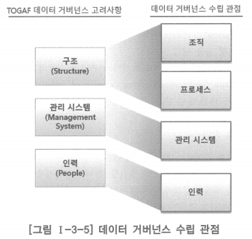

# 1. 데이터 거버넌스 구성 개요

# TOGAF(The Open Group Architecture Framework)

- 구조, 관리 시스템, 인력 관점에서 데이터 거버넌스 수립 접근을 고려하도록 제시

## 구조(Structure)

- 기업이나 조직이 데이터아키텍처 정보를 관리하는데 필요한 조직 체계와 정책, 원칙, 표준 지침 및 적절한 관리 프로세스를 갖추어야 함

## 관리 시스템(Management System)

- 라이프 사이클 관점에서 데이터아키텍처 정보 관리에 필요한 관리 시스템과 데이터 관련 프로그램을 보유해야 함

## 인력(People)

- 기업이나 조직이 혁신을 위해 필요로 하는 데이터 관련 기술과 역할을 정의하고 구성하도록 함
- 기업이나 조직에 그러한 자원과 기술이 부족하다면, 필요로 하는 중요한 기술을 습득하거나 잘 정의된 학습 프로그램을 통해 요구사항을 충족하도록 기존의 내부 인력을 훈련하는 것을 고려해야 함

- TOGAF에서 제시한 데이터 거버넌스 구성에 대한 고려 관점과 동일하며, 이들을 매핑하여 연결해보면 위와 같음