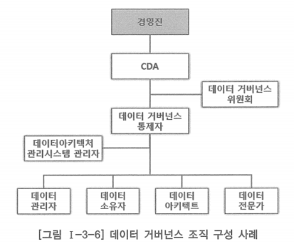

# 2. 데이터 거버넌스 조직

# 가. 데이터 거버넌스 조직 개요

- 데이터 거버넌스 조직 체계
    - 데이터아키텍처 관리를 위해 필요한 직무와 직무 간의 관계, 업무 분장을 정립하는 것
    - 계획자 수준에서 실무자 수준까지 다양한 시각에서 책임과 역할이 정의되어야 함
- 데이터 거버넌스 조직은 기업 전체 또는 정보 관리 전체 조직과 일관성을 확보해야 함

## 데이터 거버넌스 조직의 직무 예

### 데이터아키텍처 담당 임원(CDA, Chief Data Architect)

- 전사 데이터아키텍처 수립 및 데이터 거버넌스 관리에 대한 투자 의사결정과 데이터아키텍처와 데이터 거버넌스의 주요 추진 과정에 대한 승인, 전사적 지원의 확보를 담당
- CDO(Chief Data Officer)로 부르기도 함

### 데이터 아키텍트(DA, Data Architect)

- 데이터아키텍처에 대한 전체적 원칙 및 방향 정의, 데이터아키텍처 관리의 총괄을 담당
- 다수의 DA를 계층적으로 구성 시 전사 DA와 영역별 DA로 구성할 수 있으며, 전사 DA는 영역별 DA 총괄 및 조정 담당

### 데이터 소유자(Data Owner)

- 데이터 관리자에 의해 위임되어 담당 영역의 데이터에 대한 접근 및 사용 권한에 대해 승인하고 해당 데이터의 자산 가치를 확보하기 위한 데이터 구조 승인, 데이터 품질과 법적 규제 및 정책 요건 충족의 일차적인 책임을 수행

### 데이터 관리자(Data Steward)

- 데이터 요소 변경 절차에 따른 권한 승인, 데이터 관련 이해관계자 및 데이터 소유자를 결정, 데이터 품질 및 무결성에 대한 전반적 책임과 데이터 관리 구현 및 실행을 담당
- 기업이나 조직 여건에 따라 데이터 소유자로부터 위임받아 특정 데이터의 품질과 법적 규제 및 정책 요건 충족의 일차적인 책임을 수행할 수도 있음

### 데이터 통제자(Data Governor)

- 데이터 거버넌스 정책 및 표준 프로세스 등의 데이터 거버넌스 기획과 프로세스 운영 및 모니터링 등을 담당

### 데이터아키텍처 관리 시스템 관리자

- 데이터아키텍처 관리 시스템의 구축 및 운영을 담당

### 데이터 거버넌스 위원회(Data Governance Steering Committee)

- 데이터 거버넌스 수립 및 적용에 관련된 전사적인 중요 의사결정에 대한 승인 또는 자문을 수행하는 그룹

# 나. 데이터 거버넌스 조직의 정의

- 구축된 데이터아키텍처 정보를 관리하는 전담 조직이 없다면 데이터아키텍처 정보는 하나의 문서에 불과하게 됨
- 데이터아키텍처 정보는 계층간 얼라인먼트와 무결성, 전사적 통합성을 유지하며 지속적으로 관리되어야 함
- 기업이나 조직의 상황에 맞게 데이터아키텍처를 관리하기 위한 데이터 거버넌스 조직을 정의할 필요가 있음
- 데이터 거버넌스 조직은 선진 사례를 참고하고, 전사의 정보 관리 정책 및 체계, 전사아키텍처 관리 조직의 구성 및 연계, 문제점 등을 파악해 구축·개선 방향을 도출하여 이를 기반으로 데이터 거버넌스 조직을 정의

## 데이터 거버넌스 조직의 특징

- 데이터아키텍처 정보의 관리와 데이터 거버넌스 운영을 위한 위원회 및 전담 조직 정의
- 데이터아키텍처와 관련된 이슈가 있을 경우 공론화한 회의를 통해 관련 문제를 해결해 나갈 수 있는 체계 정의

## 데이터 거버넌스 조직 구성 사례

- 위 데이터 거버넌스 조직 구성 사례에서 데이터 전문가는 데이터 정의 대상이 되는 비즈니스 도메인과 데이터 또는 정보 기술 분야의 전문가로, 데이터 모델러·DBA 등을 통칭한 것
    - 기업이나 조직의 자체 보유 역량으로 부족할 경우 외부의 데이터 전문가를 활용할 수도 있음
- 데이터 거버넌스 조직 구성의 핵심은 전사 데이터아키텍처와 데이터 거버넌스를 책임지는 최종 승인자와 운영 실무자, 데이터 소유자가 명확히 정의되어야 데이터에 대한 관리 책임이 분명해진다는 것
- 데이터 아키텍트(DA)는 데이터아키텍처 정보 구축과 유지에 대한 총괄 책임을 수행하는 자로서 데이터 거버넌스 조직 구성에 고려되어야 한다는 것

## 데이터 거버넌스 조직을 정의할 때 고려할 사항

### IT 조직의 규모

- 데이터 거버넌스 조직을 별도로 구성하기 어려운 중소 규모의 IT 조직은 데이터 거버넌스 위원회(또는 TFT)를 중심으로 데이터 거버넌스 조직을 정의하고 데이터아키텍처 전담 인력 양성
- 데이터 거버넌스 조직을 별도 조직으로 구성하기에 충분한 규모의 IT 조직은 데이터 거버넌스 전담 조직을 구성하고, 데이터 거버넌스 위원회를 통해 전사적으로 데이터 관련 의사결정을 공유할 수 있는 조직 체계를 정의
- 전사아키텍처 관리 조직이 구성된 조직의 경우, 데이터 거버넌스 위원회는 전사아키텍처 관리 운영위원회의 일부일 수 있음
    - 별도의 데이터 거버넌스 위원회를 구성하지 않고 전사아키텍처 운영위원회에서 데이터 거버넌스 위원회 역할을 겸할 수 있으나, 데이터 거버넌스 위원회로서 수행해야 할 책임을 명확하게 정의하고 수행해야 함

### 데이터아키텍처 구축 목적

- 데이터아키텍처 구축 목적이 순수하게 데이터아키텍처 정보 관리와 데이터 표준화 등을 위한 것이면 데이터아키텍처 정보와 데이터 표준을 통합 관리할 수 있는 데이터 거버넌스 조직을 정의
- 데이터아키텍처 구축 목적이 새로운 시스템 구축을 위한 계획 수립이면, 프로젝트 기간 중 데이터아키텍처 정보를 체계적으로 관리할 수있는 조직이 필요함
    - 데이터아키텍처 정보를 중심으로 데이터아키텍처 프로젝트를 관리할 수 있는 PMO(Project Management Office)와 데이터 거버넌스 조직을 정의

### IT 조직과 현업의 관계

- 현업과 IT 조직 간의 의사소통 문제가 있을 경우 데이터 거버넌스 위원회는 현업의 요건을 종합적으로 관리하고 중재 및 해결하는 역할을 추가로 정의