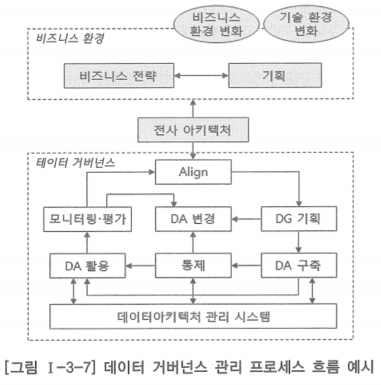
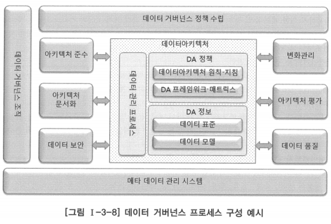
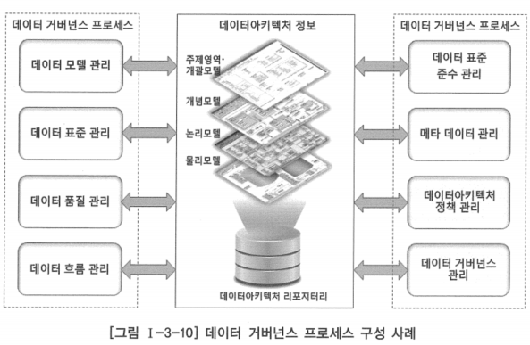
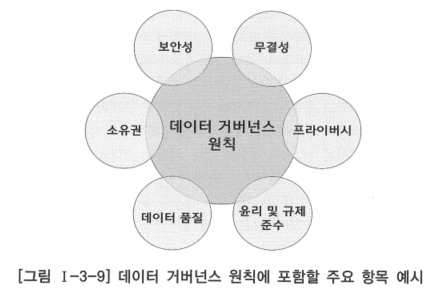
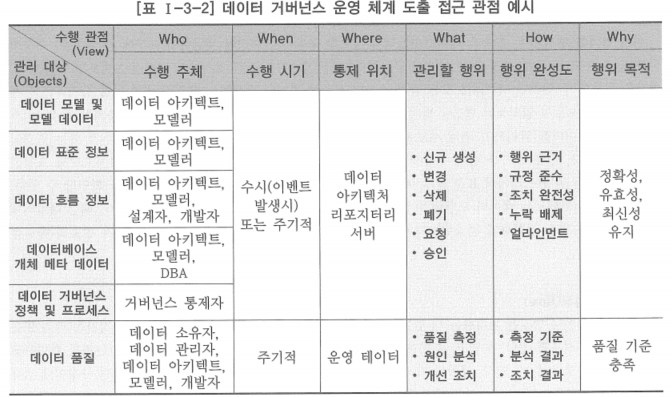

# 3. 데이터 거버넌스 프로세스

# 가. 데이터 거버넌스 프로세스 개요

## 데이터 거버넌스 프로세스

- 데이터아키텍처를 관리하기 위한 활동을 정의하는 것
- 데이터아키텍처 수립 및 관리와 관련된 모든 활동을 포함하고, 전사아키텍처 관리 및 전체 정보 관리 업무 체계와 일관성이 확보되어야 함
- 데이터아키텍처를 수립하고 관리하기 위해 수행하는 세부 업무 분류와 내용 정의는 물론, 데이터아키텍처 수립 및 관리를 위해 준수해야 할 규정이나 법적 요건, 구체적이고 표준화한 수행 절차 또는 문서 양식을 정의하는 것을 포함

### 데이터 거버넌스 기획

- 데이터아키텍처 관리의 방향을 정의하는 데이터 거버넌스 정책 수립과 데이터아키텍처를 효과적으로 구축 및 활용하기 위한 계획 수립 등의 데이터아키텍처 정보 및 관리 체계 추진의 기획과 관련된 제반 활동
- 비즈니스 환경 변화에 따른 전사아키텍처 변경과의 얼라인먼트를 유지하기 위해 필요한 사항을 검토하는 활동을 포함

### 데이터아키텍처 구축·변경 관리

- 데이터아키텍처 정보의 구축에 대한 검토·승인과 데이터아키텍처 정보 변경에 대한 검토·승인·변경 이행 등 데이터아키텍처 정보의 최신성과 품질을 확보하기 위한 제반 활동

### 데이터아키텍처 준수 통제

- 데이터아키텍처 정보를 구축·변경하는데 있어서 제반 정책 및 원칙이 준수되는지, 관련 현업 부서에서 데이터아키텍처 정보를 참조하고 준수하는지 등을 점검하고 지원하는 등의 데이터아키텍처 준수도 제고를 위한 제반 활동

### 데이터아키텍처 활용 지원

- 데이터아키텍처 관계자를 포함하여 관련 현업 부서에서 데이터아키텍처 정보를 잘 활용하도록 데이터아키텍처 정보의 공지, 홍보, 교육, 활용 사례 소개 등 데이터아키텍처 활용도를 제고하기 위한 제반 활동

### 데이터아키텍처 관리 시스템 관리

- 데이터아키텍처 관리 및 활용도 제고를 위한 데이터아키텍처 정보 관리 시스템을 구축하고 운영하는 제반 활동
- 메타 데이터 관리 시스템으로 많이 알려져 있는 지원 시스템에 대해 데이터아키텍처 정보를 관리하기 위한 리포지터리 구성, 데이터 표준 관리, 데이터아키텍처 정보 관리, 변경 승인 관리, 표준 준수도 점검 등의 기능을 구현하고 이에 대한 지속적인 유지보수 및 활용 활성화를 수행

### 데이터아키텍처 평가

- 데이터아키텍처 관리 및 활용 수준의 제고를 위해 데이터아키텍처 관리 프로세스의 수행을 모니터링하고, 데이터아키텍처에 대한 평가 모형을 정의하여 주기적인 평가 및 개선 기회를 식별하는 제반 활동

# 나. 데이터 거버넌스 프로세스 구성

- 데이터 거버넌스 프로세스는 일반적으로 데이터아키텍처 구축과 구축 후 이를 활용하고 통제하는 내용으로 구성됨
- 비즈니스 환경이나 기술 환경의 변화와 사용자 요구, 데이터아키텍처 활용 상태 등을 평가하여 필요한 변경 조치를 취하며, 이것이 다시 데이터 아키텍처 정보로 구축되어 전사적으로 적용되는 흐름을 가짐
- 데이터 거버넌스 프로세스의 정의는 데이터아키텍처 구축을 통해 모든 활동이 데이터아키텍처 중심으로 수행될 수 있도록 해야 함
- 기존의 IT 프로세스에 데이터아키텍처 변경 및 관리 프로세스만을 신규로 추가하여 정의한다면, 기존의  IT 프로세스에 따라 개발 및 운영이 진행되어 데이터 거버넌스 프로세스가 제대로 수행되지 않을 수 있음
    
    → 이는 데이터아키텍처가 제대로 관리되지 않을 문제로 연결됨
    
- 데이터아키텍처 관리를 위한 관련 프로세스가 제대로 수행되지 않을 경우, 데이터아키텍처 정보의 최신성이 유지되기 어려울 수 있음
- 데이터아키텍처 원칙 및 데이터 거버넌스 원칙이 IT 프로세스 활동에 제대로 적용되지 않아 데이터아키텍처 정보를 온전하게 유지할 수 없는 문제도 발생할 수 있음

## 데이터 거버넌스 프로세스 구성 예시

- IT 프로세스 수립-활용·통제-평가-변경 등의 흐름을 데이터아키텍처 관점에서 식별하여 데이터아키텍처 정보 중심으로 설계하면, 데이터아키텍처 정보의 완전성을 유지하기에 용이함
- 데이터아키텍처 정보의 변경을 개발 및 운영 프로세스에서 식별하여, 데이터아키텍처 정보 변경의 단절이나 누락 없이 이어질 수 있도록 함
    
    → 데이터아키텍처 정보의 최신성을 유지할 수 있어야 함
    
- 사용자 요구에 따라 일부 애플리케이션의 변경이나 추가 등과 같은 유지 보수 프로세스가 발생할 경우, 데이터아키텍처 정보 변경을 위한 데이터 거버넌스 프로세스가 연계 동작하여 아래 과정이 애플리케이션 시스템의 유지 보수 프로세스와 맞물려 수행되면서 데이터 거버넌스 정책에 따른 제반 사항 검토 및 반영까지 수행되도록 해야 데이터아키텍처 정보를 항상 최신의 상태로 유지할 수 있게 됨
    - 개념·논리·물리 데이터 모델의 변경 및 데이터 표준 준수
    - 데이터 모델 변경에 따른 데이터베이스 개체 변경·생성과 데이터 이행
    - 문서화 및 검토
    - 사용자 검증 등

- 데이터 거버넌스의 구성 및 운영에 대한 전반적인 원칙 수립은 데이터 거버넌스 정책 수립 프로세스에서 수행됨
- 데이터 거버넌스에 대한 제반 사항들이 데이터 거버넌스 원칙에 정의됨으로써 데이터 거버넌스의 동작이 원활하게 이루어질 수 있게 됨
    - 데이터 거버넌스 조직의 활동
    - 데이터아키텍처 정보의 유지 관리
    - 메타 데이터 관리 시스템의 도입 및 활용 등

- 데이터 거버넌스 프로세스의 구성은 각 기업이나 조직의 여건에 따라 달라질 수 있기 때문에 다양한 구성과 운영 방식이 정의될 수 있음
- 앞서 제시한 데이터 거버넌스 프로세스 구성 외에도 기업이나 조직의 다른 여건을 고려하여 위 그림과 같이 구성할 수도 있음

## 데이터 거버넌스 원칙에서 중요하게 고려해야 할 항목

### 보안성(Security)

- 모든 사용자는 업무 및 의사결정을 위해 필요한 데이터에 대해 적절한 접근 권한을 가져야 함
- 데이터는 사용자의 역할에 따라 부여된 접근 권한에 맞게 사용되도록 해야 함

### 무결성(Integrity)

- 데이터는 일관성, 신뢰성, 적시성 및 정확성을 합리적으로 보장하여 수집하고 유지해야 함
- 악의적이거나 우발적인 변경으로부터 보호하여 데이터의 무결성을 유지하도록 해야 함
- 이를 위한 데이터 구조 설계와 대안 적용, 사용자의 데이터 처리 및 활용 등을 위한 원칙을 제시하고, 준수 여부 모니터링과 평가 및 지속적이 교육이 필요함

### 프라이버시(Privacy)

- 민감한 데이터를 식별하고 무단 액세스와 부적절한 공개로부터 보호해야 함
- 이에 관련된 법적 요건을 충족해야 함

### 윤리 및 규제 준수(Ethics & Compliance)

- 데이터는 윤리 원칙, 허용된 모범 사례 및 법적 요건에 따라 접근 및 사용되어야 함
- 접근 권한에 의해 허용되지 않은 데이터에 접근하지 않아야 함

### 데이터 품질(Data Quality)

- 데이터 품질을 유지하기 위한 책임은 모든 사용자에게 있음
- 데이터는 설계 의도에 따라 유효한 최신 상태가 정확하게 반영되어야 하고, 의미 있는 업무 기록이 확보되도록 해야 함

### 소유권(Ownership)

- 데이터 오너십(소유권)은 데이터의 자산 가치를 확립하기 위한 책임 소재에 대한 사항
- 필요한 데이터를 정의하고 데이터 구성의 변경에 대해 의사결정을 하며, 데이터 품질과 접근 권한에 대한 책임을 수행하도록 주요 데이터 또는 데이터 그룹을 구분하여 해당 조직에 책임을 할당함
- 데이터의 오너십 외에도 데이터 거버넌스 수행 체계의 관리 책임에 대한 오너십도 고려되어야 함

# 다. 데이터 거버넌스 프로세스 도출 방법

- 데이터아키텍처 정보의 구축 및 유지·관리를 위한 데이터 거버넌스 프로세스 도출은 관리할 대상을 구체적으로 정의하는 것으로부터 시작됨
- 실질적인 관리 대상은 데이터아키텍처 매트릭스에 정의된 산출물
    - 개념·논리·물리 데이터 모델과 모델 데이터
    - 데이터 표준
    - 데이터 흐름 정보
    - DBMS에 생성된 데이터베이스 개체에 대한 메타 데이터 등
    - 데이터 품질까지 관리 대상의 범주에 포함시키기도 함
- 데이터 거버넌스에서 관리할 대상(Objects)에 대해 관리할 내용을 6하원칙에 따라 접근 관점(View)을 구분해 봄으로써 데이터 거버넌스 프로세스를 도출할 수 있음
- 데이터 거버넌스 프로세스 도출을 위한 대상과 관점은 기업이나 조직의 여건에 따라 조정하여 각자에 적합한 데이터 거버넌스 프로세스 구성을 도입하는 것이 바람직함

- 데이터 거버넌스 프로세스 도출을 위해 집중할 것은 데이터아키텍처 정보를 대상으로 수행되는 행위 또는 활동에 대한 체계적인 관리와 결과물의 품질 확보
- 필요한 데이터 거버넌스 프로세스 도출하기
    - 데이터 모델이나 데이터 흐름도 등과 같은 관리 대상물에 대해 수행될 수 이는 행위 또는 활동의 유형 정의
    - 관리 대상물 자체의 정확성이나 요구 충족 정도 등 기술적 차원의 관리 외에 관리 대상물이 거버넌스 목적을 충족하기에 충분한 수준의 완성도를 갖추었는지를 확인할 수 있는 관리 항목을 도출하여 매핑

## 효과적으로 데이터 거버넌스 프로세스 정의하는 법

- 위 표에서 제시한 6하원칙 관점 중 관리할 행위(What)와 행위 완성도(How)에 집중하여 데이터 거버넌스 프로세스를 설계
- 관리할 행위(What)와 행위 완성도(How)를 검토하여 거버넌스 프로세스가 도출되면 수행 주체, 수행 시기 등과 같은 나머지 관점 사항을 추가하여 프로세스 정의를 완성

### 관리할 행위(What)

- 데이터 거버넌스의 관리 대상에 대해 어떤 행위 또는 활동을 관리(통제)할 것인지를 결정
- 기본적으로 거버넌스 조직을 구성하는 역할(Role)에 따라 관리 대상(Object)에 대한 적절한 접근 권한이 부여되어 있는지가 고려되어야 함
- 관리 대상 정보에 대해 발생할 수 있는 행위 또는 활동
    - 신규 생성: 데이터 모델이나 엔터티, 표준 단어·용어 등과 같은 데이터아키텍처 정보의 신규 추가
    - 변경: 이미 생성된 데이터아키텍처 정보 구성요소에 대한 변경
    - 삭제: 이미 생성된 데이터아키텍처 정보 구성요소에 대한 삭제
    - 폐기: 용도가 완료되었거나 더 이상 사용하지 않는 데이터아키텍처 정보 구성요소에 대한 폐기(라이프 사이클에 따른 보존연한 만료 경우도 고려)
- 위에 열거한 행위 또는 활동은 데이터아키텍처 정보의 구축이나 변경에 해당하기 때문에 관리(통제) 대상이 되며, 관리(통제)는 크게 ‘요청’과 ‘승인’으로 구분
- 중소규모의 IT 조직에서는 여건상 별도의 관리(통제) 과정을 생략할 수 있지만, 원칙적으로는 관리 대상의 형상에 변경이 발생하는 행위에 대해 이를 승인하는 통제 절차를 운영함으로써 임의적인 변경을 방지해야 함
- 예를 들어 ‘고객성향’이라는 데이터를 추가로 관리하고자 할 때
    - 해당 데이터를 관리하기 위해 새로운 주제영역과 데이터 모델이 추가되거나 엔터티 추가 또는 변경이 발생할 수 있음
    - 신규 추가나 변경이 발생한 논리/물리 데이터 모델에 대해 승인 절차를 거침으로써 요청된 신규 추가 또는 변경이 데이터 표준 준수 여부와 필요한 사항을 모두 반영하였는지 등을 재차 확인할 수 있음
    - 이때 데이터 아키텍트는 데이터 모델에 대한 조치 내용이 업무 목적에 적합하게 설계되었는지, 해당 데이터에 관련된 업무 규칙을 정확하게 반영했는지 등의 기술적 검토를 함께 수행하여 데이터아키텍처 정보의 품질 유지

### 행위 완성도(How)

- 신규 생성이나 변경을 처리하는데 있어서 검토해야 할 사항들을 정의
- 요청자는 행위 또는 활동의 완성도를 높일 수 있고, 승인자는 관리할 행위가 ‘승인’ 할 수 있는 수준에 이르렀는지를 확인하고 승인 근거로 삼을 수 있음
- 데이터 거버넌스의 관리 대상(Objects)에 ‘데이터’를 포함한다면 규정이나 법규에 따라 프라이버시(Privacy)에 관련된 데이터가 불필요하게 포함되어 있는지, 적절한 보호 수준을 준수하고 있는지 등의 검토와 데이터 품질에 대한 고려가 포함되어야 함
- 관리 대상(Object)에 대한 ‘승인’ 수준을 검토할 때 표준이나 규정 등에 따른 보안성, 무결성 등과 같은 원칙들이 충분히 고려되었는지를 확인해야 함
- 행위의 완성도를 가늠할 항목의 예
    - 행위 근거: 신규 생성, 변경 등과 같이 요청된 행위가 발생하게 된 근거에 대한 확인(예: 사용자 요구, 이해 관계자 협의 사항·회의록 등)
    - 규정 준수: 관련 표준이나 규정, 원칙 및 관련 법규 등에 대한 준수 여부 및 준수 수준
    - 조치 완전성: 요청 내용이 필요한 조치 항목을 모두 충족하는지 여부(예: 데이터 요소 설명 작성 여부, 관계명, 관계나 속성의 선택성 정의 등)
    - 누락 배제: 요청 내용이 아키텍처 매트릭스에 정의된 연계 대상을 누락 없이 포함하고 있는지 여부(예: 신규 추가된 엔터티가 데이터 흐름에 반영되었는지 여부)
    - 얼라인먼트: 요청 내용이 아키텍처 매트릭스에 정의된 얼라인먼트 유지 대상을 누락 없이 포함하고 있는지 여부