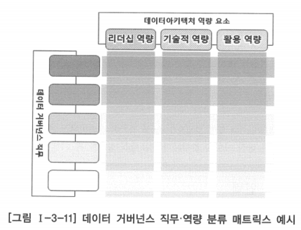
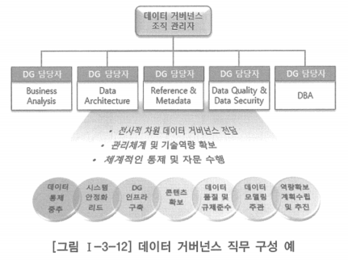

# 4. 데이터 거버넌스 인력

# 가. 데이터 거버넌스 인력 개요

## 데이터 거버넌스 인력

- 데이터아키텍처 관리를 담당하는 직무별 역량을 정의하고 이를 확보하기 위한 방안을 정의하는 것
- 데이터아키텍처 관리를 위해 필요한 역량 요소를 분류하고 역량 요소를 직무별로 할당한 후, 이러한 역량 요소를 확보하기 위한 교육 계획을 수립하고 역량 수준을 평가할 수 있는 체계도 포함
- 데이터아키텍처가 제대로 정착되고 성과를 발휘하기 위해서는 관련 인원들의 역량 확보가 매우 중요함
- 데이터아키텍처 관련 역량 강화를 위한 교육 프로그램은 구성원의 특성에 맞게 직무별로 맞춤식 교육이 제공될 수 있도록 해야 함

## 데이터아키텍처 역량 요소

### 리더십 역량

- 데이터아키텍처의 사상과 가치가 기업이나 조직에 어떤 의미가 있는지를 정확히 파악
- 기업이나 조직이 데이터아키텍처를 효율적으로 도입하고 효과적으로 활용할 수 있도록 데이터아키텍처에 대한 전사적 공감대를 형성
- 내재화를 위한 변화 관리를 제대로 이끌 수 있는 관리 능력

### 기술적 역량

- 데이터아키텍처의 구축 및 관리에 대한 절차와 방법론을 이해하고 있고, 데이터아키텍처 정보를 정의할 수 있음
- 데이터아키텍처 관리 시스템을 구축할 수 있는 기술적 능력
- 데이터 표준화와 데이터 모델링 능력은 데이터아키텍처 기술적 역량 중 가장 핵심

### 활용 역량

- 데이터아키텍처 정보를 활용하여 데이터 품질을 유지하고 데이터의 자산 가치를 실현
- 현업의 업무 활동 효율성과 효과성을 증대시킬 수 있는 실용적 능력
- 실질적으로 데이터아키텍처 투자에 대한 성과와 직접적으로 연관되어 있음

- 데이터 거버넌스 직무에 대해 요구되는 역량 요소를 파악하기 위해 그림과 같이 매트릭스 형태로 직무와 역량 요소를 나열하여 교차하는 셀에 대해 필요 역량을 검토하는 방법은 직무별 역량 요건을 파악하고 역량 확보를 위한 방법 및 기회를 제공하는데 도움이 됨
- 교차하는 셀에 대해 직무별로 어떠한 역량 요소가 필요한지를 검토하고, 필요한 상세 역량이나 기술을 구체적으로 기입함으로써 데이터 거버넌스를 위한 직무·역량 분류표를 작성하여 관리하고 활용하는 것이 바람직함

# 나. 데이터아키텍처 전문가 육성

- 데이터아키텍처 구축 완료 후 이를 관리하기 위한 조직을 정의하는 것만으로는 데이터아키텍처 정보를 지속적으로 발전시킬 수 없음
- 데이터아키텍처 정보를 지속적으로 발전시킬 수 있는 전문적 능력을 갖춘 데이터 아키텍트가 조직 내부에 있어야 함
- 잘 설계된 데이터아키텍처 정보를 보유하고 있더라도 지속적으로 발생하는 비즈니스 변화로 인한 불가피한 데이터 모델의 변경 상황에서 전문성을 갖춘 데이터 아키텍트가 적절하게 데이터 모델의 변경을 통제하지 않으면 데이터의 전사적 통합성과 유연성, 확장성을 유지하기가 어렵고 데이터 표준화 적용 수준도 저하되기 쉬움
- 데이터아키텍처 구축 프로젝트가 완료된 이후에 프로젝트에 참여한 내부 인력을 중심으로 관리 조직을 구성할 수도 있음
- 데이터아키텍처 구축 프로젝트에 참여한 인력을 데이터 거버넌스 조직으로 발령내고 데이터 아키텍트 임무를 부여하는 것만이 전부가 아님
- 진정한 데이터 거버넌스 인력으로 성장하기 위해서는 데이터 거버넌스 직무에서 필요한 기술 목록과 수준을 정의해야 함
- 이와 함께 부족한 기술이 있을 경우 교육을 통해 관련 기술을 쌓아 내재화할 수 있도록 관리해야 함

## 데이터 거버넌스 조직의 직무 구성 사례

- 데이터 거버넌스 및 데이터아키텍처 정보의 유지 관리와 관련하여 현재 조직 내부의 기술 수준을 평가하고 내부의 데이터 아키텍트를 비롯한 데이터 거버넌스 직무 수행 인력이 원활하게 데이터 거버넌스 업무를 수행할 수 있는 기술 수준에 도달할 수 있도록 인력 양성 계획을 수립해야 함
- 인력 양성 계획은 데이터 거버넌스 직무 수행 인력 각자에게 경력 개발 경로를 제시하고 교육 및 평가 과정을 통해 상위의 관련 직무로 성장할 수 있도록 함