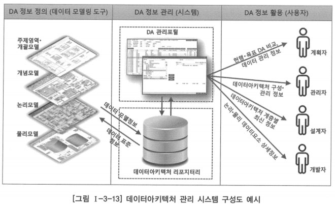
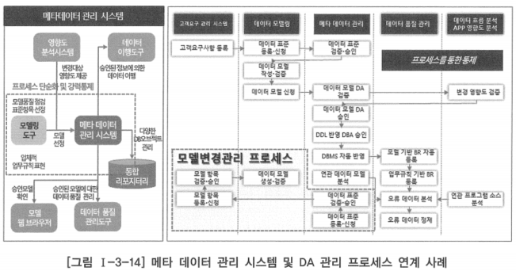

# 5. 데이터아키텍처 관리 시스템

# 가. 데이터아키텍처 관리 시스템 개요

## 데이터아키텍처 관리 시스템

- 데이터아키텍처 정보를 구축하여 관리하고 활용하는 모든 데이터아키텍처 업무 프로세스에 대한 효율성을 제고하기 위한 정보시스템
- 일반적으로 메타 데이터 관리 시스템이라는 명칭으로 많이 사용됨
- 최근에는 개념을 좀 더 확장하여 데이터 거버넌스 지원 시스템 혹은 데이터 거버넌스 솔루션이라는 이름으로도 사용됨
- 데이터 모델링 도구를 포함하는 정보 정의 도구 영역, 데이터아키텍처 리포지터리와 데이터아키텍처 관리 포털로 구성된 정보 관리 영역, 데이터아키텍처 정보 활용 영역으로 크게 구분할 수 있음

## 데이터아키텍처 관리 시스템 구성도 예시

### 데이터아키텍처 정보 정의 영역

- 데이터아키텍처 모델링 도구를 사용하여 데이터아키텍처 정보를 정의
- 데이터아키텍처 모델링 도구
    - 데이터아키텍처 정보를 도식화하여 표현할 수 있는 데이터 모델링 도구
    - 데이터 아키텍처 계층별 데이터 모델을 정의하는 도구
    - 계층별 데이터 모델을 정의하는데 있어서 각기 다른 도구로 구성되거나 하나로 통합된 도구

### 데이터아키텍처 정보 관리 영역

- 데이터아키텍처 리포지터리(Repository)와 데이터아키텍처 관리 포털로 구성되며, 경우에 따라서 데이터아키텍처 정보를 전문적으로 분석하여 활용하는 도구 포함
    - 데이터아키텍처 리포지터리: 데이터아키텍처 정보를 저장하기 위한 데이터베이스와 데이터아키텍처 정보 관리 데이터를 포함
    - 데이터아키텍처 관리 포털: 데이터아키텍처 정보를 다양한 사용자가 쉽게 접근할 수 있도록 유저 인터페이스 제공
        - 데이터아키텍처 정보를 제공하는 것만이 아니라, 이를 토대로 다양한 계층의 이해 관계자를 지원하기 위해 여러 가지 기능을 추가로 구현할 수 있음
            - 데이터 품질 관리 기능 연계 및 추가
            - 애플리케이션 아키텍처 정보와 연계하여 데이터-애플리케이션 연관 정보 및 변경 영향 분석 추가
        - 데이터아키텍처 정보 제공기능을 뼈대로 하여 각 기업이나 조직의 여건에 맞게 다양한 추가 기능을 구현하여 활용하고 있음

# 나. 데이터아키텍처 정보 정의 도구

- 데이터아키텍처 모델링 도구는 데이터아키텍처 정보를 도식화하여 표현할 수 있는 모델링 도구를 말함

## 데이터아키텍처 정보 정의 도구로서 데이터 모델링 도구

- 엔터티-관계 다이어그램 기법을 사용하여 데이터 구조를 표현
- 데이터아키텍처 프레임워크에 정의된 각 개체 간의 관계 표현과 산출물 생성 기능을 제공해야 함
- 데이터 모델 정보에 대한 질의와 보고서 생성 기능
- 데이터아키텍처 리포지터리 및 데이터아키텍처 관리 포털과 정보를 인터페이스할 수 있는 기능 제공
- 데이터아키텍처 계층간 얼라인먼트 유지와 역공학 또는 리버스 데이터 모델링 지원
- 데이터 표준 적용 및 준수 검증·물리 데이터 모델 자동 생성
- 물리 데이터 모델로부터 데이터베이스 개체 생성 등을 지원해야 함
- 정교하고 상세화한 논리 데이터 모델을 정의할 수 있어야 함
- 데이터아키텍처 관리 시스템의 구성요소로서 역할을 하기 위해 데이터아키텍처 리포지터리에 직접 연결하여 데이터 모델을 저장하고 변경할 수 있어야 함
- 리포지터리에 저장된 데이터 표준 정보를 데이터 모델에 적용할 수 있어야 함
- 리포지터리에 저장된 모델 관련 정보를 데이터아키텍처 관리 포털을 통해 다양한 계층의 이해 관계자에게 제공할 수 있어야 함

- 데이터 모델링 도구를 사용하여 데이터아키텍처 정보를 정의하고 등록하는 이유
    - 데이터아키텍처 정보의 표준화 및 활용도를 높이기 위한 것
    - 데이터아키텍처 정보에서 계층별 상세화 수준에 따른 개념·논리·물리 데이터 모델 간의 얼라인먼트와 데이터 표준의 적용
    - 데이터 흐름으로 정의된 데이터간 연관 관계 정보까지 관리하여 상호운용성과 통합성 효과 발휘

# 다. 메타 데이터 관리 시스템

- 데이터아키텍처 정보 관리 시스템은 메타 데이터 관리 시스템이라는 이름으로 더 널리 사용되고 있음
- 데이터아키텍처 정보를 저장하는 리포지터리와 데이터아키텍처 정보를 사용자에게 배포하는 포털로 구성됨
- 데이터아키텍처 정보를 기반으로 전문적인 분석을 수행할 수 있는 도구가 추가되기도 함

## 데이터아키텍처 정보 관리 시스템(메타 데이터 관리 시스템)의 구성 사례

### 메타 데이터 관리 시스템 기능

- 데이터아키텍처 정보에 대한 버전 관리
- 데이터 모델 및 데이터 표준 정보의 변경 관리
- 현행 및 목표 데이터아키텍처 정보 간의 비교
- 아키텍처 매트릭스나 참조모델과의 연계
- 데이터아키텍처 사용자의 권한 관리
- 데이터아키텍처 정보에 대한 활용 지원 및 통계, 분석 및 의사결정 지원 기능

### 메타 데이터 관리 시스템 도입 방법

- 패키지 형태로 도입하여 커스터마이징하는 방법
- 자체 시스템으로 구축하는 방법
- 장단점은 일반적인 패키지 도입과 자체 개발의 차이 관점에서 보면 됨

### 메타 데이터 관리 시스템의 도입 효과

1. 데이터아키텍처 정보를 쉽게 공유할 수 있어 해당 조직의 데이터 구조에 대해 이해 관계자들이 정확하게 파악할 수 있음
    - 최신의 데이터아키텍처 정보를 이해 관계자 계층별 관점에 맞게 제공할 수 있게 됨
    - 동시에 다수의 사용자에게 동일한 정보를 제공할 수 있음
    - 메타 데이터 관리 시스템의 다양한 조회 기능을 통해 좀 더 빠르게 데이터아키텍처 정보에 접근할 수 있음
    
2. 의사소통 도구로 메타 데이터 관리 시스템을 활용할 수 있음
    - 현업과 IT 조직이 공유할 수 있는 데이터 모델을 메타 데이터 관리 시스템을 통해 제공함으로써 현업과의 의사소통 시 오류를 줄일 수 있음
    - 데이터아키텍처 정보에 정의된 논리/물리 데이터 요소 간의 연관 관계를 파악하여 관련 데이터 오너(소유자) 조직과 사전에 협의하여 문제를 조기에 해소함으로써 현업의 만족도를 높일 수 있음
    
3. 메타 데이터 관리 시스템을 의사결정 도구로 활용할 수 있음
    - 업무 및 IT 서비스와의 차이를 분석하고 개선점을 파악하는데 메타 데이터 관리 시스템을 이용할 수 있음
    - 현행 데이터아키텍처와 목표 데이터아키텍처 간의 차이 분석을 손쉽게 할 수 있음
    - 시스템 개선 및 목표 데이터아키텍처 간의 차이 분석을 손쉽게 할 수 있어, 시스템 개선 및 목표 데이터아키텍처로의 전환과 관련하여 좀 더 빠른 의사결정을 할 수 있음