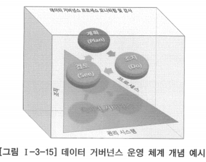

# 1. 데이터 거버넌스 운영 개요

- 데이터아키텍처 정보를 구축하는 것 못지않게 데이터아키텍처 정보를 효과적으로 활용할 수 있도록 최신 상태를 유지·관리하는 것이 중요함
- 데이터아키텍처 정보의 구축, 유지·관리, 활용 등 데이터아키텍처 정보에 연관된 모든 과정이 체계적으로 잘 관리되어야 함
- 최상의 데이터 수준과 품질을 확보하고 자산으로서의 데이터의 가치를 확고히 하는데 데이터 거버넌스가 반드시 필요하다는 의미
- 데이터 거버넌스 운영 체계를 갖추기 위해서는 앞서 설명한 바와 같이 각 기업이나 조직에 적합한 데이터 거버넌스 프로세스 정의와 이를 수행할 조직과 적절한 관리 시스템이 뒷받침되어야 함
- 데이터 거버넌스 프로세스를 효과적으로 실효성 있게 수행하기 위해서는 기술적·관리적 역량을 갖춘 데이터 거버넌스 조직이 필요하며, 데이터 거버넌스 조직의 역할이 명확하게 정의되어야 함
- 조직의 역량을 갖추기 위해 필요하다면 외부에서 전문 인력을 소싱하거나 내부 역량 확보를 위한 교육 등 다양한 방법이 사용될 수 있음
- 프로세스와 조직 역량이 갖추어져도 효율적으로 데이터 거버넌스를 수행하기 위해서는 관리 시스템의 지원이 반드시 필요함
- 관리 시스템 없이 조직과 사람 만으로 프로세스를 운영하게 되면 인력이나 시간 낭비가 커지고 수행 내용에서도 담당자마다 불일치나 수행 누락 등과 같은 오류가 빈발하여 데이터아키텍처 정보의 품질을 유지하기 어려울 수 있음

- 데이터 거버넌스는 조직·프로세스·관리 시스템이 조화로울 때 제대로 운영될 수 있으며, 데이터 거버넌스 프로세스는 계획(Plan)·조치(Do)·검토(See)의 틀 안에서 수행되어야 함
- 데이터 거버넌스 프로세스를 수행할 때 일정·담당자·조치사항·조치 근거·검증 방법 등과 같은 수행 계획을 수립하고, 이에 따라 적절한 조치가 이루어지고 나면 계획에 의거하여 조치 결과를 검증하는 과정으로 프로세스의 틀을 구성하는 것이 바람직함
- 모든 데이터 거버넌스 프로세스에 대해 프로세스의 효과성이나 개선점을 파악할 수 있는 모니터링 및 감사 활동과 이에 대한 수행 주체, 수행 방법 등이 데이터 거버넌스에 추가되어야 함

