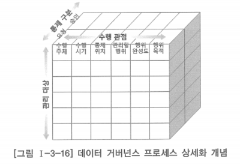
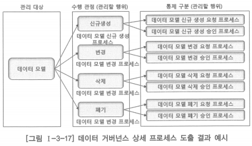
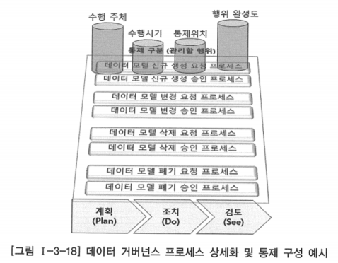

# 2. 데이터 거버넌스 프로세스 운영 및 통제

- 데이터 거버넌스 프로세스는 관리 대상에 대해 관리할 행위와 행위 완성도를 매핑하여 프로세스를 도출하고 정의할 수 있음
- 프로세스가 좀 더 실효성을 가지려면 프로세스를 관리 가능한 수준으로 더 분할하고, 분할한 프로세스에 대해 다시 수행 관점과 요청·승인 등 통제 구분을 추가하여 상세 프로세스를 도출하고 정의

## 데이터 거버넌스 프로세스 상세화

- 통제 가능한 데이터 거버넌스 상세 프로세스를 구성하는 개념 도식화

## 데이터 거버넌스 상세 프로세스 도출

- 위의 상세 프로세스 구성 개념에 따라 데이터 모델에 대해 관리할 행위 관점과 통제 구분에 따라 세분화

- 통제가 반영된 데이터 거버넌스 상세 프로세스를 도출한 결과에 대해 나머지 접근 관점을 추가하고 계획·조치·검토 구성 체계를 적용하면 상세 프로세스를 완성할 수 있음
- 관리 대상의 신규 생성이나 변경 등과 같은 상위 프로세스에 대해 요청·승인의 통제 구분을 추가한 상세 프로세스를 도출하고, 여기에 수행 주체·수행 시기·행위 완성도 등과 같은 내용을 추가하면 데이터 거버넌스 상세 프로세스를 정의할 수 있음
- 앞 그림에서 제시한 데이터 모델에 대한 데이터 거버넌스 상세 프로세스 중 데이터 모델 신규 생성 요청 프로세스에 대해 나머지 접근 관점과 계획·조치·검토 구성 체계를 적용하여 상세 프로세스를 정의한다고 할때, 아래 내용을 명시하여 상세 프로세스로 정의해야 함
    - 데이터 모델의 신규 생성을 수행하고 승인을 요청할 주체와 수행 및 승인 요청 방법
    - 수행 및 승인 요청 시기
    - 수행 및 승인 요청 시 신규 생성이라는 행위 또는 활동의 완성도를 평가할 수 있는 방법 등
- 수행 및 승인 요청 방법에 대해 이를 계획·조치·검토 관점으로 하위 세부 프로세스를 나열하고 각각의 구체적인 수행 방법과 확보할 근거나 산출물 등을 정의하여 데이터 모델 신규 생성 요청에 대한 상세 프로세스 정의

## 상세화 방법의 개념 도식화

- 데이터 거버넌스 통제자는 이와 같은 데이터 거버넌스 프로세스의 구성과 운영을 관리하며, 각 프로세스들이 원활하게 수행되고 있는지와 개선할 점이 있는지 등을 파악하기 위해 프로세스 수행 결과를 지속적으로 모니터링
- 관리 대상에 따라 책임을 담당하는 각 수행 주체들은 자신이 담당하는 관리 대상에 대해 상세 프로세스들을 정의하고, 각 프로세스의 수행 결과에 대한 행위 완성도를 검증할 수 있는 방법과 확인할 수행 근거들을 정의하여 각 프로세스들이 적절한 통제 하에 수행될 수 있도록 해야 함

### 데이터 거버넌스 운영 및 통제 활용

- 데이터아키텍처의 현행 데이터아키텍처 정보를 바탕으로 시스템을 운영
- 데이터의 현재 상태를 빠르고 정확하게 파악할 수 있도록 함
- 사용자의 개선 또는 추가 요구 발생 시 데이터아키텍처 정보를 바탕으로 수용 또는 적용 방안을 결정하여 시스템 및 데이터 구조 변경에 반영하는 것
- 시스템 운영 시 성능 문제나 장애 발생에 대응하여 신속한 파악과 해결에 데이터아키텍처 정보가 매우 유용하게 활용될 수 있음

### 데이터아키텍처 정보

- 매핑되지 않는 비즈니스 아키텍처 정보 요소나 애플리케이션 아키텍처 정보 요소를 확인하는데 사용됨
- 더 이상 사용되지 않는 데이터를 인지하는데 사용됨으로써 시스템의 도입 및 폐기의 근거 자료가 될 수 있음
- 운영 상에 발생하는 이슈의 경중이나 우선순위를 가릴 수 있는 정보로도 활용할 수 있음
- 데이터 품질 지표는 데이터아키텍처 정보 구축 효과를 평가하기 위한 단서로 활용될 수 있음
- 데이터 거버넌스 프로세스에 대한 주기적인 평가와 보완이 이루어져야 함
- 피드백이나 실행을 통해 도출된 보완 내용이 데이터 전략이나 예산 프로세스에 제공될 수 있음