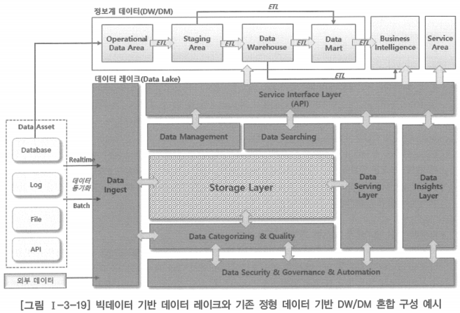

# 1. 데이터 거버넌스의 확장

- 기업의 비즈니스 환경이 갈수록 더 복잡해지고 4차산업혁명의 바람과 함께 정보기술을 이용한 기업 혁신을 추구하는 디지털 트랜스포메이션(Digital Transformation)이 키워드로 떠오르면서 우리가 접하는 정보기술과 데이터 형태는 매우 다양하고 폭넓게 변화하고 있음
- 사물 인터넷(IoT)과 클라우드 컴퓨팅, 인공지능(AI), 빅데이터 솔루션 등 새로운 정보통신기술(ICT)을 이용한 플랫폼이 등장하고, 이에 따라 그동안 비즈니스 영역에서 많이 다루지 않았던 비정형, 반정형 데이터 등 다양한 형태의 거대한 규모의 데이터들이 비즈니스 영역으로 진입하고 있음
- 사용자의 요구 수준도 높아지고 있고, 그동안 데이터아키텍처가 주로 다루었던 관계형 데이터베이스(RDB)에서 처리되는 정형 데이터 위주의 비즈니스 데이터들에 더하여 다양한 플랫폼에서 생산된 비정형, 반정형 데이터와 외부에서 생산된 데이터까지 업무에 활용하고자 하는 방향으로 사용자의 요구가 변하고 있음
- 다양한 유형의 데이터를 기업이나 조직이 통합적으로 활용하여 새로운 인사이트와 기업의 경쟁력을 확보할 수 있도록 하기 위해서 데이터를 어떻게 관리하고 연계해야 하는지 등과 같은 새로운 형태의 데이터아키텍처와 데이터 거버넌스 체계를 요구하고 있음
- 기업이나 조직은 데이터에 기반한 합리적인 의사결정을 하기 위해 점점 더 많고 다양한 유형의 데이터 활용을 필요로 하고 있음
- 이에 따라 자연스럽게 데이터 중심적인 비즈니스 패러다임이 기업이나 조직에 자리를 잡아 가고 있음

# 데이터 레이크(Data Lake)

- 매일 새롭게 쏟아지는 다양한 유형의 수많은 데이터를 비즈니스에 활용하기 위해 최근에 이르러 주목받고 있는 기술
- 모든 유형의 데이터를 보관할 수 있는 대규모 저장 창고로 이해할 수 있음
- 저장에서 끝나는 것이 아니라 데이터를 관리하고 분석해서 새로운 정보를 찾아낼 수도 있어 빅데이터를 활용하는 새로운 플랫폼 기술로 주목받고 있음
- 데이터 레이크에 대한 관심이 높아지면서 이제 그동안 축적한 정형의 비즈니스 데이터와 데이터 레이크에 집적된 다양한 유형의 수많은 데이터를 결합하여 업무에 활용할 수 있는 방법과 이러한 환경에서 데이터를 어떻게 관리해야 하는지에 대해 새롭게 관심이 모아지고 있음
- 이에 대한 기술적 대안은 아직까지 정형화 또는 안정화하고 있다고 보기 어려우며, 계속해서 새로운 대안과 기술 솔루션들이 등장하여 검증되고 있음

## 데이터 레이크와 기존의 정보계 데이터를 연계하는 개념적 구성

- 데이터 레이크를 구축하는 방법론이나 기술에 대한 내용보다 빅데이터가 개입되는 기술 환경 변화에서 데이터아키텍처와 데이터 거버넌스는 어떻게 대처해야 할 것인가에 대한 문제를 생각해봐야 함

- 하부의 데이터 레이크
    - 다양한 유형의 데이터를 수집하여 정형·비정형 분석을 통해 필요한 정보를 추출할 수 있도록 하고 있음
- 상위의 정보계 데이터 영역
    - 기존의 비즈니스 데이터를 저장하고 있는 복수의 데이터베이스로부터 추출한 데이터를 통합·변환·가공하여 데이터 웨어하우스(DW, Data Warehouse) 및 데이터 마트(DM, Data Mart) 정보를 생성
    - 데이터 레이크로부터 추출한 요약 또는 분석 결과를 데이터 웨어하우스와 데이터 마트에 병합하여 비즈니스 인텔리전스(BI, Business Intelligence) 솔루션 영역으로 연결함으로써 데이터 분석·활용의 폭을 확장하도록 구성

- 최근의 데이터 활용 경향은 다양한 데이터를 분석에 활용함으로써 기존에 비즈니스 데이터만으로 수행하던 분석에 더하여 더 넓은 범위와 유형의 결과를 얻을 수 있도록 분석 영역을 확장하고자 하는 시도가 빈번하게 나타나고 있음
- 정보기술 환경의 변화는 필연적으로 확장된 데이터의 효율적인 관리 체계 수립으로 나아가게 하고 있음

## 데이터 거버넌스 체계 수립을 위해 고려할 사항

### 전사의 범위와 관리 대상 데이터 유형

- 기존의 데이터아키텍처에서는 일반적으로 구조화한 정형 데이터 위주로 전사의 범위를 정의함
- 관리 대상 데이터는 거의 대부분 비즈니스에 밀접하게 연관된 구조화한 정형 데이터
- 정보기술 환경의 변화에 따라 다양한 유형의 빅데이터가 관리 범위에 들어오기 시작했기 때문에 이러한 데이터가 생산되는 원천(시스템)까지 전사의 범위로 고려될 필요가 있음
- 데이터가 발생되는 원천(시스템)은 기업이나 조직 내부에 있을 수도 있고, 외부에 있을 수도 있기 때문에 전사의 범위를 명확하게 정의하고, 그 외부의 데이터를 안정적으로 수집하는 방안이 함께 검토되어야 함

### 데이터 흐름 관리 범위

- 관리해야 할 데이터 유형 및 원천이 다양해짐에 따라 원천으로부터 데이터아키텍처 관리 범위 내로, 혹은 데이터아키텍처 관리 범위 내부에서의 데이터 이동까지 포함하여 전체적으로 데이터의 이동 경로가 확장될 수 있음
- 그만큼 흐름 관리 대상이 되는 데이터가 늘어나고 데이터 이동을 위한 교환 기술이나 표준이 복잡해질 수 있음

### 민감 데이터의 식별 및 처리(비식별화)

- 민감 데이터는 개인정보만을 의미하지 않음
- 개인정보는 대표적인 민감 데이터에 해당하지만 기업이나 조직에서 바라보는 민감 데이터에는 개인정보 외에도 경영, 인사, 회계, 영업 등 다양한 비즈니스 영역에서 외부에 유출되거나 내부의 비인가자에게 노출되지 않도록 보호해야 할 데이터들이 포함됨
- 이러한 데이터들은 윤리 및 컴플라이언스(Compliance) 차원에서 다루어져야 하는 것이기 때문에 세심한 주의가 필요함
- 기업이나 조직에서 보호해야 할 민감 데이터를 식별하는 것은 매우 중요함
- 식별된 민감 데이터를 보호할 방법에 대해서 관련 전문가와의 협력을 통해 적절한 조치를 강구해야 함
- 비식별 처리가 수행된 데이터라 하더라도 다양한 접근 또는 다른 데이터와의 결합에 의해 재식별 가능성이 있을 수 있음을 고려하여 관련 전문가와의 협력이 반드시 필요함

### 다양한 원천 데이터를 고려한 데이터 품질 관리

- 기존의 데이터 품질 관리는 일반적으로 비즈니스와 연관된 구조화한 정형 데이터 위주로 이루어짐
- 데이터에 관련된 비즈니스 규칙을 표준화하여 관리 대상 데이터가 이 규칙을 준수하고 있는지, 구조화 개념에 의해 도출된 검증 사항들을 충족하는지 등을 검사하여 데이터 품질을 가늠하는 방식으로 데이터 품질 관리의 패턴 정의
- 빅데이터 플랫폼 환경에서는 비구조화한 데이터를 다루게 되기 때문에 기존의 방식만으로 데이터 품질을 관리하기 어렵게 됨
- 다양해진 데이터 유형 문제에 더하여 데이터의 생산이 통제 범위 밖에서 이루어지는 경우가 많다는 점 또한 데이터 품질을 관리하는데 어려움을 주는 요소가 됨
- 이러한 점들을 고려하여 다양한 유형에 대해 어떤 방법으로 데이터 품질을 관리할 것인지에 대한 고민이 필요함
- 데이터 유형별로 데이터 품질을 관리하는 방법을 달리 하는 것도 하나의 방법이 될 수 있음
- 데이터 이동 경로 상에서 어느 위치에서, 어떤 시점에 데이터 품질이 검증되어야 하는지에 대한 문제도 함께 고민해 보아야 함

### 데이터 카탈로그 또는 메타 데이터 관리

- 데이터 레이크의 특징은 원시 데이터(Row Data)를 그대로 저장한다는 점
- 데이터 웨어하우스에 데이터를 저장하기 위해서는 데이터를 추출-변환-적제(ETL)하는 과정을 거침
- 구조가 다른 각기 다른 데이터베이스에서 가져온 데이터이기 때문에 데이터 웨어하우스에 설계된 하나의 구조로 맞추기 위한 처리 과정이 필요함
- 데이터 레이크는 원칙적으로 이러한 ETL과 같은 중간 처리 과정을 두지 않음
- 다양한 원시 데이터를 그대로 저장해두고 있다가 분석 시점에 필요한 형태로 데이터 가공
- 이러한 처리를 하려면 ‘카탈로그’라는 기능이 반드시 필요함
    - 어떤 데이터가 어디에 저장되어 있는지 카탈로그 정보를 만들어놓고, 분석이 필요할 때 그것을 보고 필요한 데이터가 있는 곳의 데이터에 접근하는 것
    - 카탈로그는 메타 데이터라고 부르기도 하는데, 저장된 데이터에 대해 알 수 있는 내용들을 갖고 있기 때문에 ‘데이터의 데이터’라는 관점에서 메타 데이터라고 부르기도 함
    - 기존의 구조화된 데이터들은 거의 대부분 관계형 데이터베이스에 저장된 데이터이고, 관계형 데이터베이스는 내부적으로 이미 다양한 메타 데이터를 생성하여 사용하고 있기 때문에 이것을 활용하여 데이터를 이해할 수 있었지만 데이터 레이크에 저장된 파일 데이터와 같은 데이터들은 그와 같은 메타 데이터가 제공되지 않아 일반적으로 데이터 레이크를 운영하는 쪽에서 직접 만들어 사용함
    - 카탈로그 또는 메타 데이터를 어떻게 구성할 것인지에 대한 설계와 데이터 확보가 매우 중요한 사안이 됨
    

### 적재 파일 및 용량 관리

- 기존의 구조화한 데이터는 주로 관계형 데이터베이스에 저장되었고, 업무 수행에 따라 주로 텍스트 형태의 데이터로 생성되기 때문에 기계적으로 발생하는 트랜잭션 데이터가 아닌 한은 데이터의 증가가 빠르지 않고 데이터베이스의 저장 용량을 관리하는 것도 상대적으로 수월한 편
- 데이터 레이크에 저장되는 데이터는 보통 파일 형태로 되어 있고, 데이터 유형이나 사이즈·발생 주기 등도 아주 다양함
- 이러한 환경에서 데이터 적재 현황을 관리하기 위해서는 관리할 항목을 미리 선정하여 지속적인 점검과 예측이 수행되어야 함
- 관리 항목의 예
    - 데이터 총 사이즈
    - 테이블별 파일 사이즈
    - 금일 중분 데이터 사이즈

### 데이터 분류 체계

- 데이터 모델은 정형 데이터를 대상으로 하는 구조화한 환경에서 전통적으로 데이터의 이해 및 관리에 대한 지도 혹은 지침 역할
- 데이터 분류체계(Taxonomy)는 구조화하지 않은 환경에서 데이터 모델과 동일한 역할을 함
- 둘이 완전 같은 개념은 아니지만, 분류체계는 데이터 모델과 거의 동일한 목적으로 사용됨
- 가장 간단한 형태의 분류체계는 관련 핵심 단어(키워드) 목록
- 이 외에도 데이터를 분류하는 방법들은 매우 많으며 실제로 거의 무한한 수의 분류 방법이 존재함
- 분류체계는 적용가능성을 토대로 비정형 데이터에 적용됨
    - 자동차 회사는 엔지니어링과 제조에 관련된 분류체계를 사용할 수 있음
    - 회계 법인은 세금과 회계 규칙에 적용되는 분류체계를 선택할 수 있음
    - 소매업자는 제품 및 판매와 관련된 분류체계를 선택할 수 있음
    - 엔지니어링 회사가 종교나 법률에 관련된 분류체계를 사용하는 것은 적절하지 않음
- 분류체계와 관련된 것은 온톨로지(Ontology)임
    - 온톨로지(Ontology): 어떤 일정 범위에서 사용되는 단어들의 개념·특성·연관 관계 등을 표현하여 단어에 대한 일반적 지식이 명시적으로 드러나고, 단어 간 관계 정의를 통해 문장의 의미를 파악할 수 있도록 하는 명세 방법
    - 분류체계 안에 포함된 요소들의 상호 관계를 바탕으로 하여 분류함으로써 분류체계에 온톨로지를 접목할 수 있음
    - ‘강릉’이라는 지명은 ‘강릉단오제’라는 행사 명칭을 매개로 하여 ‘지역축제’나 ‘민속행사’ 등의 분류에 연결될 수 있음
- 데이터 레이크에서 다루고자 하는 데이터에 대한 분류체계를 정의하고 관리하는 것은 데이터의 활용과 관련하여 매우 중요하게 다루어져야 함

### 권한 관리

- 데이터의 범위가 확장된 만큼 데이터에 접근하고자 하는 사용자도 늘어나고, 데이터의 공유 기회도 증가하게 됨
- 이에 따라 데이터에 대한 접근 허용/통제 관리가 신중하게 다루어져야 함
- 특히 식별된 민감 데이터가 있는 경우 민감 데이터에 대한 접근 권한을 관리하는 것은 매우 중요한 사안이 됨
- 접근을 허용하거나 통제할 대상을 정의하는 것 못지 않게 접근 권한의 변경 관리를 소홀히 해서는 안 됨

### 다양한 기술 세트에 대응하기 위한 데이터 거버넌스 조직 강화

- 빅데이터 플랫폼을 구성하는 기술 분야가 매우 다양하고, 이에 따라 오픈소스 소프트웨어를 포함한 유무료 솔루션들도 매우 다양하게 존재함
- 다양한 기술들이 복잡하게 연계되어 하나의 플랫폼을 구성하기 때문에 모든 기술 분야에 전문성을 갖고 있기는 쉽지 않음
- 확장된 플랫폼에 맞추어 이를 충분히 통제하고 관리할 수 있는 조직 역량을 갖추는 것이 중요함
- 이를 위한 데이터 거버넌스 조직의 인력 구성과 역량 확보를 위한 프로그램 또한 아주 중요한 고려 사항의 하나
- 정보기술 환경의 변화에 따른 고려 사항을 감안하여 데이터 거버넌스 체계를 확장한 사례

- 다양해진 데이터 유형과 변화된 플랫폼 환경을 감안한 추가 요소들이 데이터 거버넌스에 포함되어 있음을 볼 수 있음