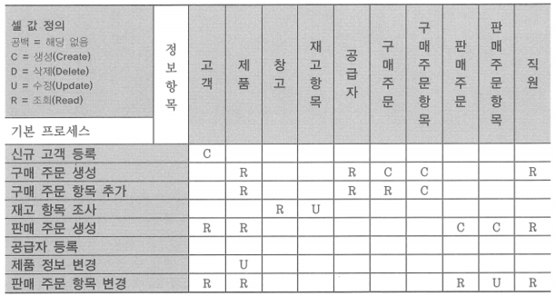

# 연습 문제(4 ~ 5)

# 4. 정보 요구 사항 명세화

1. 다음 중 요구 사항 명세서에 대한 정의로 잘못된 것은?
    1. 요구 분석 과정의 최종 산출물로 사용자와 개발자를 연결시키는 중요한 문서
    2. 설계 및 구현에서 참조할 사항, 전반적으로 알아야 할 사항을 포함하는 문서
    3. ~~정보 요구 사항 분석 대상을 정의한 현행 업무 영역 관련 자료 및 현행 시스템 관련 자료를 분석~~
    4. 사용자와 개발자 간의 계약서
    
    → 정보 요구 사항 명세는 기능적 요구 사항만이 아닌 비기능적 요구 사항도 명세화해야 함
    

2. 정보 요구 분석 명세서는 시스템 개발자가 구현할 것에 대한 공식적인 문서로, 시스템 개발과 관련된 이해 당사자에게는 중요한 기준이 된다. 이때 관련된 이해 당사자로 가장 연관성이 적은 대상은?
    1. 사용자
    2. 개발자
    3. ~~테스터~~
    4. 고객
    
    → 정보 요구 사항 명세는 사용자와 개발자 간의 계약서로써 사용자와 계약자 관점에서 종합 작성되어지며, 테스터 입장에서 요구 분석 명세서는 테스트를 수행하기 위한 테스트 케이스를 만드는 데 사용되고, 오류에 대한 판단과 동작에 대한 기준이 됨
    

3. 요구 분석 명세서 작성 시 주의할 사항으로 가장 바람직하지 않은 것은?
    1. 사용자가 쉽게 읽고 이해할 수 있도록 작성
    2. 개발자가 설계와 코딩에 효과적으로 사용할 수 있도록 작성
    3. 기능적 요구 사항 외 제약사항과 비기능적 요구 사항을 명확히 작성
    4. ~~품질에 대해서는 다 만족하도록 명시~~
        
        → 품질 특성은 다 만족시키지 못하고 서로 상충되는 경우가 있으므로 어떤 품질 특성을 우선순위로 할 것인지를 명시
        

4. 요구 사항 명세서 작성 시, 사업의 목적을 이루기 위해 기능을 어떻게 구현하거나 요구 사항을 어떻게 수행해야 하는지에 대한 내용을 작성하는 요구 사항 명세 항목은 어떤 것인가?
    1. 요구 사항 명칭
    2. 요구 사항 정의
    3. *요구 사항 상세설명*
    4. 요구 사항 출처

5. 데이터 요구 사항 명세를 작성할 시 데이터 요구 사항의 유형으로 볼 수 없는 것은?
    1. 데이터 이관 요구 사항
    2. 초기자료 구축 요구 사항
    3. ~~시스템 인터페이스 요구 사항~~ → 인터페이스 요구 사항 유형
    4. 데이터 관리 요구 사항

# 5. 정보 요구 사항 검증 및 변경 관리

1. 일반적으로 정의된 정보 요구 사항은 정보 항목·애플리케이션 상관분석, 정보 항목·업무 기능 상관분석, 정보 항목·조직 상관분석 등의 기법으로 수집된 사용자 정보 요구 사항이 적절하게 반영되었는지를 검증한다. 다음 중 상관분석 기법의 설명으로 틀린 것은?
    1. CRUD 매트릭스 분석 수행 과정에서 기본 프로세스가 사용하는 정보 항목에서 복수의 액션이 발생하는 경우에는 C > D > U > R의 우선순위에 따라 기술
    2. 모든 정보 항목이 모든 프로세스에서 사용되는지 혹은 기본 프로세스가 모든 정보 항목을 사용하고 있는지를 확인
    3. 업무 기능·조직 대 정보 항목의 상관분석에서 정보 항목의 생성, 수정, 삭제 등을 ‘C(Create, Change)’로 표시
    4. ~~업무 기능·조직 대 정보 항목의 상관분석에서 정보 항목 값의 변경 없이 검색만 하는 경우에는 ‘R(Read)’로 표시~~ → ‘U(Use)’로 표시함

2. K 과장은 약 1.5개월 간의 분석공정을 거쳐 H 대리의 정보 요구 사항을 반영하였는데 요구 사항이 정확하게 반영되었는지 시스템 및 산출물에 대한 리뷰를 실시하고자 한다. 다음 중 산출물별 체크리스트 기준에 일반적으로 포함되지 않는 것은?
    1. 일관성: 표준화 준수 여부 확인
    2. ~~주관성~~
    3. 정확성: 사용자의 정보 요구 사항이 정확히 표현되었는지 여부 확인
    4. 완전성: 사용자의 정보 요구 사항이 누락됨 없이 모두 정의되었는지 확인
    
    → 안전성: 추가 정보 요구 사항 변경에 따른 영향도 파악
    

3. H 대리는 약 3개월 간 진행된 분석 단계에서 사용자의 요구 사항들이 잘 반영되었는지 확인하기 위해 1박2일로 사용자가 포함된 상태에서 검토회의를 진행할 예정이다. 현재 회의 계획서를 작성하던 중 사용자는 자신의 요구 사항이 잘 반영되었는지 분석·설계자가 사용자의 요구 사항을 잘 이해하여 처리하였는지를 검토할 수 있는 재검토 기준을 도출하였다. 다음 중 재검토 기준에 포함되지 않는 것은?
    1. 사용자의 정보 요구 사항의 누락 여부에 대한 검토 기준
    2. 사용자의 정보 요구 사항의 정확성 검토 기준
    3. 사용자의 정보 요구 사항에 따른 영향도 파악에 대한 검토 기준
    4. ~~사용자의 정보 요구 사항에 대한 주도성 검토 기준~~

4. CRUD 매트릭스 분석을 실시할 때 하나의 정보 항목에 대하여 여러 개의 프로세스 액션이 발생할 경우가 있다. 다음 중 CRUD의 셀 값 입력 우선순위로 가장 적절한 것은?
    1. C > D > R > U
    2. C > R > U > D
    3. *C > D > U > R*
    4. C > U > R > D

5. 아래 매트릭스의 분석 결과 창고, 공급자, 직원 등의 정보 항목에서 문제가 발견되었다. 다음 중 문제가 발생한 3가지 정보 항목에 대한 조치사항으로 부적합한 것은?
    
    
    
    1. 생성하는 기본 프로세스의 도출이 필요함
    2. 불필요한 정보에 해당할 수 있으므로 정보 항목 삭제 여부를 검토
    3. 분석 대상의 업무 영역 범위 외에 해당하므로 해당 업무 영역으로 이동
    4. *기본 프로세스의 통합 여부를 고려*
    
    → 정보 항목을 생성하는 기본 프로세스가 없는 경우에는 기본 프로세스의 도출, 정보항목 삭제, 해당 업무 영역으로 이동 등의 조치사항이 존재