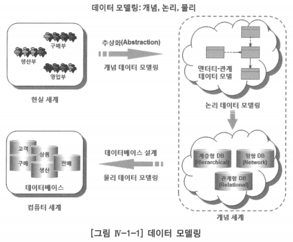
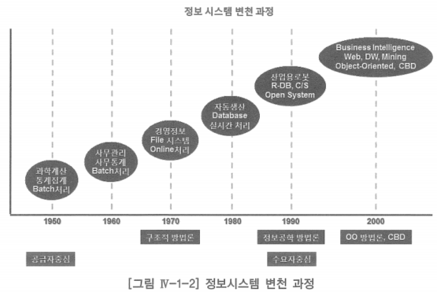
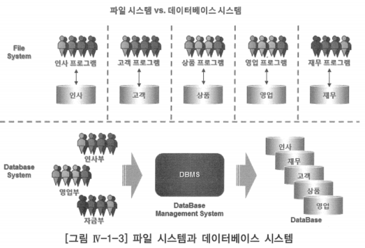
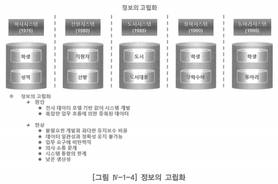
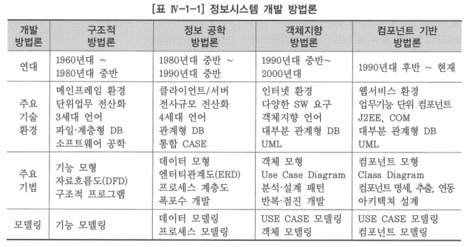
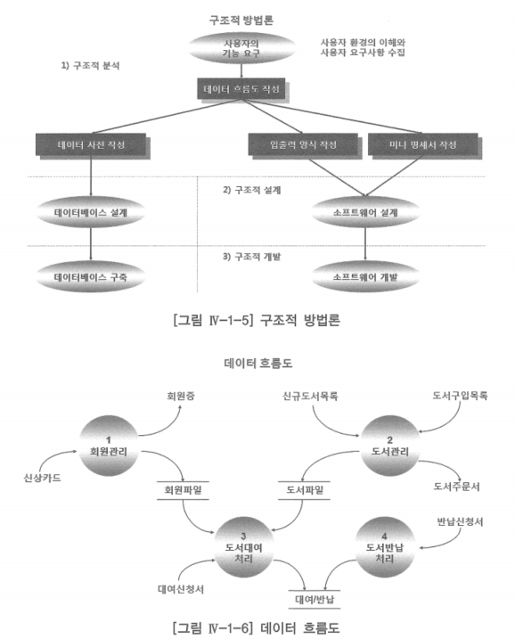
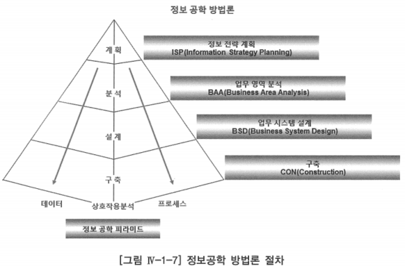

# 1. 데이터 모델링 정의

## 데이터 모델링(Data Modeling)

- 현실 세계 조직의 업무에서 필요로 하는 정보를 컴퓨터 세계의 데이터베이스에 저장, 활용하기 위한 지적인 작업 과정
- 데이터 모델(Data Model): 이 현실 세계를 데이터베이스로 표현하는 중간 과정, 즉 데이터베이스 설계 과정에서 컴퓨터에 저장할 데이터의 구조 및 업무 규칙을 표현하기 위해 사용하는 지적인 도구

### 개념 데이터 모델링(Conceptual Data Modeling)

- 현실 세계의 영업·구매·생산·판매 등 다양한 업무에서 발생하는 정보를 컴퓨터 세계의 데이터베이스에 저장·활용하기 위하여 추상화(Abstraction)를 통하여 개념 세계에서 정보의 구조와 업무 규칙을 엔터티-관계도(ERD, Entity-Relationship Diagram)로 표현해 나가는 과정

### 논리 데이터 모델링 or 데이터 모델링

- 개념 데이터 모델을 특정 데이터베이스(계층형, 망형, 관계형)로 구현할 것을 결정하고, 그 구조로 표현하는 것
- 오늘날 거의 모든 조직의 (매일의 업무에서 발생하는 데이터를 처리하는) 온라인 거래 처리 시스템에서는 대부분 관계형 데이터베이스로 시스템을 구축하기 때문에 개념 데이터 모델링과 논리 데이터 모델링을 명확하지 않고 합쳐서 부름

### 물리 데이터 모델링(Physical Data Modeling) or 데이터베이스 설계

- 논리 데이터 모델링은 데이터베이스 설계의 핵심 과정
- 논리 데이터 모델링의 산출물인 논리 데이터 모델, 즉 엔터티-관계도(ERD)를 특정 데이터베이스 관리 시스템(DBMS, Database Management System)이 이해하고 처리할 수 있도록 하는 일련의 과정
- 데이터베이스 관리 시스템 종류
    - 오라클(ORACLE)
    - 디비투(DB2)
    - 에스큐엘 서버(SQL Server) 등

# 가. 데이터 모델링 탄생 배경

- 정보시스템 변천 과정은 컴퓨터가 발명되어 사용되기 시작한 시기부터 2000년대까지의 과정을 보여주고 있음
- 2000년대까지만 보여주는 이유는 정보 시스템 환경이 많이 바뀌어도 매일의 일상적인 업무 처리는 대부분 관계형 데이터베이스를 사용하고 있기 때문
- 초창기 컴퓨터는 과학 계산 처리나 통계 또는 미사일의 탄착점 계산 등 기업 정보시스템보다는 연구소나 군대 내에서 연구나 국방 목적에 주로 사용
    - 이 당시의 프로그램은 데이터보다는 주로 처리 알고리즘에 관심을 두고 있었음
- 이후 연구소나 군대가 아닌 기업에서도 일괄(Batch) 처리 업무에 컴퓨터를 이용하기 시작함
    - 매일의 일상적인 업무 처리에 컴퓨터가 사용되기 시작한 이 시기의 하드웨어는 지금과는 비교할 수 없을 정도의 고가로 조직 전체가 통합·공유할 수 있는 시스템이 아닌, 어떤 특정 업무만을 위한 시스템을 개발하여 사용하고 있었음

- 데이터를 처리하기 위해서는 데이터베이스에 통합·공유하는 체제가 아니라 단순한 파일을 이용하여 입력(Insert)·읽기(Read)·통합(Merge)·정렬(Sort)해야 했음
- 복잡한 알고리즘을 이용하여 매우 많은 양의 프로그램을 개발하여 정보 시스템 개발과 유지보수 비용이 폭증하게 됨
- 이러한 파일 시스템에서는 복수의 프로그램이 파일을 공유할 수 없기 때문에 프로그램마다 파일이 존재해 중복되는 개인 또는 부서 중심의 마스터 파일이 많이 발생하게 됨
- 동일한 의미의 데이터일지라도 사용하는 파일이 다르므로 어떤 업무 요건에 따라 데이터를 변경하는 경우, 데이터 중복으로 인해 어떤 데이터는 변경되고 어떤 데이터는 변경이 안 되어 결과적으로 데이터의 불일치 및 시스템 통합의 한계 등 많은 문제를 야기함
- 프로그램마다 사용하는 전용 파일에 데이터를 저장하는 방식에서는 데이터의 불일치 및 유지보수의 어려움으로 생산성이 매우 나쁘다는 것을 인식
- 프로그램 개발과 유지보수 비용을 낮추기 위해서는 프로그램과 저장매체(Storage) 사이에 유용한 어떤 것이 필요하다는 것을 이해하게 됨
- 값싼 저장 매체 및 컴퓨터의 성능 향상과 더불어 데이터베이스 기술은 프로그램으로부터 데이터의 독립성을 보장할 수 있게 되어 정보시스템 개발과 유지보수에서 생산성을 향상시킴

- 데이터베이스의 개념과 기술의 진보는 데이터 구조를 개념화하는 기법에 이르게 됨
- 파일을 몰아내고, 계층형(Hierarchical) 데이터베이스와 망형(Network) 데이터베이스를 거쳐 오늘날 관계형(Relational) 데이터베이스에 이르게 됨
- 관계형 데이터베이스가 국내에 소개되던 초창기(80년대 후반 ~ 90년대 초반) 대부분의 정보시스템은 세계적인 컴퓨터 회사인 아이비엠(IBM, International Business Machines Corporation)의 대형 컴퓨터 환경 하에서 개발 및 운영되고 있었음
    - 대부분의 데이터베이스는 아이비엠의 IMSDB(Information Management System DataBase)라는 계층형 데이터베이스를 사용
- 정보 시스템 구축을 위한 분석, 설계 방법은 데이터보다는 프로세스와 기능 위주의 업무 흐름을 중심으로 분석, 설계하는 구조적(Structured) 방법론으로 진행되던 시기
- 대부분의 프로젝트에서 구조적 방법론의 대표적인 산출물인 데이터 흐름도(DFD, Data Flow Diagram)를 생성하여 프로젝트를 진행
- 관계형 데이터베이스에 대한 기본적인 개념은 전무한 상태
- 정보 시스템은 일반적으로 통합 개념이 아닌 그때그때 필요한 시스템을 구현하여 정보의 고립화를 초래하던 시기

- 전사적으로 공유할 수 있는 데이터 모델의 기반이 없이 시스템을 개발하여 중복 데이터로 인한 정보의 고립화를 불러옴
- 개발과 유지보수 비용을 증가시켰고, 중복 데이터는 데이터의 정확성(Accuracy)과 일관성(Consistency)을 유지하지 못하게 함
- 이로 인하여 업무 요구에 대한 대응이 탄력적이지 못하였으며, 시스템 통합에도 한계를 보여 결국에는 정보 시스템의 낮은 생산성을 유발함
- 정보 고립화 현상을 없애고자 기능(Function), 프로세스(Process), 특히 절차(Procedure) 중심의 분석·설계 방법이 정보 시스템 모델링의 중심이던 여러 해가 지나고 나서야, 몇몇의 선구자적인 정보기술 컨설팅 회사에 의하여 관계형 데이터베이스에 대한 기본적인 개념 및 논리 데이터 모델링이 소개됨
- 이들의 노력과 인터넷의 발달로 외국의 이론과 서적의 국내 소개, 각 대학 내 연구소 등 다양한 분야에서의 노력에 의하여 현재는 거의 모든 조직의 온라인 거래 처리(OLTP) 시스템에서는 대부분 관계형 데이터베이스를 이용하고 있음
- 논리 데이터 모델인 엔터티-관계도(ERD)가 거의 모든 정보 시스템 구축 프로젝트의 산출물로 자리매김을 하였으나, 업무에서 필요로 하는 정보의 구조와 업무 규칙을 빠짐없이 정확하게 표현하고 있는 데이터 모델을 찾아보기 힘든 것이 현실

# 나. 정보시스템 개발 방법론

- 정보의 고립화는 소프트웨어 위기(Software Crisis)라는 인식을 하게 되었고, 많은 학자들은 이러한 소프트웨어 위기를 해결하고자 소프트웨어 개발 방법론을 생각하게 됨
- 정보 시스템 개발 방법론은 구조적 방법론으로부터 컴포넌트 기반 방법론까지의 주요 기술 환경과 주요 기법을 보여주고 있음

## 구조적 방법론

- 1970년대를 풍미했던 구조적 방법론(Structured Methodology)은 소프트웨어의 위기가 조직의 프로세스에 대한 명확한 분석을 통하여 해결할 수 있다고 생각하고 절차를 중심으로 업무를 파악하여 시스템을 구현해야 한다는 이론을 제시

- 구조적 방법론은 사용자의 기능요구로부터 구조적 방법론의 대표적 산출물인 데이터 흐름도(DFD, Data Flow Diagram)로부터 업무를 구조적으로 분석, 설계하여 소프트웨어를 개발하는 절차를 보여주고 있음
- 프로세스를 중심으로 업무를 구조적으로 분석, 설계, 개발하는 구조적 방법론으로도 소프트웨어 위기를 해결 못하는 한계를 깨달은 일련의 학자들은 조직의 정보시스템은 연구소나 군사용 프로그램과는 달리 프로세스나 프로그램을 구현하는 알고리즘이 중요한 것이 아니라 대용향의 데이터를 처리하는 것이 상대적으로 중요하다는 것을 인식
- 데이터베이스는 주로 계층형 데이터베이스를 사용했던 이러한 구조적 방법론도 전사적으로 공유할 수 있는 데이터 모델의 기반이 없는 시스템 개발로 인하여 소프트웨어 위기 문제를 해결하지는 못함
- 구조적 방법론은 그 당시 정보 시스템 분석의 질적인 향상을 도모하였지만, 조직 전반의 거시적 관점의 부족과 데이터 모델링 방법의 미흡, 그리고 가장 많이 사용하고 있던 계층형 데이터베이스 모델의 한계로 인하여 큰 성공을 거두지는 못함
- 1960년대 후반 아이비엠 연구소에 근무하던 코드(E.F.CODD) 박사는 그 당시의 데이터베이스 모델과 데이터베이스 제품이 가지고 있는 데이터 중복, 약한 데이터 무결성(Integrity), 데이터베이스 구조가 물리적 구현에 지나치게 의존하는 것 등의 문제를 해결하고 대규모의 데이터를 취급할 수 있는 새로운 방법을 찾고 있었음
- 그 결과 수학의 집합 이론과 1차 술어 논리라는 두 분야를 새로운 데이터 모델의 기초로 관계형 모델 이론을 만들었음

## 정보 공학 방법론

- 정보 공학의 아버지로 불리는 제임스 마틴(James Martin)은 데이터와 프로세스를 병행으로 분석하면서도 데이터에 좀 더 초점을 맞추는 새로운 정보 시스템 개발 방법론이 정보 공학 방법론(IEM, Information Engineering Methodology)을 완성

### 정보 전략 계획(ISP, Information Strategy Planning)

- 아키텍처 모델링이라고도 함
- 중요한 네가지 아키텍처
    - 정보 아키텍처: 데이터와 프로세스를 병행 분석한 후 상호작용 분석을 정리
        - 데이터와  프로세스 아키텍처로 나뉨
        - 이러한 아키텍처를 업무 영역 분석(Business Area Analysis)  단계의 입력물로 사용하여 데이터와 프로세스 관점에서 매우 상세한 엔터티-관계도와 프로세스 계층도(PHD, Process Hierarchy Diagram)를 통하여 업무 분석 수행
    - 시스템 아키텍처: 정보 아키텍처를 시스템화
        - 업무 시스템 설계 단계에 상세하게 파악된 데이터와 프로세스를 이용하여 시스템 단위의 화면 설계와 데이터베이스 설계를 한 후 구현
    - 기술 아키텍처: 시스템 아키텍처의 기반 기술 구조 형성
    - 조직 아키텍처: 위 세가지 아키텍처를 구현

- 정보 공학 방법론은 객체지향(Object-Oriented)이나 컴포넌트 기반(Component-Based) 방법론의 등장에도 불구하고 전사아키텍처(EA, Enterprise Architecture) 방법론으로 발전하며 아직도 현장에서 많이 사용되고 있음
    - 그 이유는 객체지향이나 컴포넌트 기반 방법론에서도 데이터베이스는 주로 관계형 데이터베이스를 사용하고 있음
    - 또한 기업의 정보시스템을 공학적 기법을 적용하여 데이터를 중심으로 시스템을 계획·분석·설계·구축하는 방법론으로 데이터를 중심으로 업무를 분석하기 때문에 다른 방법론에 비하여 상대적으로 안정적
    - 다른 정보 시스템 개발 방법론을 사용하더라도 조직의 전략적 목표를 지원하는 경영전략을 수립하고, 업무 전반에 걸친 거시적 분석을 통하여 네 가지의 아키텍처를 수립한 후, 차세대 개발 계획을 수립하게 되는 정보 전략 계획을 수행한 후, 본 프로젝트를 진행하는 것을 대부분의 조직이 채택하고 있기 때문

## 객체지향·컴포넌트 기반 방법론

- 이 두 가지 방법론은 소프트웨어 공학에서 유래된 것
- 응용 소프트웨어를 어떻게 하면 잘 개발할 수 있을까에 초점을 맞추고 있기 때문에 정보 공학 방법론에서 데이터를 바라보는 관점과는 많은 차이가 있음
- 객체지향 모델은 객체지향 프로그래밍 언어의 모든 특징을 가지고 있고, 궁극적으로 관계형 데이터베이스를 저장소 수준으로 격하시킴
- 수학의 두 분야(집합과 명제)에 확고한 이론적인 기초를 가지고 있는 관계형 모델과는 달리, 객체지향 데이터 베이스 모델은 특별한 이론적 기초를 가지고 있지 않음
- 따라서 객체지향 데이터베이스 관리 시스템의 사실상의 표준에 해당되는 객체 관리 그룹(OMG, Object Management Group)이 제안한 모델이 있을 뿐
- 객체지향 후원자와 관계형 데이터베이스 지지자들은 오늘날까지 다양한 논쟁을 해옴
- 양측은 어떤 종류의 애플리케이션에는 관계형 데이터베이스가 잘 적용되지 않는다는 점에서는 동의하지만, 이 문제의 적절한 해결책에는 동의하지 않음

> 운명적 존재를 위한 데이터베이스 설계, 2003(Database Design for Mere Mortals - Michael J.Hernandez)
>