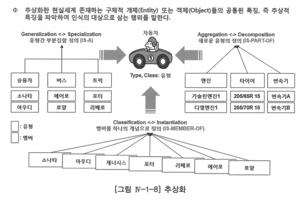
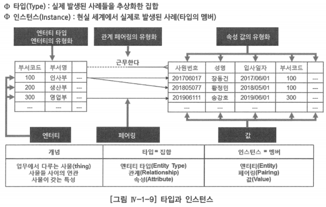
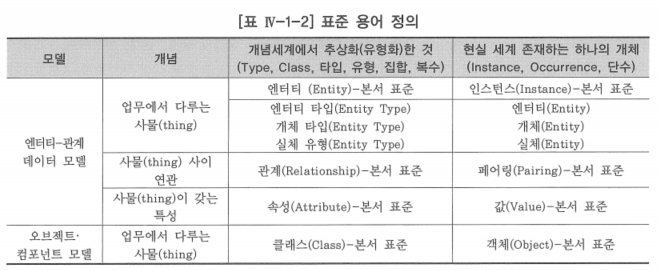

# 1. 엔터티-관계 데이터 모델

- 1976년에 피터 첸(Peter Chen)이 최초로 제안, 그의 논문을 통해 이 모델의 기본적인 구성요소가 정립됨
- 그 후 데이터 모델을 만들어 주는 많은 도구와 기법이 소개됨
    - 계층적 데이터 모델
    - 망형 데이터 모델
    - 관계형 데이터 모델
    - ANSI/SPARC 데이터 모델
    - 의미 객체(Semantic Object) 모델 등
- 엔터티-관계 데이터 모델은 표준적인 데이터 모델
- 이 모델이 지니고 있는 단순성 때문에 현재 개념·논리 데이터 모델링에서 가장 일반적으로 사용되고 있음
- 이론을 설명하기 위하여 ‘가. 추상화’, ‘나. 타입과 인스턴스’ 부분에서만 하나의 개체를 엔터티(Entity)로 하나의 개체를 추상화한 개체의 집합을 엔터티타입(Entity Type) 또는 개체타입으로 설명
    - 나머지 영역에서는 본 과목의 표준을 하나의 개체는 인스턴스로, 하나의 개체를 추상화한 개체의 집합을 엔터티로 부름

# 가. 추상화

- 엔터티-관계 데이터 모델을 구현하기 위해서는 현실 세계를 이해하고, 사람들과 소통하기 위하여 추상화(Abstraction)라는 기법 사용
- 개념 데이터 모델링: 개념 세계에서 인간의 이해를 위해 현실 세계에 대한 인식을 추상적 개념으로 표현하는 과정
- 엔터티-관계 데이터 모델에서는 엔터티(개체)를 추상화하면 엔터티 타입(개체 타입)이 되고, 객체지향이나 컴포넌트 기반에서 객체를 추상화하면 클래스가 됨
- 추상화가 가능한 엔터티들은 그것들이 소유하고 있는 특성의 이름으로 하나의 집합을 이룸
- 추상화한다는 것은 여러 엔터티들을 집합으로 파악하는 것과 동일한 것

## 논리 데이터 모델링에서 사용하는 추상화

### 유형화(Classification)

- 현실세계에 존재하는 같은 성질을 갖는 멤버들을 타입 또는 유형(Class)이라는 하나의 개념으로 정의하는데 사용됨
- 위 추상화 그림에서 ‘소나타’, ‘제네시스’, ‘포터’ 등의 멤버를 원동기에 의하여 육상에서 이동할 못적으로 제작한 용구라는 공통의 특성을 가지고 있는 집합으로 유형화하면, ‘자동차’라는 타입으로 정의할 수 있음
- 또 다른 예로 ‘부서’는 ‘인사부’, ‘구매부’, ‘생산부’, ‘영업부’와 같은 각각의 멤버를 유형화한 타입
- 현실세계에 존재하는 하나의 엔터티는 우리가 그 엔터티를 바라보는 관점에 따라서 여러 가지로 유형화할 수 있음
    - ‘소나타’라는 하나의 엔터티가 어떤 회사에서는 ‘상품’이라는 엔터티 타입이 될 수 있고, ‘소나타’를 구매한 어떤 회사에서는 ‘고정자산’이라는 엔터티 타입이 될 수 있음
    - 자동차를 이용하여 유통업을 하는 회사라면, 이 자동차를 ‘운송수단’이라는 엔터티 타입이라 할 수 있음
- 조직의 업무가 수행되는 관점에 따라서 하나의 엔터티를 여러 가지 엔터티 타입으로 유형화할 수 있음

### 집단화(Aggregation)

- 속성이라는 타입들의 세트로 구성되는 새로운 타입(엔터티 타입)을 정의하는 개념
    - 값(Value)을 유형화하면 속성이라는 타입이 됨
- 추상화 그림에서 ‘가솔린엔진1’, ‘디젤엔진1’ 등과 같은 값(멤버)을 유형화하면 ‘엔진’이라는 속성(타입)이 되고, ‘205/65R 15’, ‘265/70R 15’ 라는 값(멤버)을 유형화하면 ‘타이어’라는 속성(타입)이 되는 것
- ‘엔진’, ‘타이어’와 같은 속성(타입)들을 구성요소로 새로운 엔터티 타입 ‘자동차’를 정의하는 개념이 집단화
- ‘자전거’라는 엔터티 타입은 자전거를 구성하는 ‘핸들’, ‘바퀴’, ‘몸체’, ‘페달’이라는 속성(타입)들의 집단화라고 할 수 있음

### 일반화(Generalization)

- 여러 엔터티 타입 간의 공통적인 특성을 파악하는 과정
- 둘 또는 그 이상의 엔터티 타입 요소 간에 서브세트(부분집합)를 정의하는 개념
- 추상화 그림에서 ‘자동차’라는 엔터티 타입은 많은 멤버(엔터티)를 가지고 있음
- 이 멤버들을 다른 관점에서 유형화하면 ‘승용차’, ‘버스’, ‘트럭’도 엔터티 타입
- 이 세 개의 타입간 서브세트(부분집합)를 정의한 것이 일반화
- 일반화 역시 현실 세계에 존재하는 엔터티들을 우리가 그 엔터티들을 바라보는 관점에 따라 여러 가지 방법으로 할 수 있음
    - 성별 관점에서 ‘남’, ‘여’ 타입(엔터티 타입)을 ‘사람’이라는 타입(엔터티 타입)으로 일반화 할 수 있음
    - 내외국인 관점에서 ‘내국인’, ‘외국인’ 타입(엔터티 타입)을 ‘사람’이라는 타입(엔터티 타입)으로 일반화할 수도 있음
    - ‘자동차’, ‘비행기’, ‘선박’이라는 타입(엔터티 타입)을 유통업 회사라면 ‘운송수단’이라는 타입(엔터티 타입)으로 일반화할 수 있음
    - 제조·판매하는 회사라면 ‘상품’이라는 타입(엔터티 타입)으로 일반화할 수 있음
- 일반화가 다른 추상화 개념과 다른 점은 슈퍼타입(전체집합)에 정의된 모든 특성이 서브타입(부분집합)으로 상속된다는 것
    - ‘사람’ 타입(엔터티 타입)은 ‘이름’, ‘성별’, ‘생년월일’이라는 타입(속성)이 집단화되어 생성된 타입(엔터티 타입)
    - ‘남자’와 ‘여자’라는 타입(엔터티 타입)은 ‘사람’이라는 타입(엔터티 타입)의 서브타입이므로 ‘남자’, ‘여자’ 역시 ‘이름’, ‘성별’, ‘생년월일’이라는 타입(속성)의 집단화로 생각할 수 있음
- 이 상속 특성 때문에 일반화는 매우 중요하게 취급됨

# 나. 타입과 인스턴스

- 데이터 모델링은 업무와 관련된 현실 세계의 모든 인스턴스를 표현할 수 있는 타입을 정의하는 작업

## 타입

- 엔터티-관계(Entity-Relationship) 데이터 모델이라는 용어에서 사용하는 엔터티는 엄밀히 얘기하면 엔터티 타입을 말하는 것
- 논리 데이터 모델링에서 모델링의 대상은 엔터티 타입, 관계, 속성
- 위 타입과 인스턴스 그림을 보면
    - ‘인사부’, ‘생산부’, ‘영업부’라는 동일한 특성을 갖는 엔터티를 유형화하면, ‘부서’라는 엔터티 타입이 되는 것
    - ‘인사부’에 ‘장동건’이 근무한다는 ‘인사부’라는 하나의 엔터티와 ‘장동건’이라는 엔터티가 ‘근무한다’는 업무에 의하여 연관되는 사실을 페어링(Pairing)이라고 함
    - 동일한 특성을 갖는 페어링을 유형화하면 ‘근무한다’는 관계가 됨
    - ‘2017/06/01’, ‘2018/05/01’, ‘2019/06/01’과 같은 하나의 사원이 입사한 날짜라는 동일한 특성을 갖는 값(Value)을 유형화하면 ‘입사일자’라는 속성이 됨
- 현실 세계에 존재하는 동일한 특성을 갖는 멤버들을 표현하기 위하여 유형화라는 추상화 기법을 통하여 타입으로 만들었기 때문
    - 엔터티 타입(타입) = 엔터티(인스턴스)의 집합
    - 관계(타입) = 페어링(인스턴스)의 집합
    - 속성(타입) = 값(인스턴스)의 집합
- 논리 데이터 모델링의 대상인 엔터티 타입, 관계, 속성을 집합(Set)으로 얘기하고 있는데, 이는 1960년대 후반 IBM 연구소에 근무하고 있었던 수학자인 코드(E.F.CODD) 박사가 수학의 집합 이론(Set Theory)과 1차 술어 논리(1st Predicate Theory)라는 두 분야를 새로운 데이터 모델의 기초로 관계형 모델 이론을 만들었기 때문

## 인스턴스

- 현실 세계 업무에서 발생하는 엔터티 타입·관계·속성의 실제 발생 사례(Sample)를 말하는 것
- 타입·관계·속성에 대하여 공통적으로 사용되는 용어
- 인스턴스 차트는 논리 데이터 모델을 생성 또는 점검할 때 사용할 수 있음
- 엔터티-관계 데이터 모델이 많은 업무 규칙을 직관적으로 부여주고 있기는 하지만, 이 데이터 모델이 업무 규칙을 빠짐없이 정확하게 반영하고 있는 지를 파악하는 것은 그렇게 쉬운 일이 아님
- 가장 좋은 방법이 엔터티 타입, 관계, 속성의 개별 인스턴스 차트를 만들어서 점검하는 것
- 데이터 모델링 과정 중에서도 불명확한 업무를 좀 더 명확하게 하기 위하여 작성할 수도 있고, 데이터 모델링이 끝난 프로젝트에서 데이터 모델을 점검할 때도 이것을 작성해 보면서 데이터 모델의 품질을 점검할 수 있는 좋은 방법
- 엔터티 타입 인스턴스 차트는 엔터티의 사례를 보여주는 것
- 관계의 인스턴스 차트는 페어링의 사례를 보여주는 것
- 속성의 인스턴스 차트는 값의 사례를 보여주는 것
- 많은 책들과 실무상에서 엔터티(Entity: 단수)와 엔터티 타입(Entity Type: 집합)을 업격하게 구분하지 않고 혼용하고 있음
    - 하나의 담수를 얘기하는 것인지, 집합을 얘기하는 것인지를 책을 보는 사람이 문맥을 파악해야 함
    - 집합인 ‘엔터티 타입’을 ‘엔터티’로 표현하고, 단수인 ‘엔터티’를 ‘엔터티 인스턴스’로 표현
    - 한글로는 ‘개체’와 ‘개체타입’, ‘실체’와 ‘실체유형’으로 많이 사용하기도 함

## 용어 정의

- 인스턴스: 업무에서 다루는 사물의 단수 개념
- 엔터티: 업무에서 다루는 사물의 집합 개념
- 페어링: 사물 사이 연관의 단수
- 관계: 사물 사이 연관의 집합 개념
- 값: 사물이 갖는 특성의 단수
- 속성: 사물이 갖는 특성의 집합 개념

