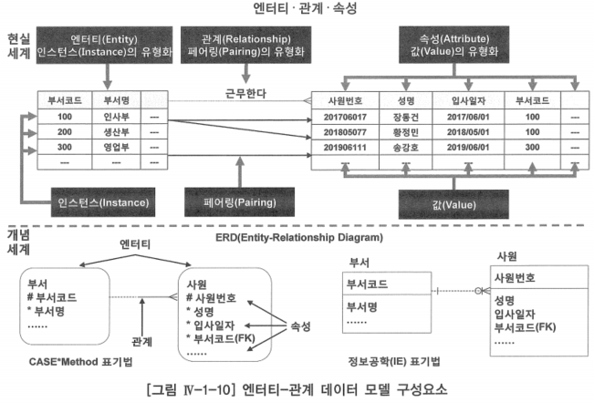

# 2. 엔터티-관계 데이터 모델 구성요소

- 엔터티-관계 모델은 엔터티, 관계, 속성이라는 세 가지 요소로 구성됨

- 엔터티, 관계, 속성은 현실 세계 업무에서 발생하는 물리 객체인 인스턴스, 페어링, 값을 추상화라는 지적인 과정을 통하여 공통적인 성질을 갖는 집합적인 단일 개념으로 정의한 개념 세계의 논리 객체
- 위 엔터티-관계 데이터 모델 구성요소의 현실세계 부분은 업무에서 발생하는 것으로 인스턴스, 페어링, 값의 사례들을 보여 주고 있음
    - 아래 부분 개념세계는 이러나 인스턴스, 페어링, 값들을 추상화한 엔터티, 관계, 속성으로 표현되는 엔터티-관계 데이터 모델을 보여주고 있음
- 엔터티-관계 데이터 모델의 표기법(Notation)은 여러 가지가 있음
- 현재 가장 많이 사용하고 있는 정보공학(Information Engineering) 방법론 표기법과 리차드 바커(Richard Barker)가 제안한 케이스 메소드(CASE Method) 방법론 표기법을 설명하고 사용할 것
- 그림 엔터티-관계 데이터 모델 구성요소의 우측은 정보공학 표기법(이후 정보공학(IE) 표기법이라 지칭), 좌측은 케이스 메소드 표기법(이후 CASE Method 표기법이라 지칭)을 적용한 엔터티, 관계, 속성의 예

# 가. 엔터티

- 조직의 업무를 수행하는데 필요로 하는 사물(Thing), 사건(Event) 또는 개념(Concept)을 나타내는 어떤 것
    1. 동일한 업무 행위를 하는 단일 개념으로 정의한 멤버들의 집합체
    2. 유사한 속성을 갖는 단일 개념으로 정의한 멤버들의 집합체
- 엔터티가 인스턴스의 집합이므로 외국 서적에서는 ‘Entity Type’이라는 용어 대신에 ‘Entity’의 복수형 ‘Entities’로 표현한 것이 보이기도 함
    - ‘부서’는 ‘Departments’, ‘사원’은 ‘Employees’로 표현함

## 1. 동일한 업무 행위를 하는 단일 개념

- 동일한 업무 행위를 하는 단일 개념으로 정의한 인스턴스들의 집합체는 어떻게 정의하느냐에 따라 인스턴스들의 구성이 달라질 수 있음
- 집합에 들어갈 인스턴스들의 동일한 성질을 어디까지로 한정할 것인지를 결정하는 것이 그 조직의 업무규칙이라 할 수 있음
- ‘고객’ 집합을 ‘우리 상품을 구매한 사람이나 법인’으로 정의했다면
    - 구매한 적이 없는 잠재 고객이나 구매 상담자, 또 법인번호가 없는 단체나 개인 사업자 등은 이들과 동질성을 갖지 못함
    - 그러나 이들이 현재 어떠한 방법으로든 관리되고 있거나 앞으로 관심을 갖고자 하는 범주에 해당한다면 동질성의 정의를 더 확장해야만 이들을 고객 집합 내에 끌어들일 수 있음

## 2. 유사한 속성을 갖는 단일 개념

- 유사한 속성을 갖는 단일 개념으로 정의한 인스턴스들의 집합체라는 의미는 어떤 한 인스턴스를 설명하거나 묘사할 수 있는 특성들(ex: ‘학번’·‘이름’·’학과’ 등과 같은 항목들)에 대해 다른 여러 인스턴스들이 동일한 특성들로 설명 또는 묘사될 수 있음
    - 어떤 특정한 ‘학번’·‘이름’·’학과’로 특정지어질 수 있는 ‘홍길동’ 학생은 인스턴스
    - ‘학번’·‘이름’·’학과’ 등과 같은 공통적인 특성 항목들을 공유하는 학생들의 집합인 ‘학생’은 엔터티(Entity - 집합)가 되는 것
- 집합에 대한 정의 문제는 엔터티의 구성 속성과 관계 정의에도 영향을 미치고, 이것은 결과적으로 데이터 모델 전체의 구성에 영향을 미치게 됨
- 엔터티에 대한 명확한 정의는 데이터 모델링에서 가장 핵심적인 사안 중 하나라고 할 수 있음
- 엔터티를 정의할 때는 어떤 대상이 그 엔터티에 속하는지 여부를 명확하게 구분할 수 있도록 정의해야 함
- 이러한 의사 결정은 누구나 할 수 있는 것이 아니므로 엔터티를 결정할 때는 그 엔터티와 연관된 업무를 가장 잘 아는 업무 전문가의 참여가 반드시 필요함
    - 이는 관계와 속성을 정의할 때도 동일하게 적용되는 매우 중요한 사항

# 나. 관계

- 하나 또는 두 개의 엔터티에서 인스턴스를 연관시키는 업무적인 이유
- 엔터티가 인스턴스의 집합인 것과 마찬가지로 관계도 하나 또는 두 개의 엔터티 사이 업무적인 이유에 의해서 연결되어 있는 페어링의 집합
- 하나 또는 두 개의 엔터티 사이에 연관된 업무규칙을 관계로 맺는 방법은 실제로 엔터티 사이에 존재하는 관계의 기수성(Cardinality, Degree) 및 선택성에 의존함
- 유일 식별자(UID, Unique Identifier)와 외부 식별자(Foreign Identifier)로 관계를 맺거나, 연결(Associative) 엔터티로 관계를 맺을 수 있음

### 관계가 관계형 데이터베이스에서 중요한 이유

- 관계는 여러 개의 엔터티를 조인(Join)하여 정보를 조회할 수 있음
- 관계는 중복 데이터를 배제하는데 도움이 되므로 데이터 정확성 향상에 기여함

# 다. 속성과 도메인

- 속성은 엔터티에 저장되는 인스턴스들의 특성을 설명하는 항목
- 엔터티를 명확하고 구체적으로 정의했다 하더라도 이것만으로는 인스턴스들의 특성을 설명하기에는 부족함이 있음
    - ‘사원’ 엔터티의 인스턴스인 ‘김철수’와 ‘홍길동’은 독립적인 사람 인스턴스임에는 분명하지만, 이들의 특성을 설명할 수 있는 더 구체적인 항목(속성)이 없으면 이 집합을 명쾌하게 객관화할 수 없음
    - ‘사원’ 집합의 특성을 설명하기 위해 ‘사원번호’, ‘사원성명’, ‘주민등록번호’, ‘연락전화번호’, ‘거주지주소’ 등과 같은 속성을 정의했다면 이제 이러한 속성 구성을 통해 어떻게 ‘홍길동’이하는 인스턴스를 특정짓고 변별할 것인지를 분명하게 이해할 수 있고, 집합의 의미 또한 좀 더 명확해진다고 할 수 있음
- 속성: 값을 추상화한 타입
    - 값: 속성의 멤버
    - 속성: 동일한 특성을 갖는 값의 집합
- 도메인(Domain): 하나의 속성이 갖는 같은 종류의 모든 값들의 집합
    - 단순히 데이터 타입이라 할 수도 있음
    - 시스템 정의 도메인: 문자, 날짜, 숫자
    - 사용자 정의 도메인: 상태코드, 부서코드, 고객번호
- 각 속성은 어느 한 도메인 상에서 정의되어야 하고, 정의된 속성은 반드시 그 해당 도메인으로부터만 값을 취할 수 있음
- ‘계약일자’라는 속성이 있다고 하면
    - 속성 ‘계약일자’가 가질 수 있는 값은 모든 날짜 값들 중에서 하나의 값을 취할 수 있는 것
    - 속성 ‘부서코드’는 어느 회사에서 ‘인사부’, ‘총무부’, ‘영업부’, ‘생산1부’, ‘생산2부’ 관리를 위해 임의로 ‘인사부=10’, ‘총무부=20’과 같의 정의하였다면, 업무적으로 부여한 코드 ‘10’, ‘20’ 등의 정의된 코드 내에서만 사용할 수 있음
- 도메인은 시스템이 제공하는 문자(CHARACTER), 날짜(DATE), 숫자(NUMBER) 등과 같은 시스템 정의 유형과 ‘부서코드’, ‘상태코드’ 같은 사용자 정의 특수 도메인이 포함됨

# 라. 식별자

- 유일 식별자(Unique Indentifier): 속성 중에 엔터티에 저장되는 어떤 특정 인스턴스 하나를 식별할 수 있는 하나 또는 하나 이상의 속성
- 식별자 속성은 어떤 특정 인스턴스 하나를 식별할 수 있는 하나 이상의 속성이기 때문에 다음과 같은 특성을 가짐
    1. 일련의 식별자 속성은 반드시 값을 가짐
    2. 일련의 식별자 속성의 값은 유일(Unique)함
    3. 식별자를 구성하는 일련의 속성은 최소한의 개수로 해야 함