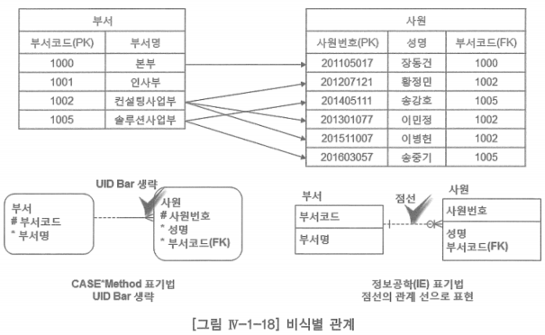

# 1. 엔터티-관계 데이터 모델 표기법

- 엔터티-관계 데이터 모델은 1976년 피터 첸(Peter Chen)에 의해 최초로 제안되었으며, 그의 논문을 통해 이 모델의 기본적인 구성요소가 정립됨
- 피터 첸이 제안한 데이터 모델 표기법은 엔터티를 사각형, 관계를 마름모, 속성을 타원에 표현함
- 이 표기법은 주로 대학에서 데이터베이스 이론을 배울 때 많이 사용하고, 정보 시스템 개발 프로젝트 현장에서는 주로 정보공학(IE) 표기법 또는 CASE Method 표기법(Notation)을 많이 사용하고 있음
    - 학교에서 배우는 데이터베이스이론을 수학으로 증명하거나 설명하기가 피터 첸의 표기법이 좀 더 편한 반면에 현장에서는 이론보다는 조직의 업무를 직관적으로 표현하기 가장 좋은 표기법이 무엇인가에 맞춰져 있기 때문
    - 정보공학(IE) 표기법이나 CASE Method 표기법은 데이터 모델을 작성할 수 있는 도구인 케이스 툴(CASE Tool)이 있는데 피터 첸의 표기법은 그렇지 못함

# 가. 엔터티 표기법

- 정보공학(IE) 표기법에서는 엔터티를 독립(Independent)과 종속(Dependent) 엔터티로 구분
- 정확히 말하면 정보공학(IE) 표기법이 아니라 ER-Win(데이터 모델링 도구)의 IDEFIX(Integration DEFinition for information modeling) 표기법
    - IDEFIX 데이터 표기법을 정보공학 표기법으로 보기 위해서 변환하면서 이런 개념을 얘기하는 것
- 독립 엔터티는 모서리가 각진 사각형으로, 종속 엔터티는 모서리가 둥근 사각형으로 표현
- CASE Method 표기법에서는 이런 구분 없이 모든 엔터티를 모서리가 둥근 사각형으로 표현

## 정보공학(IE) 엔터티 표기법

- 독립 엔터티: 하나의 인스턴스를 식별하는데 있어서 어떤 다른 인스턴스에 의존하지 않는 엔터티
    - 엔터티 ‘고객’의 하나의 인스턴스 ‘홍길동’을 식별하는데 다른 인스턴스에 의존할 필요가 없기 때문에 ‘고객’을 독립 엔터티라 함
    - 이러한 예로 ‘상품’, ‘사원’, ‘부서’ 등의 엔터티가 있음
- 종속 엔터티: 하나의 인스턴스를 식별하는데 있어서 하나 또는 하나 이상의 다른 인스턴스에 의존하는 엔터티
    - 엔터티 ‘고객주소’의 하나의 인스턴스 ‘영등포구 영등포동 618번지’라는 주소를 인식하는데, 업무 관점에서 이 주소만 가지고는 의미가 없음
    - 이 주소가 고객 누구의 주소라는 것이 의미가 있으므로, 즉 고객 ‘홍길동’이라는 인스턴스의 주소라는 것이 의미가 있으므로 다른 인스턴스에 의존하는 종속 엔터티라 하는 것

### 정보공학(IE) 표기법에서 종속 엔터티

- 특성 엔터티: 하나의 인스턴스에 여러 번 발생하는 속성의 그룹
    - ex: 사원경력, 고객주소 등
- 연관 엔터티: 두 개 이상의 연관된 다른 엔터티로부터 식별자를 상속 받는 엔터티
    - 다대다 관계 해소 시 생성됨
    - ex: 주문상품 등
- 서브타입 엔터티: 다른 부분집합과 구별되는 공통 속성이나 관계를 공유하는 엔터티의 부분집합
    - ex: 개인고객, 법인고객 등

- ‘고객’, ‘상품’, ‘주문’ 엔터티는 하나의 인스턴스
    - ‘고객’ 엔터티의 인스턴스 ‘홍길동’을 식별하는데 있어서 어떤 다른 인스턴스에 의존하지 않는 엔터티이므로 독립 엔터티라 하고 모서리가 각진 사각형으로 표시
- ‘주문상품’의 주 키(PK) 속성 ‘주문번호’는 ‘주문’ 엔터티에서 왔고, 또 하나의 주 키(PK) 속성 ‘상품코드’는 ‘상품’ 엔터티에서 온 것으로 ‘주문상품’은 다대다 관계를 해결한 연관 엔터티임을 알 수 있음
    - 연관 엔터티는 종속 엔터티이므로 모서리가 둥근 사각형으로 표시한 것
    - ‘개인고객’, ‘법인고객’은 서브타입이고, ‘고객주소’는 고객 ‘홍길동’의 주소 여러 개를 관리하는 특성 엔터티로 전부 종속 엔터티이므로 모서리가 둥근 사각형으로 표시

## CASE Method 엔터티 표기법

- 정보공학(IE) 표기법에서는 엔터티의 모양만 봐도 이 엔터티가 독립인지 종속인지를 알 수 있지만, CASE Method 표기법에서는 정보공학(IE) 표기법과는 다르게 모든 엔터티를 모서리가 둥근 사각형으로만 표현
- 정보공학(IE) 표기법과 같은 개념으로 생각하려면 부모 유일 식별자가 자식 유일 식별자의 일부가 되는지를 보는 것과 또는 관계 선에 수직으로 그어져 있는 조그마한 선이 유아이디바(UID Bar, Unique Identifier Bar)
    - 부모의 유일 식별자 속성이 자식의 유일 식별자 속성의 일부 또는 전체가 될 때 이 선으로 표현
    - 이 수직선을 보고 정보공학(IE) 표기법과 같은 해석을 할 수는 있음
- 또한 서브타입을 표현하는 방식이 조금 다른데 CASE Method 표기법에서는 슈퍼타입 안에 서브타입을 표현

- CASE Method 표기법에서 정보공학(IE) 표기법처럼 독립, 종속, 특성 같은 개념을 갖지는 않음
- 연관, 슈퍼타입, 서브타입 개념은 동일함

# 나. 속성 표기법

- 속성은 엔터티에 저장되는 인스턴스들의 특성을 설명하는 항목으로, 단어들을 조합한 명사적 용어로 표현
- 속성의 명칭은 ‘엔터티 명 + 수식어 + 도메인 명’ 형태로 하는 것이 좋은 방법
    - ‘사원’(엔터티 명) + ‘입사’(수식어) + ‘일자’(도메인 명) 형태로 속성 명을 부여하면 속성의 의미를 쉽게 이해할 수 있음
- 유일식별자(UID, Unique Identifier) 또는 주 키(PK, Primary Key): 속성 중에서 엔터티에서 하나의 인스턴스를 식별해 낼 수 있는 하나 또는 하나 이상의 속성
- 정보공학(IE) 표기법에서는 엔터티를 나타내는 사각형의 줄이 그어진 윗부분에 유일식별자 속성을 표시하고, CASE Method 표기법에서는 유일식별자 속성 앞에 ‘#’ 표시를 함
- 외래식별자(Foreign Identifier) 또는 외래키(FK, Foreign Key): 다른 엔터티로부터 상속받은 속성
    - 속성 뒤에 ‘(FK)’를 표기함

- CASE Method 표기법에서 필수(Mandatory) 속성을 나타내는 것
    - 일반 속성 앞에 ‘*’ 표시
    - 하나의 인스턴스가 입력되는 시점에서 이 속성 값이 반드시 필요하다는 업무 규칙 표현
- 필수 속성이 아닌 선택(Optional) 속성
    - 속성 앞에 ‘৹’ 표시
    - 하나의 인스턴스가 입력되는 시점에 이 속성의 값이 반드시 필요한 것은 아니고 나중에 들어와도 된다는 업무 규칙 표현
- 정보공학 표기법에서는 논리 데이터 모델에서는 표기를 안 하고, 물리 데이터베이스 설계 시점에 속성 뒤에 ‘NULL’(선택), ‘NOT NULL’(필수)로 표기함

# 다. 관계 표기법

- 관계: 하나 또는 두 개의 엔터티에서 인스턴스를 연관시키는 업무적인 이유
- 엔터티가 인스턴스의 집합인 것과 마찬가지로 관계도 하나 또는 두 개의 엔터티 사이 업무적인 이유에 의해서 연결되어 있는 페어링의 집합

## 업무 규칙을 표현하는 세 가지 중요한 특성

### 1. 관계 기수성(Cardinality, Degree) 표기법

- 기호로 나타낼 때, 일(一)은 ‘—’로, 다(多)는 까마귀발(Crow’s Foot) 형태로 표현
- 위 관계 표기법 그림에서 일대일, 일대다, 다대다의 세 가지 사례를 보여주고 있음
- 일대일 관계
    - 첫 번째 엔터티의 한 인스턴스가 두 번째 엔터티의 오직 하나의 인스턴스와 연관되어 있고, 두 번째 엔터티의 한 인스턴스가 첫 번째 엔터티의 오직 하나의 인스턴스와 연관되어 있을 때, 이 두 개의 엔터티는 일대일 관계를 가지고 있음
- 일대다 관계
    - 첫 번째 엔터티의 하나의 인스턴스가 두 번째 엔터티의 다수의 인스턴스와 연관되어 있고, 두 번째 엔터티의 하나의 인스턴스가 첫 번째 엔터티의 오직 하나의 인스턴스와 연관되어 있을 때, 이 두 엔터티는 일대다 관계를 가지고 있음
- 다대다 관계
    - 첫 번째 엔터티의 하나의 인스턴스가 두 번째 엔터티의 많은 인스턴스들과 연관될 수 있고, 두 번째 엔터티의 하나의 인스턴스가 첫 번째 엔터티의 다수의 인스턴스와 연관될 수 있을 때, 이 두 개의 엔터티는 다대다 관계를 가지고 있음
    - 이 관계는 연결 엔터티로 관계를 맺을 수 있음
    - 관계가 있는 각 엔터티의 유일 식별자 속성을 새로운 엔터티의 유일 식별자를 만드는데 사용함으로써 연결 엔터티를 정의함

### 2. 관계 선택성 표기법

- 기호로 나타낼 때, CASE Method 표기법에서는 필수를 실선으로 선택은 점선으로 표시하고, 정보공학(IE) 표기법에서는 필수는 동그라미 생략이고 선택은 관계 선에 동그라미 표시
- 필수 관계
    - 엔터티 A와 엔터티 B가 관계가 있을 때, 엔터티 B에 인스턴스를 입력(Insert)하기 전에 엔터티 A에 적어도 하나의 인스턴스를 입력해야 한다면, 엔터티 A의 선택성은 필수
- 선택 관계
    - 엔터티 A와 엔터티 B가 관계가 있을 때, 엔터티 B에 인스턴스를 입력하기 전에 엔터티 A에 적어도 하나의 인스턴스를 입력할 필요가 없다면, 엔터티 A의 선택성은 선택
- 선택성의 결정 방법을 대부분의 책에서 아래와 같은 방식으로 설명함
    - 관계 읽기를 통하여  반드시(Must)이면 필수 관계
        - ‘하나 이상의 사원이 반드시 하나의 부서에 소속되어 있다’
    - 관계 읽기를 통하여  일 수도(May be)이면 선택 관계
        - ‘하나의 부서에는 여러 명의 사원이 반드시 있다’
    
    → 이러한 방식으로 현업에게 물어보면 ‘부서에는 하나 이상의 사원이 반드시 있다’라고 하는 것이 대부분으로 ‘부서’와 ‘사원’의 관계가 양쪽 필수로 될 수도 있으니 이러한 방법을 사용하지 말라고 함
    
- ‘엔터티 B에 인스턴스를 입력하기 전에 엔터티 A에 적어도 하나의 인스턴스를 입력할 필요가 있다 또는 없다’로 선택성을 결정하는 것이 업무를 좀 더 명확하게 할 수 있다고 함
- 두 개의 엔터티 사이에 관계를 맺고 한쪽을 부모(Parent) 다른 한쪽을 자식(Child)이라 표현함
    - 일대다 관계이면 일 쪽이 부모, 다 쪽을 자식이라 함
    - 일대일인 경우는 선택성이 필수인 쪽이 부모, 선택인 쪽을 자식으로 칭함
    - 유일 식별자와 외래 식별자로 관계를 맺게 되는데 유일식별자가 표현되는 엔터티가 부모이고, 외래 식별자 또는 외래 키(FK, Foreign Key)가 표현되는 쪽의 엔터티가 자식

### 3. 관계 식별성 표기법

- 식별 관계
    - 부모 엔터티의 식별자가 자식 엔터티의 식별자의 일부분이 되는 관계
    - ‘주문’ 엔터티와 ‘주문상품’ 엔터티가 일대다 관계이므로 ‘주문’이 부모 엔터티, ‘주문상품’이 자식 엔터티가 됨
    - CASE Method 표기법에서는 관계 선에 수직인 바(UID Bar)를 사용하고, 정보공학(IE) 표기법에서는 실선을 사용하여 식별 관계를 표현
    
    
    
    - ‘주문상품’ 엔터티의 인스턴스 한 건이 존재하려면 반드시 ‘주문’ 엔터티에 인스턴스가 존재해야 하고, ‘주문상품’ 엔터티의 인스턴스를 식별하려면 반드시 ‘주문’ 엔터티의 인스턴스를 식별해야만 함
        
        → 식별 관계는 자식 엔터티는 부모 엔터티에 대하여 존재 종속적이고 식별 종속적이어야 함
        
    - 일반적인 상품 주문 업무에서 하나의 주문서에는 하나 이상의 상품을 주문할 수 있고, 하나의 상품은 여러 개의 주문에 주문될 수 있음
    - ‘주문’과 ‘상품은 다대다의 관계이고, 다대다를 해소하기 위하여 연결 엔터티로 관계를 맺은 것이 ‘주문상품’ 엔터티가 됨
    - 주문서를 하나의 엔터티로 정의하면 여러 개의 상품 때문에 ‘주문일자’, ‘고객번호’ 등의 일련의 반복 속성 그룹이 발생하게 됨
    - 정규화(Normalization): 반복 속성 그룹을 따로 떼어 내어 하나의 엔터티로 정의하는 것
    - 정규화로 ‘주문’과 ‘주문상품’ 엔터티를 식별하고, 일대다의 관계를 설정하면서 식별 관계인지 비식별 관계인지를 맺으며 데이터 모델링을 진행함
    - 주문 상품 어느 한 건을 식별하려고 하는데, 상품코드 속성 값만을 가지고 주문 상품 어느 하나를 식별하는 것이 업무적으로 큰 의미가 없다는 것
    - 주문 상품 어느 하나를 정확히 식별하려면, 주문번호와 상품코드를 조합해야만 주문 상품 하나를 정확하게 식별할 수 있음
    
- 비식별 관계
    - 부모 엔터티의 식별자가 자식 엔터티의 식별자의 일부분이 안 되고 일반 속성으로 표현되는 관계
    - ‘부서’ 엔터티와 ‘사원’ 엔터티가 일대다의 관계이므로 ‘부서’가 부모이고, ‘사원’이 자식 엔터티가 됨
    - CASE Method 표기법에서는 관계 선에 수직인 바(UID Bar)가 없고, 정보공학(IE) 표기법에서는 점선을 사용하여 비식별 관계를 표현항
    
    
    
    - ‘사원’ 엔터티의 인스턴스 한 건이 존재하려면 반드시 ‘부서’ 엔터티의 인스턴스가 존재해야 하지만, ‘사원’ 엔터티의 인스턴스 한 건을 식별하려고 할 때 반드시 ‘부서’ 엔터티의 인스턴스를 식별해야만 하는 것은 아님
        
        → 비식별 관계는 자식 엔터티는 부모 엔터티에 대하여 존재 종속적이지만, 식별 종속적은 아님
        
    - 논리 데이터 모델링 단계에서 엔터티 간의 관계를 표현할 때, 식별 관계인지, 비식별 관계인지를 나타내는 이름에서 힌트를 얻을 수 있음
        
        → 식별 관계이면 자식 엔터티의 인스턴스를 식별할 때 반드시 부모 엔터티의 인스턴스를 먼저 식별해야 함
        
        → 비식별 관계이면 자식 엔터티의 인스턴스를 식별할 때 부모 엔터티의 인스턴스를 먼저 식별할 필요가 없음