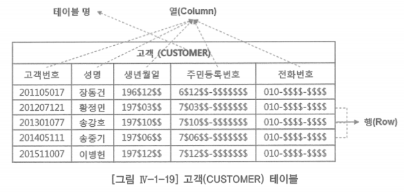
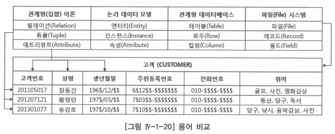
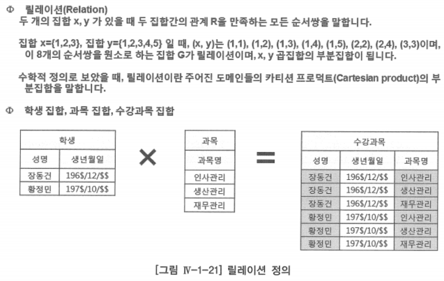
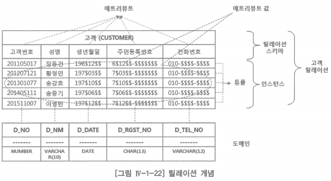

# 1. 릴레이션 개념

- 관계형 모델 이론: 업무에서 사용하는 데이터의 구조(Structure), 조작(Manipulation), 무결성(Integrity)에 대한 매우 간단한 이론
- 관계형 데이터베이스 관리 시스템(RDBMS, Relation DataBase Management System)에 생성한 테이블(Table)의 개념은 수학의 집합이론에서 말하는 릴레이션(Relation)으로부터 유래한 것
    - 릴레이션이 테이블과 학술적인 개념에서는 차이가 있지만, 일반 사용자는 릴레이션을 테이블이라도 생각하면 됨
- 테이블은 열(Column)과 행(Row)으로 이루어져 있음
    - 테이블은 테이블 이름과 각 열의 이름으로 구성되어 있음
    - 통상적으로 사용하는 테이블을 학술적인 릴레이션에 대응시키면 관계형 데이터베이스 모델을 이해하는데 많은 도움이 됨

- 위 고객 테이블에서, 관계형 모델에서는 이 테이블을 릴레이션이라 하고, 테이블 이름인 ‘고객(CUSTOMER)’을 릴레이션 이름이라 함
- ‘고객(CUSTOMER)’ 테이블은 ‘고객(CUSTOMER)’ 릴레이션이 됨
- 테이블의 열은 애트리뷰트(Attribute)라 하고, 행은 튜플(Tuple)이라 함

### 관계형 이론, 논리 데이터 모델, 관계형 데이터베이스, 과거의 파일 시스템에서 사용하는 용어 비교

## 릴레이션 정의

- 위 릴레이션 정의에서 릴레이션이란 집합 x와 집합 y 사이에 관계 R을 만족하는 모든 순서쌍이라고 함
- 학술적인 릴레이션 개념을 학생 테이블에 대응시키면, 학생은 성명과 생년월일 집합 사이에 관계  R을 만족하는 모든 순서쌍의 부분집합이 됨
- 수강과목은 학생과 과목 집합 사이에 관계 R을 만족하는 모든 순서쌍의 부분집합
    - 수강과목은 학생과 과목 집합의 주어진 도메인의 카티션 프로덕트(Cartesian Product)의 부분집합

### 관계형 데이터 모델의 릴레이션 도식화

- 어떤 릴레이션 R이 n개의 도메인(어떤 속성이 취할 수 있는 모든 값의 집합) D1, D2, ⋯, Dn(도메인은 서로 같을 수도 있음) 상에서 정의될 때, 위 릴레이션 개념에서 볼 수 있는 것과 같이 릴레이션 스키마(Relation Schema -  릴레이션 구조)와 릴레이션 인스턴스(Relation Instance - 릴레이션에서 발생된 행(Row))들로 구성됨
- 릴레이션 R의 스키마는 릴레이션 이름 R과 일정수의 애트리뷰트 A1, A2, ⋯, An의 집합으로 구성되는데 편의상 R(A1, A2, ⋯, An)으로 표기함
    - 릴레이션의 스키마를 관계형 데이터베이스 관점에서 표현하면 테이블 ‘고객’의 구조는 테이블 이름 ‘고객’과 일정수의 칼럼 ‘고객번호’, ‘성명’, ‘생년월일’, ⋯, ‘전화번호’의 집합으로 구성되는데 편의상 고객(고객변호, 성명, 생년월일, ⋯, 전화번호)으로 표기함
- 여기서 각각의 애트리뷰트 Ai(i = 1, 2, ⋯, n)는 도메인 D1, D2, ⋯, Dn의 한 도메인 Di와 정확히 대응됨
    - 관계형 데이터베이스 관점에서 표현하면, 각각의 칼럼 C(고객번호, 성명, 생년월일, ⋯, 전화번호)는 도메인 D(NUMBER, VARCHAR(10), DATE, ⋯, VARCHAR(12))에 정확히 대응됨
- 릴레이션 R의 인스턴스는 어느 한 시점에 릴레이션 R에 포함되어 있는 튜플(Tuple)의 집합을 말함
    - 하나의 튜플은 릴레이션 R의 스키마에 정의된 각 애트리뷰트에 대응하는 값, V(V1, V2, ⋯, Vn)으로 구성됨
    - 값 Vi는 애트리뷰트 Ai의 값으로서 Ai가 취할 수 있는 도메인 Di의 하나의 원소 값
    - 도메인은 어떤 애트리뷰트가 취할 수 있는 모든 값을 말하기 때문에, 애트리뷰트의 값 Vi는 도메인 Di의 값 중에 취할 수 있는 하나의 원소 값
    - 관계형 데이터베이스 관점에서 표현하면, 테이블 ‘고객’의 인스턴스는 어느 한 시점에 테이블 ‘고객’에 포함되어 있는 로우(행)의 집합을 말함
    - 하나의 로우는 테이블 ‘고객’의 스키마에 정의된 각 칼럼(Column)에 대응하는 값으로 구성됨
    - 여기서 값 ‘201105017’은 칼럼 ‘고객번호’의 값으로서 ‘고객번호’가 취할 수 있는 도메인 ‘NUMBER’의 값 중에 하나의 원소 값
- 릴레이션 R의 정의에서 애트리뷰트의 개수, 즉 n을 릴레이션 R의 차수(Degree)라고 함
    - 차수 1인 릴레이션을 1차 릴레이션, 차수가 n, 즉 애트리뷰트(속성)의 개수가 n인 릴레이션을 n차 릴레이션이라고 함
    - 릴레이션 R이 가지는 튜플(Tuple = Row)의 수를 릴레이션 R의 기수성(Cardinality)이라고 함
    - 기수성의 개념은 관계(Relationship)가 갖는 기수성의 개념과는 다소 차이가 있음
    - 위 그림 릴레이션 개념에 있는 ‘고객’ 릴레이션의 차수는 5이고, 기수성도 5인 릴레이션
- 릴레이션 스키마와 릴레이션 인스턴스는 엔터티와 인스턴스 집합(Instance Set)에 비유하여 이해할 수 있음
    - 릴레이션 스키마: 릴레이션의 논리적 구조를 정의한 것
    - 릴레이션 인스턴스: 어느 한 시점의 릴레이션의 내용, 즉 튜플 전체를 말함
    - 엔터티의 스키마: 엔터티의 논리적 구조를 정의한 것
    - 엔터티의 인스턴스: 어느 한 시점의 엔터티의 내용, 즉 저장된 인스턴스 집합을 의미
- 릴레이션 인스턴스나 엔터티의 인스턴스(인스턴스 집합)는 시간이 지남에 따라 그 내용이 생성, 소멸되는 동적인 성질을 가지고 있음
- 릴레이션 스키마나 엔터티 스키마는 쉽게 변하는 것이 아니므로 시간에 따라 잘 변하지 않는 정적인 성질을 가지고 있음
- 관계형 데이터베이스에서 관계형(Relational)의 관계(Relation)는 수학의 집합이론에서 얘기하는 릴레이션을 말하는 것으로, 관계형 보다는 행과 열을 갖는 이차원의 ‘테이블형 데이터베이스’가 더 정확한 표현임

## 속성과 도메인의 개념

### 속성

- 관계형 모델에서 데이터의 가장 작은 논리적 단위는 테이블이나 행이 아닌 고객번호 ‘201105017’이나, 고객명 ‘장동건’과 같은 열이 취할 수 있는 값, 즉 애트리뷰트(Attribute) 값
- 업무에서 다루는 ‘고객’이나 ‘사원’과 같은 집합은 차수가 여러 개(즉, 속성이 여러 개)인 경우가 대부분일 것
- 애트리뷰트(속성)명: 차수에 대한 구조(Schema)를 표현하는 것
    - 논리 데이터 모델링 단계에서는 보통 속성 값으로 표현
    - 집합 이론을 근간으로 관계형 데이터 모델 이론을 설명하므로 이 장에서만 애트리뷰트와 속성을 적절히 혼용하여 사용
- 관계형 모델에서의 애트리뷰트(속성) 값은 업무에서 의미를 갖는 더 이상 분해할 필요가 없는 값, 즉 원자 값(Atomic Value)을 말함
    - 원자 값의 개념: 업무를 수행하는데 의미 있는 데이터의 최소 단위
        - ‘고객’의 ‘생년월일’이라는 속성이 있는 경우 12월 25일이 생일인 고객에게 축하 메시지나 CRM을 위한 고객 정보를 찾고자 한다면, 우리는 12월 25일이 생일인 고객 정보를 제공해 달라고 할 것
        - SQL(Structured Query Language)로 표현하면 “SELECT 고객명, 고객주소 FROM 고객 WHERE 생일 = ‘1225’”
        - 특정 월일 12월 25일이 중요한 것이지 이 고객들이 몇 년도에 태어났는지는 중요하지 않을 수도 있음
- 도메인(Domain): 하나의 애트리뷰트(속성)가 갖는 같은 타입(유형)의 모든 원자 값들의 집합
    - 각 속성은 어느 한 도메인 상에서 정의되어야 하고, 정의된 속성은 반드시 그 해당 도메인으로부터만 값을 취할 수 있음
    - 도메인은 단순히 데이터 타입이라 할 수도 있음
        - 시스템 정의 타입: ‘CHARACTER’, ‘NUMBER’, ‘DATE’
        - 사용자 정의 타입: ‘상태코드’, ‘부서코드’, ‘고객번호’
    - ‘계약일자’ 속성이 가질 수 있는 값은 모든 날짜 값을 중에 하나의 값을 취할 수 있음
        - ‘부서코드’는 어느 회사의 ‘인사부’, ‘영업부’, ‘생산부’ 같은 부서를 ‘인사부=10’, ‘영업부=2-’과 같이 업무적인 관리를 위해서 부여한 코드 ‘10’, ‘20’ 등 정의된 ‘부서코드’ 내에서만 사용할 수 있음
    - 도메인은 관계형 데이터베이스 관리 시스템이 제공하는 ‘CHARACTER’, ‘NUMBER’, ‘DATE’ 등과 같은 시스템 정의 도메인(타입)과 ‘부서코드’, ‘상태코드’ 같은 사용자 정의 코드 도메인(타입)이 포함되는 것
- 애트리뷰트와 도메인의 개념은 프로그래밍 언어의 변수(Variable)와 데이터 타입에 비유할 수 있음
- 어떤 데이터 타입으로 선언된 변수는 언제나 선언된 데이터 타입의 값만을 가질 수 있기 때문
- 속성 ‘계약상태코드’의 취할 수 있는 값, 즉 도메인(데이터 타입)이 ‘CHAR(2)’라고 한다면
    - ‘계약상태코드’가 프로그래밍 언어의 변수와 같은 역할을 하는 것
    - 또한 ‘CHAR(2)’는 프로그래밍 언어의 변수에 선언된 데이터 타입과 같은 역할을 함