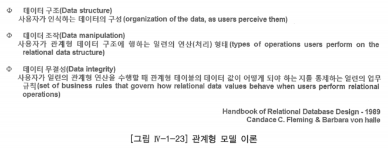

# 2. 관계형 모델 이론

- 관계형 모델은 코드(E.F.Codd) 박사가 그 당시의 데이터베이스 모델과 데이터베이스 제품이 가지고 있는 데이터 중복, 약한 데이터 무결성, 데이터베이스 구조가 물리적 구현에 지나치게 의존하는 것 등의 문제를 해결하기 위해 내놓았음
- 대용량의 데이터를 취급할 수 있는 새로운 데이터베이스 모델인 관계형 데이터베이스 모델을 수학의 집합 이론(Set Theory)과 1차 술어 논리(1st Predicate Logic)라는 두 분야를 이론적 배경으로 만들었음
    - 수학의 이 두가지 이론은 관계형 모델 이론에서 매우 중요한 위치를 점하고 있으며, 관계형 모델에 생명력을 불어 넣는 것이라 할 수 있음
    - 단지 데이터 구조(Structure), 데이터 조작(Manipulation), 데이터 무결성(Integrity)에 관한 관계형 모델 이론을 설명하는데 이러한 개념이 데이터 모델링을 수행하는데 매우 견고한 기초와 배경을 제공하기 때문

- 이론: 사물에 관한 지식을 논리적으로 연관시켜 하나의 체계로 이루어 놓은 것
- 이론의 가장 중요한 점은 우리가 어떤 일을 수행할 때 결과를 예측할 수 있도록 도와준다는 것
- 부서와 사원 테이블에서 하나의 부서에 여러 사원이 소속되어 있다는 사실로부터 어느 부서에 소속되어 있는 사원의 정보를 알기 위하여 사원과 부서를 조인(Join)하려면
    - 사원과 부서 테이블에서 ‘부서 코드’ 속성의 일치하는 값을 기초로 부서와 사원 테이블에서 동시에 데이터를 추출할 수 있다는 것을 알 것
- 관계형 모델 이론이 작용하는 방법을 토대로 테이블에서 데이터를 추출할 수 있음을 예측할 수 있음

## 단순성

- 인식해야 하는 관계형 모델은 단순성을 지향함
    - 단순성: 약산의 친숙한 개념들을 사용하여 모델을 묘사할 수 있음
    - 단순성은 시스템 설계자와 개발자, 최종사용자 모두에게 이해할 수 있는 용어와 개념을 제공
- 견고한 이론적 바탕은 관계형 질의(Query)의 결과가 잘 정의되고 그래서 예측을 보장함
- 이와 함께 도형(Diagram)을 이용하여 데이터 구조와 업무규칙을 표현하기 때문에 현실의 업무를 분석, 설계하는데 매우 직관적인 접근 방법

## 데이터 구조 및 데이터 조작

- 관계형 모델 이전에도 데이터 구조와 데이터 조작이라는 개념은 있었지만 관계형 모델 이론에서 논하는 내용과는 상당한 차이가 있음
- 관계형 데이터 모델의 데이터 구조는 단순한 플랫 파일(Flat File)이 아닌 6가지의 특성을 갖는 2차원의 관계형 테이블로 되어 있음
- 데이터 조작은 파일 시스템이나 계층적 데이터베이스 모델에서 레코드 한 건씩 로직으로 처리하는 방식과는 달리, 수학의 집합 이론에 근거하여 집합적으로 처리해야 함
- 특히 데이터 무결성이라는 개념은 관계형 모델 이전에는 데이터베이스 관리 시스템의 역할이 아니라 프로그래머가 프로그램 로직으로 처리하던 것

## 무결성

- 데이터 무결성(Integrity): 사용자가 관계형 테이블에 입력, 수정, 삭제, 조회의 데이터 조작을 수행할 때 데이터의 일관성(Consistency)과 정확성(Correctness)을 유지할 수 있도록 하는 일련의 업무 규칙(Set of Business Rules)
    - 어떤 입력 프로그램을 작성한다고 가정할 때, 화면에서 입력 받은 데이터를 데이터베이스에 저장하기 전에 프로그래머가 프로그램에서 수행하는 일련의 처리 로직의 대부분은 화면에서 입력 받은 항목의 값이 정확한지를 체크하는 데이터 검증(Validation) 로직일 것
        - 날짜 타입의 속성에 맞는 날짜가 입력되었는지
        - 숫자 타입의 속성에 문자 타입이 들어오지는 않았는지
        - 고객번호·상품코드 또는 공통코드가 사전에 각각의 테이블에 정의되어 있는지
        
        → 데이터가 정확한지를 검증하는 것이 곧 데이터 무결성 개념
        
- 이론적으로 데이터베이스 관리 시스템이 모든 데이터 무결성을 보장할 수 있다면, 프로그램을 작성하느라 소요되는 시간, 즉 정보 시스템 개발 프로젝트의 기간을 현저히 줄일 수 있을 것
- 코드 박사는 이러한 사상을 가지고 데이터 무결성에 대한 이론을 전개하여 될 수 있으면 프로그램의 로직이 아니라 데이터베이스 시스템이 이러한 데이터 무결성을 보장할 수 있도록 한 것
- 데이터 무결성을 보장하기 위하여 모든 데이터가 갖는 업무 규칙을 데이터베이스 관리 시스템에 설정하고 프로그램에서 제거한다면 현실적으로 매우 불편할 것
    - 논리 데이터 모델링 과정에서 업무 규칙을 논리 데이터 모델 내에 정확히 기술하고, 데이터 무결성 업무 규칙을 프로그램으로 처리할 것인지 데이터베이스 관리 시스템에 설정할 것인지 시스템 설계 과정 중에 결정해야 함
- 데이터 무결성 개념을 실제로 사용하는 관계형 데이터베이스 관리 시스템 중 하나인 오라클(ORACLE)을 살펴보면
    - 오라클에 선언하는 각종 제약(Constraint) 및 트리거(Trigger)가 데이터 무결성을 보장해주기 위한 관계정 데이터베이스 관리 시스템의 선언 또는 설정할 수 있는 물리적인 요소들
        - 기본 키(PK) 제약, 외래 키(Foreign Key) 제약, 체크(Check) 제약, NOT NULL 제약, 참조무결성을 보장하는 트리거(Trigger) 등