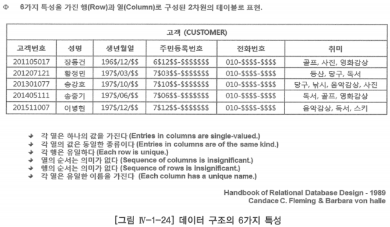

# 가. 데이터 구조

## 릴레이션이 갖는 6가지 특성

- 릴레이션: 어떤 특별한 특성을 갖는 행(Row)과 열(Column)로 구성된 2차원의 관계 테이블

### 1. 각 열은 하나의 값을 가진다

- 관계형 모델 데이터 구조의 첫 번째 특성이자 관계형 모델의 가장 중요한 특성 중 하나
- 각 열은 하나의 값을 가진다는 특성은 수학의 집합 이론에서는 릴레이션이 갖는 애트리뷰트의 원자성이라 함
    - 한 릴레이션에 나타난 애트리뷰트 값은 논리적으로 더 이상 분해할 수 없는 값으로 업무적인 이유에 의한 단위값
    - 이 특성이 가지고 있는 근본적인 의미는 애트리뷰트 값으로 반복 그룹(Repeating Group), 즉 값의 집합은 허용되지 않는다는 것
        
        → 애트리뷰트 값으로 허용하지 않는 릴레이션을 정규화한(Normalized) 또는 1차 정규형(First Normal Form - 1NF) 릴레이션
        
- 관계형 모델은 데이터를 한 건씩 처리하는 순차 처리 방식이 아니고, 집합 처리 방식이므로 관계형 테이블 내 모든 속성은 원자 값으로 구성되어 있어야 함
- 관계형 모델의 테이블이 갖는 속성이 반복 그룹 속성이 아닌 단일 값(Single value)이면서 원자 값(Atomic value)이어야 하는 가장 근본적인 이유
    1. 정보 접근의 유연성
    2. 테이블 구조 변경의 유연성(어떤 조건이 바뀌었을 때 최소한의 노력만으로 그 조건을 수용할 수 있는 성질)
    3. 정규화 이론에 나오는 입력이상, 수정이상, 삭제이상 현상을 없애고 데이터의 무결성(정확성과 일관성)을 확보하기 위한 것

### 2. 각 열의 값은 동일한 종류이다

- 이론적으로는 수학의 집합 이론에 근거한 릴레이션(테이블)의 정의에 따라 각 애트리뷰트의 값은 동일한 종류여야 함
    - 집합이란 어떤 조건에 따라 일정하게 결정되는 동일한 원소의 모임을 말하기 때문
    - 어떤 조건이란 집합의 원소들이 같은 성격을 갖는다는 말
- 도메인 무결성
    - 속성은 같은 성격을 갖는 속성 값을 추상화하여 개념화한 것으로 같은 도메인 하에서 속성을 정의하였기 때문
    - 이러한 특성을 관계형 릴레이션 내에 각 애트리뷰트의 값은 동일한 종류로 정의해야 함

### 3. 각 행은 유일하다

- 튜플(Tuple)의 유일성
    - 수학적 의미의 집합은 분별할 수 있는 원소의 모임이기 때문에 한 집합에 분별할 수 없는 똑같은 원소가 중복해서 포함될 수 없음
    - 두 개의 똑같은 튜플(Row)은 한 릴레이션에 포함될 수 없음
    - 릴레이션의 인스턴스가 튜플을 원소로 갖는 집합이라는 데서 나오는 당연한 성질
    - 릴레이션을 조작하기 위해 튜플에 접근하고 식별하는 방법의 기본이 됨
- 관계형 모델에서는 이러한 성질을 엔터티 무결성(Entity Integrity)이라 함

### 4. 열의 순서는 의미가 없다

- 애트리뷰트(Attribute)의 무순서성
    - 한 릴레이션의 스키마가 일정 수의 애트리뷰트 집합으로 정의되는 데서 나오는 결과
    - 릴레이션을 나타내는 테이블의 맨 위에 기술되어 있는 열(Column) 이름들은 이 릴레이션의 스키마의 한 표현
- 비 관계형 데이터 모델에서는 프로그램을 통하여 데이터에 접근할 경우 반드시 비 관계형 파일이나 계층형 모델의 구조와 동일하게 정의를 해야만 프로그램과 파일 또는 데이터베이스가 의사소통을 할 수 있었음
- 관계형 모델에서는 애트리뷰트의 무순서성으로 인하여 속성을 테이블에 있는 칼럼(Column)의 순서와 상관없이 우리가 사용하는 칼럼(Column) 명만 기술하면 되는 것

### 5. 행의 순서는 의미가 없다

- 튜플의 무순서성
    - 수학적 의미의 한 집합의 원소 사이에는 순서가 없는데 릴레이션은 바로 튜플을 원소로 하는 집합이기 때문에 이 튜플 사이에는 순서가 있을 수 없음
    - 릴레이션은 본질적으로 집합이라는 것
    - 두 릴레이션의 튜플들이 그 순서만 다르다고 해서 상이한 릴레이션이 될 수 없다는 뜻
- 릴레이션과 테이블의 차이는 추상적 개념(의미)과 이를 밖으로 나타내는 구체적 표현의 차이
    - 릴레이션은 추상적 개념, 테이블은 이 릴레이션을 외부로 기술하는 하나의 구체적 표현
    - 하나의 릴레이션은 여러 가지 상이한 형태의 테이블로 표현될 수 있는데, 이것은 하나의 개념을 설명하는 방법, 즉 구현 방법은 항상 여러 가지가 있을 수 있다는 것을 의미

### 6. 각 열은 유일한 이름을 갖는다

- 열의 순서는 중요하지 않기 때문에, 열은 그것의 위치에 의해서가 아니라 열의 이름에 의해서 그 값을 찾을 수 있는 것
- 열의 이름은 데이터베이스 관리 시스템(DBMS)의 전체 또는 주어진 데이터베이스에서 조차 유일할 필요는 없음
- 하지만 열이 표현되는 테이블 내에서는 반드시 유일한 이름을 가져야 함