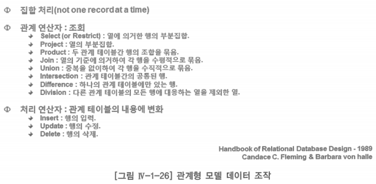
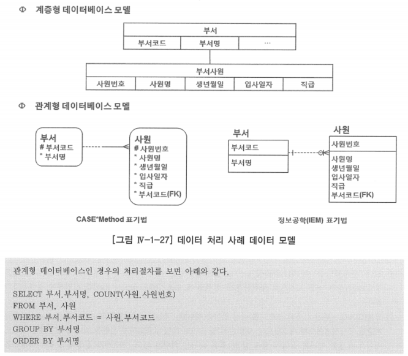

# 나. 데이터 조작

- 논리 데이터 모델링을 얘기하면서 물리적인 데이터 조작에 대해서 얘기하는 이유는 논리 데이터 모델링을 생성하고, 이 데이터 모델이 우리의 정보요구를 제대로 반영했는지를 검토하려면 데이터 시뮬레이션을 해봐야 함
- 8가지의 조회 관계 연산자를 알고 있으면 이에 대한 데이터 시뮬레이션 검증을 할 수 있지만, 기본적인 조회 기념이 없으면 이를 수행할 수가 없기 때문에 관계형 모델에서의 데이터 조회 연산자를 설명하는 것

- 위의 SQL 문장 하나로 계층형 데이터베이스에서의 처리 절차가 끝남
    - 계층형 데이터베이스에서 데이터 처리 방식: 한 건씩의 레코드를 처리하는 순차 처리 방식
    - 관계형 데이터베이스에서 데이터 처리 방식: 속성의 원자 값에 의한 집합 처리 방식
- SQL은 전체 테이블의 집합에서 정의역(SQL의 WHERE조건에 정의해 주는 값)을 결정해 주면, 관계형 데이터베이스의 옵티마이저(Optimizer)가 그 결과를, 즉 우리가 원하는 데이터 집합의 치역을 제공함
- 관계형 데이터베이스를 사용하면서 가장 중요한 개념은 집합(SET)
    - 엔터티·관계·속성이 모두 집합 개념
    - 데이터를 조회하는 8개의 연산자 모두 집합 개념
    - 데이터의 처리 입력, 수정, 삭제도 집합 개념으로 처리해야 함