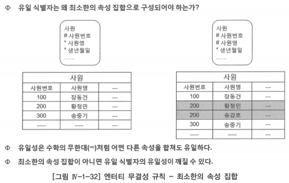
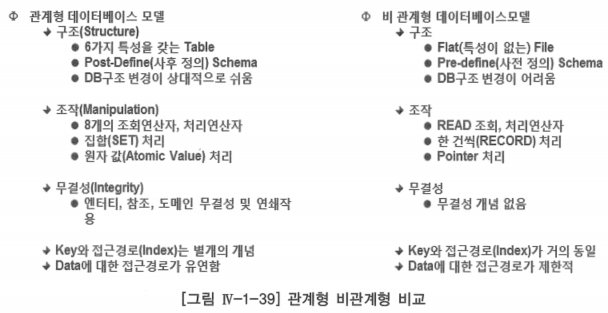

# 다. 데이터 무결성

- 관계형 모델이 갖는 중요한 장점 중의 한 가지 데이터 관점에서의 다중(엔터티 무결성, 참조무결성, 도메인(속성) 무결성, 연쇄작용) 무결성을 보장한다는 것
- 관계형 테이블 내의 의미 있는 속성들은 어떤 무결성 규칙을 가져야만 함
    - 무결성 규칙은 테이블 내의 속성 값을 정확한 것으로 보장하는 것
- 이러한 제약이 없다면 데이터의 값은 부정확하고, 불완전하며, 잘못된 결과를 보여줄 것

# 1. 엔터티 무결성 규칙

- 유일 식별자: 엔터티 내 특정 건(Instance)을 다른 것과 구별할 수 있도록 식별해주는 하나 이상의 속성과 관계의 조합

## 식별자를 구성하는 각 속성이 널(Null)이 아닐 것

- 널(Null) 값은 논리적으로 ‘모르는 값’ 또는 ‘정의할 수 없는 값’을 의미함
- 현실 세계에서 어떤 하나의 인스턴스를 식별하고자 할 때, 그 인스턴스를 식별할 수 있는 어떤 값(컴퓨터, 시계 등 모든 사물에 대한 값)이 주어져 있지 않더라도 어떤 형태만 있다면 그 인스턴스를 식별할 수 있음
    - 그 인스턴스의 이름을 모른다 하더라도 식별할 수 있는 것
    - 떠오르는 무엇이 그 인스턴스의 형상(Image) 이든, 어떤 숫자이든 상관없이 모르는 것(Null)이 아니라는 것
    

## 엔터티 내 특정 건(Instance)의 유일성(Uniqueness)을 보장할 것

- 식별자가 유일하지 않으면 조인을 할 때 원래의 행에는 없었던 행이 조회됨(Product - 다대다 곱집합 발생)
    
    → 무결성이 깨짐
    
- 주 키(PK) 선정 기준
    - 주 키(PK)를 구성하는 각각의 칼럼 수를 최소한의 집합(Minimal Set)으로 할 것
    - 값의 수정이 없는 것
    - 업무적으로 활용도가 높은 것 등
    

## 최소한의 속성 집합(Minimal set)일 것

# 2. 참조무결성 규칙

- 잘 정의된 관계는 관계 수준의 무결성을 제공하는데 이 무결성 또한 데이터가 하나 또는 두 개의 관계있는 엔터티에 입력, 수정, 삭제될 때 데이터가 어떻게 반응해야 하는가에 대한 업무규칙

## 입력 규칙

- 관계가 있는 두 개의 엔터티에서 외래 키(FK)가 나타나는 엔터티가 자식이고, 주 키(PK)를 전이 시켜주는 엔터티가 부모
- 부모 엔터티에 행(Row)이 입력될 때는 자식 엔터티가 있어도 아무 영향을 안 받는데, 자식 엔터티에 행(Row)이 입력될 때, 부모 엔터티에 영향을 받음
- 자식 엔터티에 행(Row)이 입력될 때, 부모 엔터티에 그 행(Row)이 먼저 존재해야 하는지를 결정하는 업무 규칙
- 관계형 데이터베이스 관리 시스템이 제공하는 입력 규칙
    - 종속(Dependent) 또는 제한(Restrict)
    - 대응되는 부모 엔터티에 행이 있는 경우에만 자식 엔터티에 행의 입력을 허용
    - 양쪽 선택 관계라면 외래 키(FK) 속성 값을 널(Null) 처리할 수도 있음

## 삭제 규칙

- 자식 엔터티에 행(Row)이 삭제될 때는 부모 엔터티가 있어도 아무 영향을 안 받는데, 부모 엔터티에 행(Row)이 삭제될 때는 자식 엔터티에 영향을 받음
- 부모 엔터티에 행(Row)이 삭제될 때, 자식 엔터티에 그 행(Row)이 존재하면 부모 엔터티의 행을 삭제 못하게 하든지, 부모 엔터티의 행과 그 행에 부합되는 자식 엔터티의 행을 같이 삭제할지를 결정하는 업무 규칙
- 관계형 데이터베이스 관리 시스템이 제공하는 삭제 규칙
    - 제한(Restrict): 대응되는 자식 엔터티에 행이 존재하면 부모 엔터티에 행의 삭제를 못하게 하는 것
    - 연쇄삭제(Cascade): 대응되는 자식 엔터티의 모든 행을 부모 엔터티의 행과 함께 삭제

# 3. 도메인 무결성 규칙

- 엔터티(테이블) 내의 모든 열(Column)에 관한 무결성 규칙으로 데이터 타입, 길이, 허용 값, 기본 값, 널(Null) 여부 등에 관한 업무 규칙

## 도메인이 중요한 이유

- 도메인의 어떤 특정 값이 결정될 때 우리는 이 값을 보고 의사 결정을 함
- 도메인의 중요성은 같은 도메인의 값들끼리 비교가 허용됨
- 도메인은 데이터베이스 정의의 한 부분으로 분명하게 정의함으로써 속성이 취할 수 있는 값을 제한할 수 있는 것
    - 데이터 타입, 길이 뿐 아니라 널(NULL) 여부, 허용 값(Permitted Value), 기본 값(Default Value) 등이 같은 영역 안에 포함된다면, 이것 또한 도메인으로 취급함
- 결정된 도메인의 특정 값에 대한 의사 결정

# 4. 연쇄 작용 또는 업무 규칙

- 연쇄 작용(Triggering Operation): 입력, 수정, 삭제 또는 조회 등의 작업이 동일 엔터티 혹은 다른 엔터티의 속성에 영향을 미치는 업무 규칙을 정의하는 것
- 업무 규칙: 조직이 데이터를 인식하고 사용하는 방법에 기초하는데, 이것은 조직이 운영되거나 사업을 수행하는 방법으로부터 파악됨

## 연쇄 작용 유형

## 연쇄 작용 정의 사례

- 각각의 테이블에 대하여 입력, 수정, 삭제 시의 업무 규칙을 정의하라고 할 때

# 관계형, 비관계형 데이터베이스 비교

