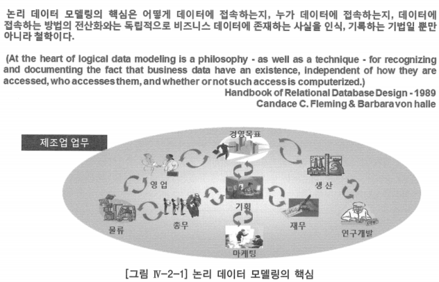

# 1. 논리 데이터 모델링 핵심

- 업무에서 필요로 하는 데이터에 존재하는 사실을 인식, 기록하는 것
- 정보 시스템 구축을 위하여 현업 사용자의 업무에서 필요로 하는 요구 사항에 따라 데이터 관점에서 요구 사항을 이해하고, 정리하여 이해 관계자(현업 사용자, 응용 사용자, 응용 설계자, 응용 개발자 등)들에게 데이터에 존재하는 업무 사실을 정확하게 알려 주기 위하여 문서화 하는 것

- 논리 데이터 모델링에서 파악한 것을 어떤 조직의 업무 사실에 기초하여 그 조직에서 필요로 하는 데이터의 구조 및 업무 규칙을 논리 데이터 모델에 기록하는 것
- 논리 데이터 모델링 핵심 성공 요소는 논리 데이터 모델링 과정에 업무에 능통한 전문가의 참여가 가장 중요함

# 가. 논리 데이터 모델링 필수 성공 요소

- 가능한 많은 시간을 업무에 능통한 현업 사용자와 함께 데이터 모델링을 진행하라
- 절차(Procedure)보다는 데이터에 초점을 두고 모델링을 진행하라
    - 절차: 단순한 업무 흐름이 아니라 어떻게(How) 업무처리를 하느냐 하는 것
- 데이터의 구조(Structure)와 무결성(Integrity)을 함께 고려하라
- 개념화(Conceptualization)와 정규화(Normalization) 기법을 적용하라
    - 개념화: 현실 세계에서 발생하는 업무 데이터를 엔터티, 관계, 속성으로 표현하는 추상화와 같은 뜻
    - 정규화: 입력 이상·수정 이상·삭제 이상이라는 데이터의 이상 현상을 제거하여 데이터 무결성과 유연성을 향상시키는 기법
- 가능하면 다이어그램(Diagram)을 이용하여 업무를 표현하라
- 데이터 모델링을 지원하는 데이터 사전을 구축하라

# 나. 논리 데이터 모델링 목적 및 효과

- 해당 비즈니스에 대한 데이터 관점에서의 명확한 이해
- 전사적인 통합 데이터 체계 확립
- 데이터의 일관성 및 정확성 유지를 위한 규칙 도출
- 안정적인 데이터베이스 설계의 토대 마련
- 정보시스템 관계자와의 명확한 의사소통을 위한 수단으로 활용