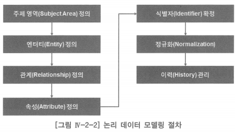

# 2. 논리 데이터 모델링 절차

- 정보 시스템 구축을 위하여 현업 사용자의 업무에서 필요로 하는 요구 사항에 따라 데이터 관점에서 요구 사항을 이해하고 정리하여 이해 관계자(현업 사용자, 응용 사용자, 응용 설계자, 응용 개발자 등)들에게 데이터에 존재하는 업무 사실을 정확하게 알려 주기 위하여 문서화하는 전 과정
- 실제로 데이터 모델링을 진행할 때는 순차적이면서도 병행적으로 일이 진행됨
- 정규화와 이력 관리를 하게 되면 새로운 엔터티를 정의하게 되는데, 이에 따른 관계·속성·식별자(Identifier)를 함께 고려해야 함

## 주제 영역 정의

- 주제 영역(Subject Area): 조직이 사용하는 데이터의 최상위 집합
- 데이터를 하향식(Top Down)으로 분석하기 위한 개념으로 유용한 것이 주제 영역
- 주제 영역은 계층적으로 표현될 수 있음
- 주제 영역을 분해하면 하위 수준의 주제 영역이나 엔터티가 나타남
- 주제 영역의 개념 및 도출 기법, 주제 영역 정의의 목적 및 장점 설명

## 엔터티 정의

- 엔터티의 개념을 설명하고, 엔터티의 유형은 어떤 것이 있으며, 어떻게 도출하고, 도출된 엔터티가 적정한가를 점검하는 방법과 엔터티에 기술해야 하는 업무 내용을 설명
- 엔터티를 통합하는 기법인 추상화의 일반화 기법 설명

## 관계 정의

- 하나 또는 두 개의 엔터티 간에 존재하는 업무 규칙인 관계(Relationship)를 정의
- 관계의 개념을 설명하고, 어떻게 도출하며, 관계 정의에 필요한 사항을 설명하고, 특수 관계인 배타적 관계·자기 참조 관계를 설명

## 속성 정의

- 조직이 사용하는 데이터를 저장하는 속성(Attribute)을 정의
- 속성의 개념과 속성 도출 방법을 설명하고, 속성 정의 사항을 설명하는데 이는 업무 규칙을 잘 기술해야 하는 매우 중요한 사항
- 시간상의 제약, 업무 전문가의 지원 미비, 데이터 모델러의 자질 등 여러 가지 이유로 대부분의 논리 데이터 모델을 보면 속성에 대한 업무 규칙이 기술되어 있는 것은 보기 어려움

## 식별자 확정

- 식별자: 엔터티의 하나의 인스턴스를 식별할 수 있는 일련의 속성
- 각종 식별자에 대한 개념과 식별자 활용 측면을 설명

## 정규화

- 정규화(Normalization): 엔터티 내에 속성이 잘못 위치하여 발생하는 데이터 이상 현상인 입력 이상, 수정 이상, 삭제 이상을 제거하기 위하여 속성의 위치를 정확하게 찾아주는 과정

## 이력 관리

- 온라인 거래 처리(OLTP, On-Line Transaction Processing) 환경에서는 매일 매일의 업무 처리를 위한 데이터를 다루지만, 온라인 거래 처리 데이터를 소스(Source)로 정보를 분석하는 온라인 분석 처리 환경에서는 시간의 이력(History) 관점에서 데이터 분석이 중요함
    - 이러한 분석을 위해서는 온라인 거래 처리부터 이력 관리를 잘 해야 하는 것