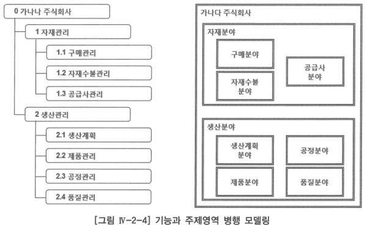

# b. 주제 영역 정의

# 1. 주제 영역 개념

- 주요 자원(Resource), 상품(Product), 활동(Activity)을 중심으로 조직이 관심을 가지는 영역
- 주제 영역은 조직이 사용하는 데이터의 최상위 집합
- 하나의 주제 영역 내에 정의되는 엔터티(Entity) 간의 관계는 밀접하고, 다른 주제 영역에 포함되는 엔터티 간의 상호작용은 최소화할 수 있도록 정의
- 데이터는 기본적으로 관계 구조
    - 관계 구조는 데이터 간의 관계가 여러 개로 표현되면서 서로 연결되어 있기 때문에 하향식 분석이 용이하지 않음
    - 계획 수립 단계는 하향식 분석을 원칙으로 하고, 검증을 위해서 상향식 분석을 부분적으로 사용
- 데이터를 하향식으로 분석하기 위한 개념으로 유용한 것이 주제 영역
    - 주제 영역은 계층적으로 표현될 수 있음
    - 주제 영역을 분해하면 하위 수준의 주제 영역이나 엔터티가 나타남
- 좋은 모델링을 위한 하나의 기준은 분할 후 정복(Divide and conquer)이라는 개념을 적용시킨다는 것
    - 전체 업무를 세분화해 나가면서 정해진 규칙을 이용하여 모델링
    - 세분화 과정 = 분해(Decomposition)

# 2. 주제 영역 도출

## 가. 주제 영역 발견 기법

- 가치 사슬(Value Chain) 분석 기법 활용
    
    
    
    - 경쟁 이론을 정립하여 가치 사슬 분석에 크게 기여한 마이클 포터(M. Porter)가 모델로 정립한 이후 광범위하게 활용되고 있는 이론 틀
    - 부가가치 창출에 직접 또는 간접적으로 관련된 일련의 활동, 기능, 프로세스의 연계를 의미
    - 프로젝트 초기 주제 영역을 찾기 위해서는 그 조직이 무슨 일을 하는지를 업무 활동과 연계해서 파악하고, 업무 영역 분석 단계에 가서는 주제 영역 단위별로 데이터를 깊이 있게 분석아는 것이 유리함
    - 업무 활동과 주제 영역의 병행 모델링은 기능과 데이터의 분할 후 정복의 개념으로 활동과 데이터간의 조정 시간을 최소화 할 수 있음
    - 조직의 가치 창출과 관련된 업무 활동을 보조(Support) 활동과 본원(Primary) 활동으로 나눌 수 있음
    

## 나. 주제 영역 도출 방안

1. 업무 기능의 이름으로부터 도출
- 가치 사슬 분석에 의한 최상위 업무활동에서 한두 단계를 내려가면서 기능을 분석하고 이에 대응 되는 데이터 영역을 정의함으로써 업무활동과 데이터의 상호보완관계를 유지하며 조직의 업무를 파악
- 업무활동(기능)은 무엇(What)을 하는가를 파악하는 것으로, 절차(Procedure) 중심의 어떻게(How) 일을 처리하는 가를 파악하는 것과는 다른 것

1. 업무에서 사용하는 데이터의 명사형 도출
- 기업의 조직명 예를 들어 구매부·인사부·생산부 등이나 기업 내 현행(As-Is) 시스템, 인사 시스템과 고객 시스템 등은 조직에서 무엇(What)을 하는지 직관적으로 알 수 있는 대표적인 명사형 단어들로 이것으로부터 주제 영역을 도출할 수 있음

1.  하향식 접근방법
- 분할 후 정복(Divide and Conquer)이라는 개념을 적용하여 최상위 주제 영역에서 출발하여 단위 주제 영역으로, 단위 주제 영역에서 엔터티로 전개하면서 안정적인 업무 분석을 진행할 수 있는 접근 방법

1. 상향식 접근방법
- 하향식 접근방법으로 주제 영역을 도출한 후 업무영역 분석 단계에서 엔터티를 도출하면서 각각의 엔터티가 지금의 주제영역에 맞는가 확인하면서 도출
- 어떤 엔터티들을 모아서 하나의 다른 주제 영역으로 정의할 때 상향식 접근방법으로 주제 영역을 도출할 수도 있음

## 다. 주제 영역 명명

1. 업무에서 사용하는 용어를 부여
- 정보 시스템을 구축하기 이전 업무를 파악하여 정리·기록하는 것이므로 최대한 현업이 사용하는 용어를 사용해야 함(ex. 인사 분야, 생산 분야, 판매 분야 등)

1. 유일한 단수형 명사 사용
- 하나의 조직에서 동일한 주제 영역 명은 정보의 중복을 의미하거나, 동음이의어로 인식되어 정보의 왜곡을 초래할 수 있음

1. 데이터의 그룹을 의미하는 이름을 부여
- 업무 활동(Activity)이나 시스템을 의미하는 이름은 배제, 데이터 그룹을 의미하는 이름 사용
    - ex. 재무관리(기능), 재무 시스템 ⇒ 재무 분야(데이터), 인사관리(기능), 인사시스템 ⇒ 인사 분야(데이터)

# 3. 주제 영역 활용

## 가. 목적

- 업무 분석의 효율을 높임
    - 데이터의 계층적 구조를 파악하는데 도움이 됨
    - 점진적인 상세화로 상위 수준에서 모델의 안정성을 유지함
- 업무 기능(Function)과 병행하여 분석하는 경우에 모델의 품질 확보에 기여
- 주제 영역 계층과 업무 기능 계층 간의 대응 관계를 확인
- 주제 영역은 기업의 전사 업무를 위한 전체 데이터 구성에 대한 청사진 제공
- 데이터 구성 및 통합에 대한 방향을 제시(선언적 성격)
- 효율적 데이터 관리를 위한 기준 제공

## 나. 장점

- 데이터 및 업무 활동 모델의 품질을 보증
- 프로젝트 관리(Project Management): 업무 범위에 대한 기준 확보
- 분할 후 정복(Divide and Conquer)으로 집중화한 토의를 할 수 있음
- 모델 개발 조정(Development Coordination)을 용이하게 함
- 상세 사항의 전개 혹은 축약이 가능

# 4. 주제 영역 정의 내용

## 가. 주제 영역 목록

- 레벨: 주제 영역의 계층 수준(1차, 2차, …, 단위)
- 주제 영역 명
- 설명(단위 주제 영역의 경우)
- 대표 엔터티: 해당 주제 영역 내에서 대표적인 엔터티를 기술

## 나. 주제 영역 정의서 샘플 양식

# 5. 주제 영역 사례

- 자원을 투입하여 이윤창출을 위한 업무 활동을 본원적인 활동과 보조적인 활동으로 구분하여 나타내고 있음
- 보조 활동은 대부분의 기업에서 유사할 것, 비즈니스 영역이 다른 기업들은 본원 활동이 다를 것
- 업무 활동이나 업무가 처리되는 절차를 파악하는 것도 중요하지만, 이 업무 처리 절차의 입력(Input)이며 결과(Output)인 데이터와 관련된 업무 규칙을 찾아 정리하는 것도 매우 중요함

- 프로젝트 초기 주제 영역을 도출할 때는 업무 활동 분석을 통하여 주제 영역을 정의하는 것이 유리함
- 프로젝트 초기 계획 단계에서 업무 활동(기능)을 중심으로 업무 파악
- 분석 단계에서 단위 주제 영역 내 엔터티-관계도(ERD)를 작성하면서 데이터 주도(Driven)의 업무파악 진행이 좋은 정보 시스템 구축의 초석이 될 것