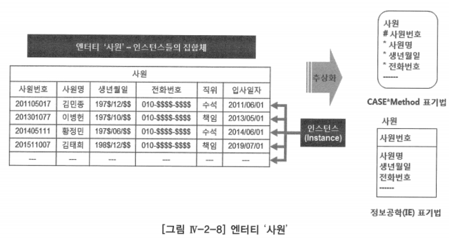
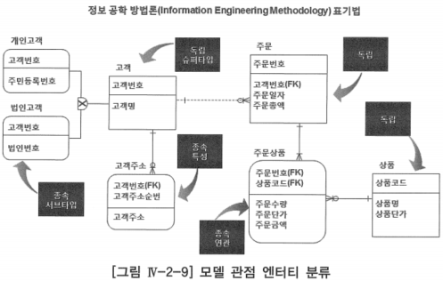
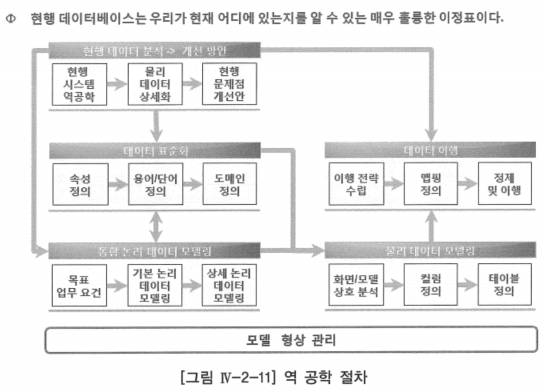
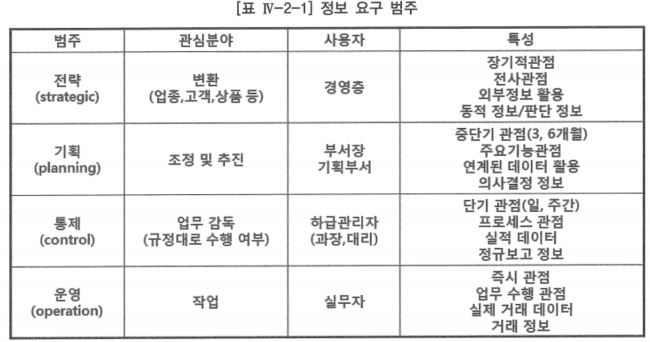

# 1 ~ 3. 엔터티 개념 ~ 도출

# 1. 엔터티 개념

- 조직에서 업무를 수행하는데 필요로 하는 사물(Thing), 사건(Event) 또는 개념(Concept)을 나타내는 어떤 것
- 동일한 업무 행위나 유사한 속성을 갖는 단일 개념으로 정의한 인스턴스(Instance)들의 집합체를 말함
    - 인스턴스: 다른 사물과 분리되어 존재하며, 자기 자신만의 명확한 정체성을 갖는 어떤 것
    - 다른 사람들와 소통하기 위하여 현실 세계에 무수히 존재하는 이런 인스턴스들을 추상화라는 개념을 통하여 엔터티로 정의하여 사용하는 것

# 2. 엔터티 분류

- 인식해야 할 엔터티를 도출해 내고, 엔터티에 대한 인식의 공유를 하는데 도움을 얻고자 하는 것
- 논리 데이터 모델링이 현업의 업무를 추상화하여 표현하는 것인데 이러한 표현 수단에 대한 인식의 공유가 정확히 이루어지지 않는다면, 현업과 전산 담당자, 데이터 모델러 사이에 인식의 갭이 존재하여 업무가 정확히 표현되지 못 할 수도 있는 것을 사전에 방지하기 위함

## 가. 일반적인 엔터티 분류

1. 유형(Tangible) 엔터티: 물리적으로 존재하는 대상(고객, 상품 등)
2. 활동(Active) 엔터티: 어떤 사건에 관한 정보(주문, 계약, 장비 고장 등)
3. 개념(Concept) 엔터티: 관리할 정보가 있는 무형의 개념(계정과목, 성적 등)

- 꼭 물리적인 형태를 갖는 것뿐만 아니라 개념적 또는 활동적인 무형의 것들도 관리해야 하는 정보가 있다면, 그것을 엔터티로 인식하고 표현하는 데 도움을 주고자 분류 기준을 제시하는 것

## 나. 모델 관점 엔터티 분류

- 엔터티가 주 키(PK)를 어떻게 획득했는가에 따라 독립 엔터티 또는 종속 엔터티로 분류함
- 독립 엔터티
    - 인스턴스를 식별하는데 있어서 어떤 다른 인스턴스에 의존하지 않는 엔터티(ex. 고객, 제품, 사원)
- 종속 엔터티
    - 인스턴스를 식별하는데 있어서 하나 또는 하나 이상의 다른 인스턴스에 의존하는 엔터티(ex. 사원가족, 주문상품)로 특성 엔터티, 연관 엔터티, 서브타입 엔터티가 있음
    - 특성(Characteristic) 엔터티: 하나의 인스턴스에 여러 번 발생하는 속성의 그룹으로, 다른 인스턴스에 의하여 직접적으로 인식되지는 않은 엔터티(ex. 사원경력)
    - 연관(Associative) 엔터티: 두 개 이상의 연관된 다른 엔터티로부터 식별자를 상속받는 덴터티(다대다 관계 해소 시 생성됨)
    - 서브타입(Subtype) 엔터티: 다른 부분집합과 구별되는 공통 속성이나 관계를 공유하는 엔터티의 부분집합
    
    
    

## 다. 발생 시점 엔터티 분류

### 1) 키 엔터티

- 자신의 부모를 가지지 않는 엔터티
    - 부모 엔터티: 자신을 태어나게 한(만약 이 엔터티가 없다면 논리적으로 자신이 태어날 수 없는) 엔터티
- 태초부터 창조된 집합: 다른 엔터티의 도움을 받지 않더라도 얼마든지 어떤 인스턴스를 새롭게 정의할 수 있는 집합
- 사원은 부서 없이도 태어날 수 있지만 부서가 결정되지 않으면 결코 탄생시키지 않겠다는 규칙을 부여할 수 있음
- 키 엔터티의 예: 사원, 부서, 고객, 상품, 자재 …

### 2) 메인 엔터티

- 키 엔터티를 제외한 다른 모든 엔터티는 부모 엔터티를 가지고 있어야만 태어날 수 있음
- 메인 엔터티: 키 엔터티를 제외한 엔터티 중에서 업무의 중심에 해당하는 엔터티
- 메인 엔터티의 예
    - 보험계약, 사고, 예금원장, 청구 …
    - 구매의뢰, 출하지시, 공사 …
    - 주문, 예산편성, 매출 …

### 3) 액션 엔터티

- 액션 엔터티: 메인 엔터티를 제외한 나머지 엔터티
- 모델링이 좀 더 구체적으로 진행되더라도 키 엔터티와 메인 엔터티는 집합의 본질이 크게 달라지지 않음
- 액션 엔터티는 상위 엔터티들이 어떻게 결정되느냐에 따라서 크게 영향을 받기 때문에 업무의 본질은 살아 있지만 최초에 예상했거나 과거에 정의했던 식별자가 크게 달라질 수 있음
- 액션 엔터티의 예
    - 상태 이력, 차량 수리 내역, 상세 주문 내역 …

# 3. 엔터티 도출

## 가. 현행 데이터베이스로부터 엔터티 도출

### 현행 데이터베이스를 정밀하게 분석해야 하는 이유

1. 현행 데이터베이스가 조직의 정보 요구 사항을 빠짐없이 정확하게 지원하고 있는지를 알기 위해
2. 현행 데이터베이스의 구조적인 문제점 및 해결 방안을 도출하기 위해
3. 목표 정보 요구 사항을 지원하기 위하여 논리 데이터 모델을 어떻게 생성할지를 결정하기 위해
4. 현행 데이터베이스에서 목표 데이터베이스로의 데이터 이행이 필요한 경우 이에 대한 원천 데이터를 정확하게 파악하기 위해

- 대부분의 차세대 정보시스템 구축 프로젝트에서 프로젝트 초기 현행 데이터베이스의 분석은 매우 미미하게 행해지고 있는 것이 현실
- 현행 데이터베이스 분석 기간을 짧게 가지고 가는 이유는 앞에서 얘기한 과업의 규모에 대한 적절한 판단을 못하고 있기 때문

### 역공학(Reverse Engineering) 기법

- 위 역 공학 절차를 보면 현행 데이터베이스 관리 시스템에 접근하여 딕셔너리(Dictionary)로부터 정보를 읽어서 현행 물리 데이터 모델을 상세하게 파악하고 문제점 및 개선 사항을 정리
- 현행 데이터 모델이 없는 경우 데이터 모델링 도구를 사용하여 데이터베이스 관리 시스템(DBMS)에 접근하여 딕셔너리(Dictionary)로부터 정보를 읽어서 데이터 모델을 만들어 내는 과정
- 역공학 기법으로 만들어진 데이터 모델을 보면, 테이블에 외래 키 컨스트레인트(Constraint)를 설정했다면 관계(Relationship)가 있을 것이고, 외래 키를 설정 안 했으면 관계가 없는 테이블과 속성만이 보일 것
- 외래 키를 설정 안 하고 사용하고 있는 시스템의 경우, 규모가 큰 조직의 테이블 수는 몇천 개에서 몇만 개가 될 수도 있음
    - 현행 데이터 모델의 관리 수준이 매우 낮은 조직에서는 프로젝트 전체 기간을 수립하는 데 있어 현행 데이터 모델을 만드는 기간을 반드시 고려하여 전체 일정을 수립해야 함

## 나. 정보요구 분석

- 정보요구: 부서(조직)가 주어진 목적을 달성하고 기능을 수행하기 위해서 필요로 하는 정보

- 정보요구 목록에서 데이터와 관련된 내용을 식별하고, 데이터 관련 내용이 논리 데이터 모델에 어떻게 반영되었는가를 프로젝트 관계자(현업, 분석가, 설계자, 개발자 등)에게 논리 데이터 모델과 함께 설명할 수 있는 자료를 생성
- 위 정보 요구 범주에서 보는 바와 같이 정보 요구 사항을 전략, 기획, 통제, 운영과 같은 범주로 분류하여 조직 내의 어떤 계층(임원, 관리자 등)이 원하는 정보요구 사항을 정리
- 조직 전체 관계자들의 정보요구 사항을 파악하여 이를 논리 데이터 모델에 반영하는 것이 매우 중요함

## 다. 업무에서 사용하는 문서로부터 도출

- 논리 데이터 모델링을 수행하는데 있어서 가장 좋은 자료 중 하나가 현업에서 사용하고 있는 실 데이터 값이 보이는 문서
- 현업의 업무에서 발생하는 데이터와 관계된 업무 사실을 가감 없이 볼 수 있다는 장점이 있음
- 논리 데이터 모델이 잘 되었는지 안 되었는지를 검토할 때는 항상 현업에서 발생하는 문서를 이용하는 방법을 기본으로 할 것을 추천

## 라. 사용자 인터뷰로부터 도출

- 사용자 인터뷰는 프로젝트의 전 기간에 걸쳐서 수행하는 논리 데이터 모델링의 전부라고 해도 과언이 아닌 방법
- 데이터 모델러는 처음부터 끝까지 업무를 현업 업무 전문가와의 인터뷰를 통해서 명확하게 이해해야만 좋은 모델을 만들 수 있음
- 현실은 많은 조직에서 현업 업무 전문가가 논리 데이터 모델링의 목적, 수행 방법, 수행 역할 등을 이해하고, 논리 데이터 모델링 과정에 참여하여 업무 규칙을 설명하는 곳은 생각보다 많지 않음
- 데이터와 관계된 일들이 프로젝트의 인프라 영역에 속해 논리 데이터 모델링도 그저 데이터베이스를 구축하는 매우 단순한 일로 여겨지게 된 것이 가장 큰 원인

## 마. 아키텍처 모델로부터 도출

- 차세대 정보 시스템 구축 프로젝트 시작 전에 정보 전략 계획(ISP, Information Strategy Planning)이나 전사아키텍처 계획(EAP, Enterprise Architecture Planning) 프로젝트를 수행하여 전사 개념 데이터 모델을 생성하였다면, 이러한 개념 데이터 모델을 이용하여 엔터티를 도출할 수 있음
- 논리 데이터 모델링을 수행하기 전에 개념 모델이 잘 만들어져 있다면 업무 전체를 이해하면서 엔터티를 도출하는 데 많은 도움이 될 것

## 바. 업무를 수행하는 프로세스로부터 도출

- 업무 프로세스: 잘 정의된 목적을 달성하기 위하여 업무 입력요소를 받아 업무 산출요소로 변환시키는 일련의 작업 활동들의 집합
- 통상적으로 정보 시스템을 구축하는 사람들의 프로세스는 데이터를 입력, 수정, 삭제, 조회를 수행하는 업무 단위를 프로세스라고 함
- 프로세스를 중심으로 데이터 모델링을 수행하다 보면, 중복 데이터가 발생할 수 있지만 향후 논리 데이터 모델 통합 과정이나 정규화를 제대로 수행한다면, 프로세스로부터 엔터티를 도출하여 논리 데이터 모델링을 진행하는 것도 잘못된 방법은 아님

## 사. 엔터티 분류 기법을 활용하여 도출

- 업무의 중심이 되는 엔터티면서 독립 엔터티로부터 하나의 주제영역에 근간이 되는 엔터티를 도출한 이후, 그 업무와 관계된 독립 엔터티 및 데이터의 종속성에 맞춰서 종속 엔터티를 하나씩 찾아 나간다면 이 또한 훌륭한 데이터 모델을 생성하는 방법일 수 있음
- 엔터티 도출이 어려운 이유
    1. 논리 데이터 모델링 이론을 배울 수 있는 곳은 많아도, 실전을 경험할 수 있는 기회는 별로 많지 않음
    2. 논리 데이터 모델링의 대상이 되는 업무에 대한 경험 내지는 이해도 부족
    3. 논리 데이터 모델 이해 관계자의 집합이론과 1차 술어 논리에 근거한 관계형 모델 이론의 이해 부족