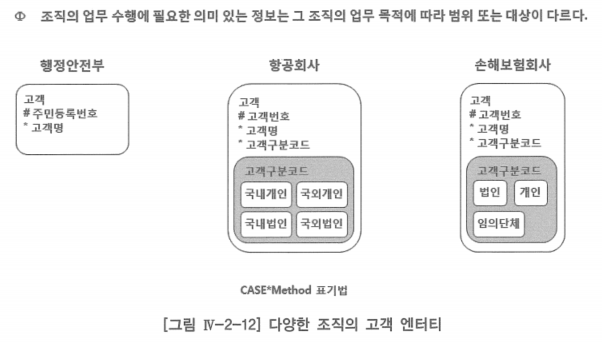
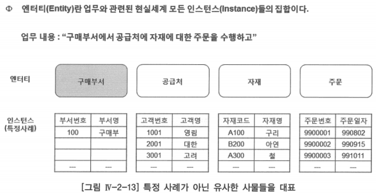
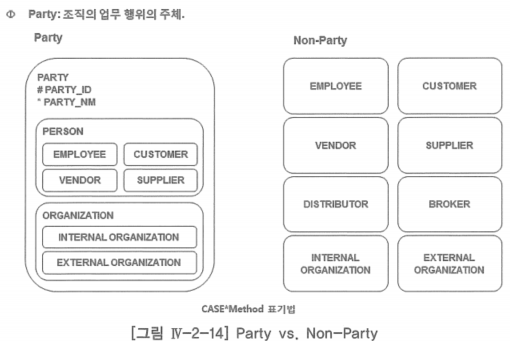
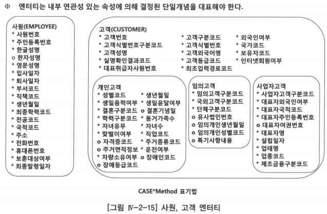

# 4. 엔터티 검증

## 가. 조직의 업무를 수행하는데 필요한 의미 있는 정보를 나타내야 함

## 나. 특정 사례가 아닌 유사한 사물들을 대표하는 집합체

- 프로젝트에서 고객과의 업무 분석 과정에서 업무 설명 내용이나 문서 등에서 파악되는 명사라 하더라도 그 내용이 특정 사례인지, 사례들의 집합인지를 인식하는 것은 매우 중요함

## 다. 인스턴스가 포함할 내부 연관성 있는 속성에 의해 결정된 단일 개념을 대표해야 함

- 일반화 수준이 높은 데이터 모델링 기법을 선호하는 이유는 패키지 데이터 모델은 각각의 조직에서 원하는 많은 정보 요구를 수용하자면 매우 유연한 데이터 모델을 가지고 있어야 하기 때문
- 추상화 수준이 높은 데이터 모델의 단점
    1. 업무를 이해하기가 매우 어려움
    2. 데이터 관리 또한 쉽지 않음
    3. 데이터 무결성을 보장하기가 어려움
- 솔루션을 도입하는 어쩔 수 없는 경우라면 몰라도 자체 개발(In-House)을 하는 곳에서는 파티(Party)와 같은 데이터 모델 기법을 활용하지 말 것을 권고

## 라. 엔터티 내 인스턴스의 출현을 구별할 수 있는 능력을 제공해야 함

- 엔터티 무결성: 구현하고자 하는 엔터티는 인스턴스를 구별할 수 있는 능력을 제공해야 함
- 식별(Identification): 인스턴스를 구별할 수 있는 능력, 사물이나 사람을 알고있는지
    - 컴퓨터의 세계는 인간과 같은 지적 능력을 갖고 있지 못하므로 식별의 문제를 해결 할 수 있는 수단을 보유하고 있어야 함
- 엔터티 내 인스턴스의 출현을 구별할 수 있는 능력을 제공하기 위한 규칙
    1. 식별자를 구성하는 일련의 속성 값이 반드시 있어야 함
    2. 이 값들이 유일해야 함
    3. 이 일련의 속성이 최소한의 개수로 이루어져야 함
    - 위 규칙 중에 하나라도 만족시키지 못하면, 하나의 인스턴스를 유일하게 식별해 낼 수 없게 되어 데이터 무결성이 깨질 수 있음

## 마. 정규화 규칙을 만족해야 함

- 정규화의 최대 목적: 입력 이상, 수정이상, 삭제 이상이라는 데이터의 이상 현상을 없애는 것
- 데이터의 이상 현상을 제거하기 위해서는 데이터 중복을 없애야 하기 때문에, 중복 데이터가 없어져 저장 공간의 효율을 가져 오는 것 또한 당연할 것

