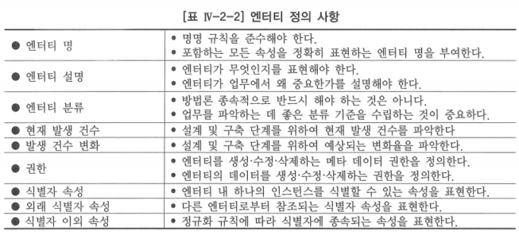

# 5. 엔터티 정의 사항

- 데이터 모델 구축 팀이 수집 및 기록해야 하는 것들
- 목적: 고품질 데이터 모델의 특성인 정보 요구 사항에 대하여 빠짐없이 정확하게 업무 규칙을 표현하는 것

## 가. 엔터티 명

- 엔터티는 일련의 설정된 명명 규칙을 따르는 고유한 이름을 부여 받아야 함
- 논리 데이터 모델링 단계에 엔터티 명을 결정하는데 많은 시간을 할애하는 것은 속성 명과 마찬가지로 명칭을 통해 업무를 이해하는 것이 매우 중요하기 때문

### 지켜야 할 명명 규칙

1. 엔터티 명은 현실 세계의 인스턴스 및 정보를 대표하도록 한다
    - 좋은 엔터티 명은 업무 전문가의 도움을 받아 될 수 있으면 현업에서 사용하는 용어를 이용하여 만드는 것이 좋음
2. 엔터티 명 자체로 의미를 표현하도록 한다
    - 논리 데이터 모델을 활용하는 사람들이 그 엔터티가 표현하고자 하는 것이 무엇인지를 직관적으로 이해할 수 있는 명칭을 사용하는 것이 좋음
3. 물리적인 사항을 개념화한 논리적 사물을 반영하도록 한다
    - 가능하면 물리적인 표현을 피하고, 순수한 논리적인 표현을 사용하여 엔터티 고유의 특성을 나타낼 수 있도록 함
4. 최소한의 어휘를 사용하여 의미를 전달할 수 있도록 한다

### 지키지 말아야 할 명명규칙

1. 데이터 관리자의 승인을 받지 않은 약어 또는 두문자어(Acronym)
2. 테이블, 파일, 메뉴, 보고서, 입력화면 같은 정보시스템 구성요소
3. 두 가지 이상의 개념을 동시에 사용하는 표현

## 나. 엔터티 설명

- 엔터티 그 자체가 무엇(What)이며 업무에서 이 엔터티가 왜(Why) 중요한가와 엔터티의 범위(Scope)에 대하여 정확히 기술해야 함
- 일반적으로 사용하고 있는 용어를 이용하여 기술
- 엔터티에 속하는 인스턴스들이 무엇인지(범위), 어떻게 다른 인스턴스와 구별되는지를 정확하게 설명해야 함

## 다. 엔터티 분류

- 방법론 종속적인 사항으로 반드시 해야만 하는 사항은 아니며, 업무를 좀 더 잘 이해하기 위한 개념이라는 것만 기억

## 라. 현재 발생 건수

- 논리 데이터 모델링의 후속 단계인 데이터베이스 설계 단계의 설계자 및 운영자를 돕기 위함
- 데이터 이행과 관계된 사람들에게 저장 공간 사용 계획을 위한 정보를 제공하기 위해 유용한 정보가 될 것

## 마. 발생 건수 변화

- 설계, 구현 및 데이터 이행 단계를 위하여 현재 발생 건수의 변화되는 증가 또는 감소 건수를 기록 관리

## 바. 권한

- 두 가지 관점에서 정의
    1. 엔터티, 속성, 관계 및 기타 모델 구성요소를 생성 또는 변경하는 것에 대한 권한을 갖는 것
    2. 엔터티의 데이터를 입력, 수정, 삭제, 조회할 수 있는 권한

## 사. 식별자 속성

- 엔터티의 인스턴스를 인식할 수 있는 속성 정의

## 아. 외래 식별자 속성

- 엔터티 내 속성들로서 그들의 값이 다른 엔터티에 대한 관계를 지원하는 어떤 다른 엔터티의 식별자 속성 값과 합치될 것이 요구되는 속성들이 외래 식별자로서 지정

## 자. 식별자 이외 속성

- 정규화 규칙에 따라 엔터티 안에 놓이게 됨
- 엔터티의 양적 또는 질적 특징이나 성질 기술
- 다른 엔터티의 식별자로서 역할을 하지 않는 속성들