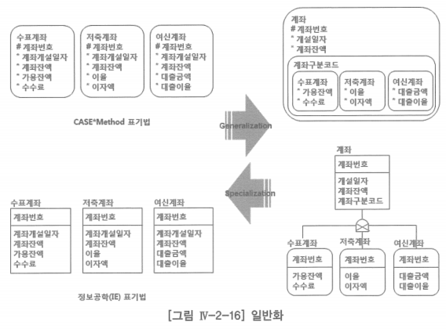
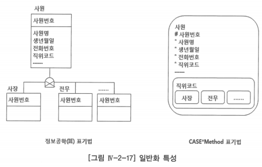
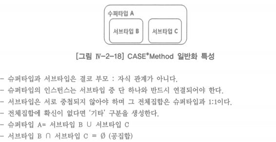
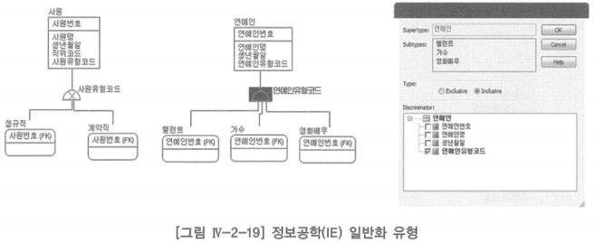
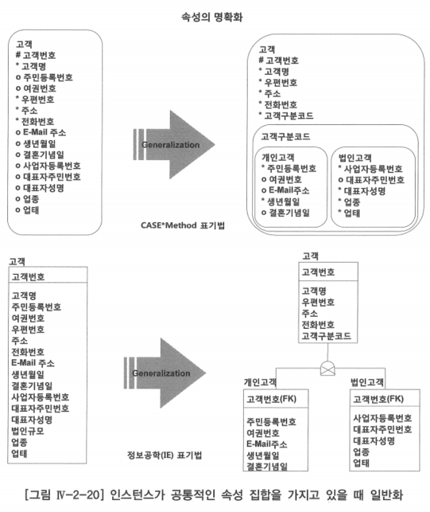
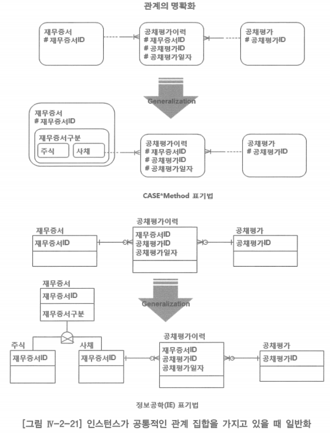
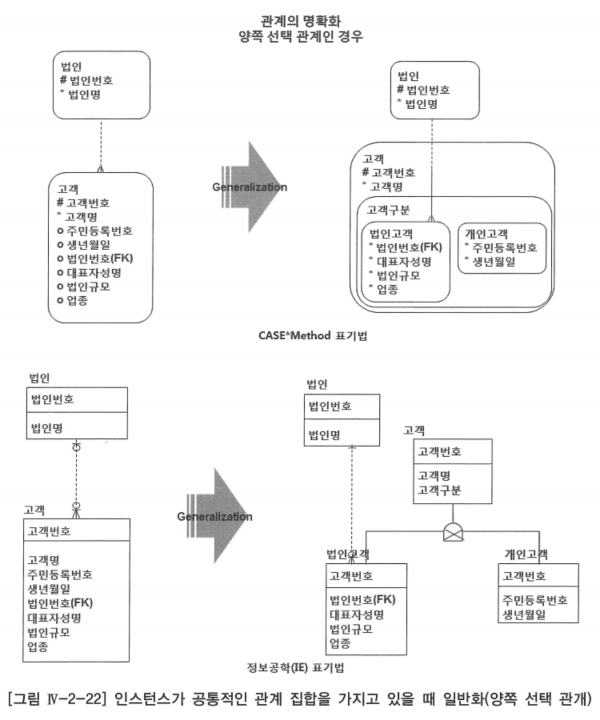
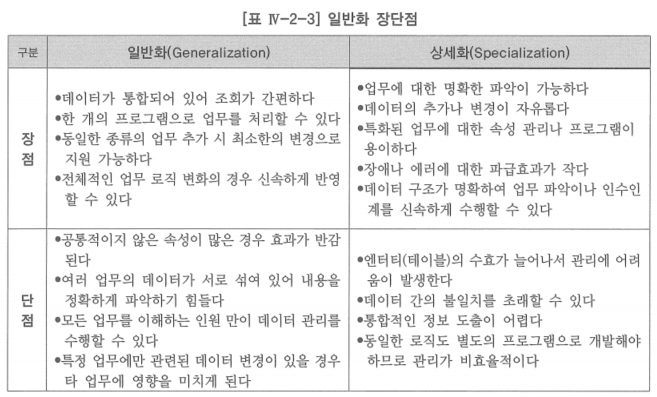

# 6. 엔터티 일반화

# 가. 일반화 정의

- 현실 세계의 사물, 사건을 단순화하여 표현하는 추상화 기법 중 하나로 엔터티의 부분집합을 정의하는 것
- 슈퍼타입(Super-type), 서브타입(Sub-type) 엔터티를 이용하여 데이터 구조를 명료화하는데 사용되는 모델링 언어의 대부분을 차지하며, 엔터티 간의 제한된 관계만을 허용함으로써 업무규칙을 명확하게 함
- 슈퍼타입 엔터티: 일반화 계층의 가장 상위에 있는 엔터티
- 서브타입 엔터티: 다른 부분집합과 구별되며, 공통의 속성이나 관계를 공유하는 인스턴스들의 부분집합

- 위 그림을 보면 좌측에 수표계좌·저축계좌·여신계좌라는 3개의 계좌를 일반화(Generalization) 하여 하나의 계좌로 통합하고, 공통적으로 갖는 속성을 정의한 엔터티를 슈퍼타입이라 함
- 계좌 각각의 속성을 정의한 엔터티를 서브타입이라 정의하여 업무를 명확하게 표현하는 것

# 나. 일반화 특성

- 슈퍼타입은 두 개 이상의 독립적인 서브타입으로 구성됨
- 슈퍼타입은 각 서브타입들의 공통적인 속성과 관계를 가짐
- 서브타입은 자신의 속성이나 독립적인 관계를 가짐
- 자신의 속성이나 관계를 가지지 않는 서브타입도 존재할 수 있으나 이런 경우는 일반적인 속성으로 처리하는 것이 좋음

- 위 일반화 특성을 보면 자신의 속성이나 관계를 가지지 않는 서브타입을 표현하는 것을 볼 수 있음
- 왼쪽과 같은 표현은 현장에서 거의 사용하지 않고, 오른쪽 CASE Method 표현 방식은 업무의 직관적인 이해를 위하여 많이 사용함

## CASE Method 방법론의 일반화 특징

## 배타적(Exclusive)·포함적(Inclusive) 일반화

- 정보공학 배타적 표기법: 슈퍼타입 사원 = 서브타입 계약직 ∪ 서브타입 정규직
- 포함적 표기법: 슈퍼타입 연예인 = 서브타입 탤런트 ∪ 서브타입 영화배우가 안맞음

# 다. 일반화 시점

1. 인스턴스가 공통적인 속성 집합(common set of attributes)을 가지고 있을 때
2. 인스턴스가 공통적인 관계 집합(common set of relationship)을 가질 때

## 인스턴스가 공통적인 속성 집합을 가지고 있을 때 - 속성의 명확화

## 인스턴스가 공통적인 관계 집합을 가질 때 - 관계의 명확화

- 재무증서와 공채평가이력이 일대다 한쪽은 선택, 한쪽은 필수인 식별 관계로 표현되어 있고, 재무증서의 인스턴스를 살펴보니 주식인 것과 사채인 것들이 있음
- 이중에 사채 인스턴스들만 공채 평가를 수행하는 것으로 업무가 파악됨
- 모델링 팀에서 이와 같은 업무를 데이터 모델로 좀 더 명확하게 표현하기 위하여 일반화를 진행하여 서브타입을 정의하고 공채 평가 이력과의 관례를 명확하게 한 것

## 인스턴스가 공통적인 관계 집합을 가질 때 - 관계의 명확화(양쪽 선택 관계)

- 법인과 고객이 일대다 양쪽 선택, 비식별 관계로 표현되어 있고, 데이터를 살펴보니 양쪽 선택인 경우는 고객 중에 개인고객은 법인번호가 필요 없기 때문에 양쪽 선택이 발생하는 것으로 파악됨
- 고객이 법인인 경우는 반드시 법인번호를 가져야 하는 것으로 파악되었기 때문에 이 업무 규칙을 명확하게 표현하기 위하여 일반화한 모델

# 라. 일반화 장단점

- 데이터 일반화를 수행하면 데이터의 통합적인 관리가 가능하므로 데이터 관리 노력 및 프로그램의 수효를 줄일 수 있는 효과가 있을 수 있음
- 통합을 통하여 데이터의 복잡성이 증가하고 데이터 무결성이 약화될 수 있으니 더 세밀하고 체계적인 관리가 필요함

