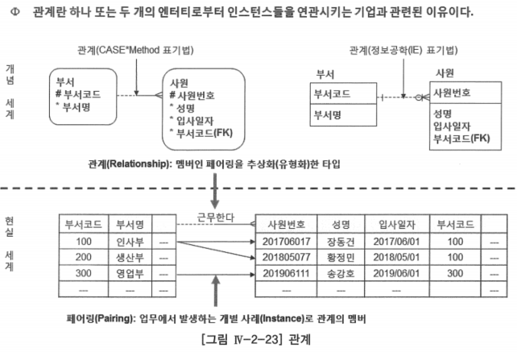
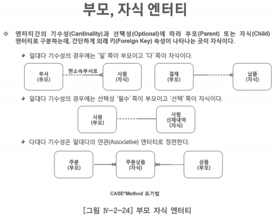
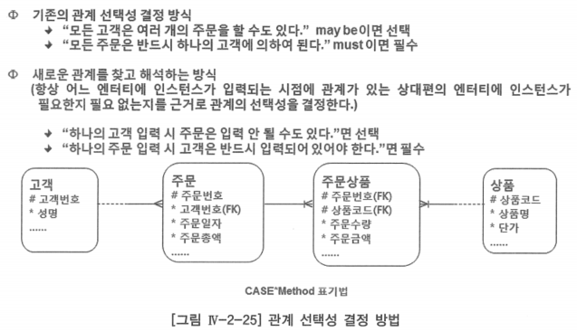

# 1. 관계 개념

- 관계(Relationship): 하나 또는 두 개의 엔터티로부터 인스턴스를 연관시키는 업무적인 이유
    - 업무 사실을 관계 표기법을 이용하여 논리 데이터 모델에 표현할 수 있는 것

- ‘부서’ 엔터티의 데이터와 ‘학생’ 엔터티의 데이터 사이에는 논리적인 관계 존재
- ‘부서’ 엔터티의 각각의 인스턴스는 ‘사원’ 엔터티의 하나 이상의 인스턴스들과 연관될 수 있음

## 부모·자식 엔터티

- 하나 또는 두 개의 엔터티 사이 관계가 있을 때 기수성과 선택성에 따라 부모(Parent), 자식(Child) 엔터티를 구분
- 외래 키(Foreign Key)가 나타나는 곳이 자식 엔터티

## 관계 읽기

