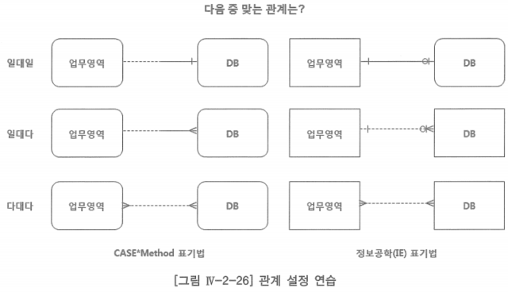
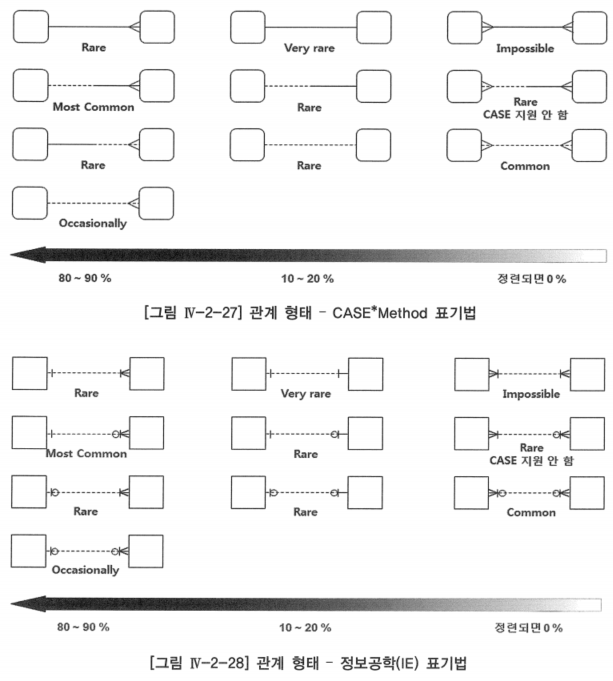

# 2. 관계 도출

- 모델링을 진행하면서 관계를 정의하다보면 관계의 도출이 그렇게 쉽지만은 않다는 것을 알게 됨
- 현업과의 모델링 과정 중 관계를 식별하기 위하여 현업이 사용하는 용어에서 일반적으로 동사적인 표현에 유의할 필요가 있음
    - ‘고객은 상품을 주문한다’ ‘사원은 부서에 소속되어 있다’ 에서 ‘주문 한다’, ‘소속되어 있다’와 같은 표현이 대부분 관계를 나타냄
- 존재 관계(Existence Relationship): 부서에는 사원이 근무한다
- 기능 관계(Functional Relationship): 교수는 학생을 가르친다
- 사건 관계(Event Relationship): 고객은 상품을 주문한다

## 엔터티 사이 관계 설정

- 위 세 개의 관계 중에서 어느 하나가 맞는다고 할 수 없음
    - 관계의 정의를 다시 상기해 보면 관계란 하나 또는 두 개의 엔터티로부터 인스턴스를 연관시키는 업무적인 이유
    - ‘업무영역’과 ‘DB’가 엔터티라는 것은 알지만, 이 엔터티의 인스턴스가 무엇인지를 알 수 없기 때문에 정확한 관계를 설정할 수 없음
- 엔터티·관계·속성의 사례 데이터를 통해 업무를 확인하면서 논리 데이터 모델링을 진행하는 것이 매우 중요함
- 관계를 사례 데이터를 작성해보면서 어떻게 시각화 하는지를 배우는 것은 하나 또는 두 개의 엔터티 사이 관계를 설정하는 원리를 이해할 수 있도록 해줌
- 어떻게 그리고 왜 관계가 작동하는지를 일단 이해하면, 주어진 한 쌍의 엔터티들 사이 관계가 있는지를 아주 쉽게 판단할 수 있도록 해줌

## 관계 형태

- 다대다 관계는 카티션 프로덕트(Cartesian Product -  다대다의 곱집합)가 발생하여 정보의 왜곡이 발생함
- 논리 데이터 모델링이 끝나는 시점에는 연관 엔터티를 사용하여 일대다의 관계로 표현해야 하기 때문에 정련되면 0퍼센트
    - 정련되다: 충분히 단련되다