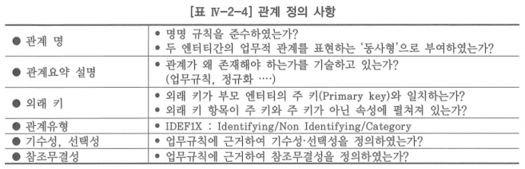
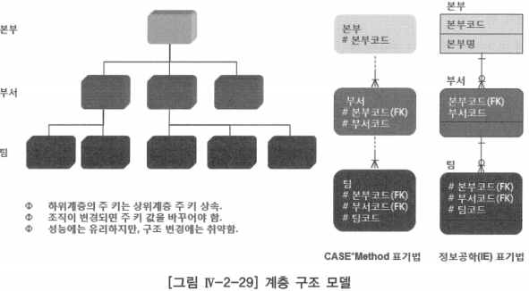
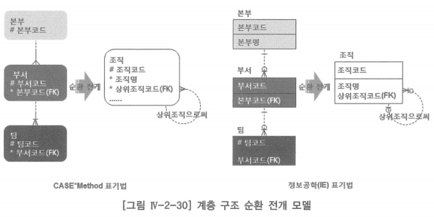
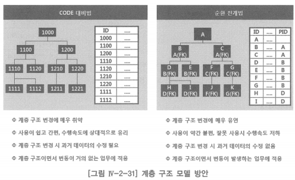
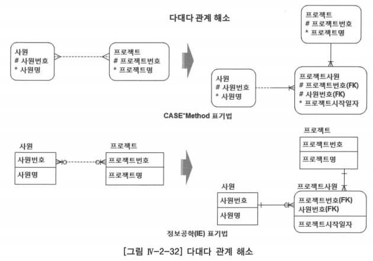
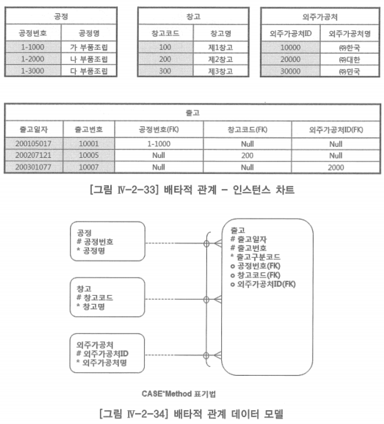
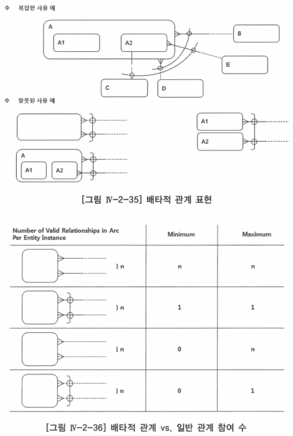

# 3 ~ 4. 관계 정의 사항, 특수 관계

# 3. 관계 정의 사항

- 데이터 모델 구축 팀이 수집 및 기록해야 하는 것들
- 목적: 고품질 데이터 모델의 특성을 만족시키는 정보 요구 사항에 대하여 빠짐없이 정확하게 업무 규칙을 표현하는 것

## 가. 관계 명

- 명명 규칙이나 표준에 맞는 이름을 부여 받아야 함
- 관계 명을 부모 엔터티에서 자식 엔터티, 자식 엔터티에서 부모 엔터티 두 가지로 사용하도록 하는 경우가 있음
- 관계 명은 일반적으로 있다 해도 데이터 모델의 명료성에 보탬이 미미하고 말이 되풀이 되는 경향이 많으며, 데이터베이스 설계에 도움이 되는 경우는 거의 없음
- 관계 명의 대부분은 ‘부서’는 ‘사원’을 ‘가지고 있다’, ‘주문’은 ‘주문상품’을 ‘포함한다’ 등 대부분의 관계명이 비슷함
- 관계명을 부여하는데 들이는 시간을 더 중요한 측면에 시간을 쓰는 것을 추천

## 나. 외래 키

- 모든 외래 키(Foreign Key) 속성은 반드시 데이터 모델 내 주 키(Primary Key)로 선언되어 있어야 함
- 참조 무결성의 기본 규칙

## 다. 관계 유형

- 부모의 이전 키들이 자식 엔터티에서 수행하는 역할에 따라 관계유형을 구분
    - IDEFIX(미국 국방성 데이터 모델 표기법) 모델 구축 표기법에서는 관계를 식별 비식별로 정의
    - CASE Method 표기법에서는 이에 대한 특별한 언급 없음

## 라. 기수성, 선택성

- 관계의 기수성, 선택성은 업무 규칙을 정밀하게 묘사하는 매우 중요한 내용

## 마. 참조무결성

- 관계에 의하여 데이터의 정확성과 일관성을 보장하는 입력, 수정, 삭제 규칙 세 가지가 있음
- 업무 규칙에 근거하여 정의

# 4. 특수 관계

## 가. 자기 참조 관계

- 한 쌍의 엔터티 사이에 관계를 설정하는 방법을 알기 때문에 자기 참조 관계를 설정하는 것은 비교적 단순하다 할 수 있음
- 어떤 업무적인 상황에서 자기 참조 관계를 정의하느냐가 중요

- 위 계층 구조 모델은 자기 참조 관계가 아닌 부모의 식별자를 자식의 식별자의 일부로 사용하면서 조직의 계층 구조를 표현하고 있음
- 이와 같은 계층 구조 모델은 조직 변경이 일어나는 경우, 이에 대한 대응을 원활하게 하기가 매우 어려움

- 조직과 같이 계층(Hierarchy) 구조를 갖는 업무에서 데이터 모델은 계층 구조 순환 전개 모델처럼 관계로 표현해야 조직 변경에 탄력적으로 대응할 수 있음
- ‘계정과목’과 ‘조직’이 같은 계층구조를 갖는 업무이지만 이 두 개는 계층구조 말고 다른 매우 중요한 업무 규칙을 가지고 있음
    
    → 계층 구조의 변화 가능성
    

- 조직은 계층 구조가 년 단위 내지는 조직 경영의 목적상 필요한 경우 등등 지속적으로 변화함
- 회계 업무의 계정 과목은 계층 구조가 한 번 결정되고 나면 변화가 거의 없음
- 같은 계층 구조이지만 업무의 변화 가능성에 따라 이를 모델링하는 방법이 다름

## 나. 다대다 관계

- 첫 번째 엔터티의 하나의 인스턴스가 두 번째 엔터티의 많은 인스턴스들과 연관될 수 있고, 두 번째 엔터티의 하나의 인스턴스가 첫 번째 엔터티의 다수의 인스턴스와 연관될 수 있을 때 이 두 개의 엔터티는 다대다 관계
- 다대다 관계는 카티션 프로덕트(다대다의 곱집합)가 발생하여 정보의 왜곡이 따름
- 논리 데이터 모델링이 끝나는 시점에는 연결(Associative) 엔터티로 다대다 관계를 해소함
- 관계가 있는 각 엔터티의 주 키(PK) 속성을 새로운 엔터티의 주 키를 만드는데 사용함으로써 연결 엔터티 정의

## 다. 배타적 관계

- 어떤 엔터티(출고)의 행이 두 개 이상의 다른 엔터티의 행과 관계를 맺는데 있어서 어느 시점에 반드시 하나의 엔터티의 행과 관계를 맺는 형태

- ‘출고’ 엔터티에 많은 행(Row)들이 있고 다른 엔터티와 관계를 맺고 있지만, 출고의 특정 한 행은 다른 엔터티와 모두 관계가 있는 것이 아니라, 특정 하나의 엔터티의 한 행과만 관계를 맺는다는 업무 규칙을 보여줌
- 배타적 관계의 특성
    1. 배타적 관계는 보통 동일함
    2. 배타적 관계는 항상 필수(Mandatory)이거나 선택(Optional)이어야 함
    3. 배타적 관계는 반드시 하나의 인스턴스에만 속해야 함(하나의 배타적 관계가 여러 인스턴스를 가질 수 없음)
    4. 어떤 엔터티는 다수의 배타적 관계를 가질 수 있음
        - 그러나 지정된 관계는 단 하나의 배타적 관계에만 사용되어야 함

- 첫 번째 두 개의 관계가 필수이므로 관계가 n이면 유효한 관계가 최소  n, 최대 n개의 관계를 가짐
- 두 번째 두 개의 관계가 필수이지만, 아크(Arc) 관계로 배타적이기 때문에 관계가 n이더라도 최소 1, 최대 1개의 관계를 가짐
- 세 번째 두 개의 관계가 선택이므로 관계가 n이면 유효한 관계가 최소 0, 최대 n개의 관계를 가짐
- 네 번째 두 개의 관계가 선택이지만, 아크 관계로 배타적이기 때문에 관계가 n이더라도 최소 0, 최대 1개의 관계를 가짐
- 두 번째와 네 번째 배타적 관계를 구별하여 표현할 수 있는 모델링 도구는 현재 없음
    - 최소 참여 수를 텍스트로 기록해야 함