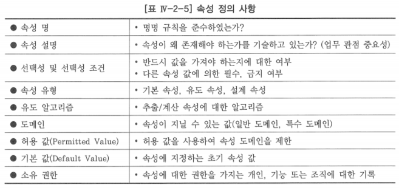

# 3. 속성 정의 사항

## 속성에 대한 상세 정보의 중요성

1. 속성 상세 정보 정의는 업무 관련 데이터의 본질과 목적을 이해하는데 도움을 줌
2. 속성 수준의 무결성을 설정하고 강화하는데 도움을 줌
3. 데이터 무결성을 개선하여 데이터 품질을 향상시킴
4. 데이터 사전(Data Dictionary)을 구성

# 가. 속성 명

- 속성의 목적이나 내용이 무엇인지 알려주는 명사 또는 명사구로 조직에서 널리 쓰이는 용어 사용
- 속성 명을 잘 만드는 방법은 엔터티명+수식어+도메인명 형태로, 속성 명만 보고 내용이 무엇인지를 쉽게 이해할 수 있도록 명명하는 것이 좋음
    - ‘사원’+’입사’+’일자’
- 속성 명은 중복을 허락하는 외래 키 속성이 아니면, 전체 데이터 모델 내에서 유일하도록 하기 위하여 복합 명사를 사용하여 명명하는 것을 권장

## 1) 의미가 명확한 속성 명칭 부여

- 그 속성의 개념을 정확히 부여함을 뜻함

## 2) 유일한 복합명사 사용

- 남들에게 구구절절 보충설명을 하지 않더라도 거의 유사한 생각을 가질 수 있도록 보편적이고 함축성 있는 단어를 찾아내어야 함
- 속성이란 자신만이 가지는 분명한 독립적인 의미를 가지고 있기 때문에 명칭 또한 단순히 일반 용어만으로 부여해서는 결코 구체적인 의미를 나타낼 수 없음

## 3) 단수형으로 속성 명 사용

- 속성은 단일 값만을 저장하기 때문에 단수형으로 적는 것이 바람직함

## 4) 표준 단어 및 용어 제정

- 표준 단어와 용어 사전을 데이터 모델링을 하기 이전에 생성하여 두면 데이터 모델의 각 객체들(엔터티, 속성, 테이블, 칼럼 등)이 최대한 그 기준을 준수하도록 유도하기가 용이하며 뚜렷한 일관성이 생길 것
- 표준화 준수 여부를 관리하거나, 표준으로 변경할 대상을 선정하는 일, 어떤 속성의 파생 근원을 분석하는데도 굉장한 힘을 발휘
- 속성을 구성하는 단어들을 관리하는 용어 사전에 데이터베이스 설계 단계에서 속성을 칼럼(Column)으로 전환시킬 때 사용할 영문 약어를 같이 제정해 두는 것도 바람직함
- 최근에는 모델링 도구뿐만 아니라 데이터 표준화를 전문적으로 수행하는 툴도 등장하고 있는 추세

# 나. 속성 설명

- 분석자가 업무 전문가에게 질문을 통하여 알게 된 유용하다고 생각하는 정보를 일반 문장으로 기록

## 속성 설명 요소

1. 속성의 정의로 이 속성이 업무에 왜 중요한지 또는 어떤 업무적인 이유에서 이 속성을 사용하게 되었는지를 기록
2. 선택적 속성인 경우 모든 선택성 조건을 기록

# 다. 선택성 및 선택성 조건

- 모든 인스턴스가 해당 속성에 대하여 반드시 값을 가져야 하는지 여부를 나타냄
- 필수 속성: 모든 인스턴스가 속성 값을 가져야 하는 속성
- 선택적 속성: 속성 값을 가지지 않을 수도 있는 속성
- 선택성 조건: 속성의 선택성이 다른 속성 값에 의하여 영향을 받을 때
- 속성 수준의 무결성을 설정하고 강화하는 데 도움을 주고, 데이터 무결성을 개선하여 데이터 품질을 향상시킴

# 라. 속성 유형

- 기본(Basic) 속성: 속성 값이 해당 인스턴스에 원래 존재하여, 다른 속성 값으로부터 유도될 수 없는 속성
- 유도(Derived) 속성: 속성 값이 항상 다른 속성의 값으로부터 유도되거나 계산되는 속성
- 설계(Designed) 속성: 업무 제약사항을 반영하거나 시스템 운영을 단순화하기 위하여 생성하는 속성
- 기본과 설계 속성은 일반적으로 동일하게 다루지만, 유도 속성은 아주 다른 방법으로 취급됨
    - 유도 속성은 어떤 상수 값으로 지정되는 것이 아니라, 유도 알고리즘이라는 계산을 수행한 결과를 유도 속성의 값으로 함
- 유도 속성은 기본 속성으로부터 유도해 낼 수 있으므로 불필요한 중복이고, 데이터의 일관성을 저해하기 때문에 논리 데이터 모델에 포함시키지 말라고 함
    - 물리 데이터 모델링 단계에서 유도 속성 값을 유도해 내는 데 시간이 많이 걸리면, 이 유도 속성을 추가하여 데이터 입력 시점에 계산하여 입력하라는 것
    - 조직에서 업무를 진행하면서 의사결정에 도움을 주는 속성들은 대부분 유도 속성 값

# 마. 유도 알고리즘

- 유도 알고리즘(Derived Algorithm)을 통해 유도형 속성에 값을 지정할 수 있음
- 다른 업무 규칙들과 마찬가지로 유도 알고리즘을 데이터 모델에 기술하는 것은 매우 중요함
- 속성 수준의 무결성을 강화하는데 도움을 주고, 데이터 품질을 향상시킴

# 바. 도메인

- 하나의 속성에 대하여 지정 가능한 값의 집합
- 실제로 속성에 지정되고 있는 개개의 속성 값은 그 속성의 도메인에 속해 있어야 함

# 사. 허용 값

- 허용 값(Permitted Value)을 사용하여 도메인을 더욱 제한할 수 있음
- 속성에 대한 허용 값은 그 속성이 취할 수 있는 모든 값들의 집합

## 아. 기본 값

- 속성이 지정하는 초기 속성 값

# 자. 소유 권한

1. 데이터 거버넌스 차원의 속성 정의 및 승인에 대한 권한
    - 메타 데이터 승인 권한 - 속성 자체를 생성, 삭제, 수정할 수 있는 권한을 가지는 개인, 기능 또는 조직에 대한 기록 관리
2. 데이터(속성 값)를 생성하고 사용하는 것에 대한 권한
    - 조직 안에서 데이터 창출로 결과 되는 업무 운영 또는 작업 수행 권한을 부여 받은 개인들이나 조직에 대한 기록 관리