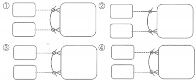

# 연습 문제

1. 다음 중 논리 데이터 모델링의 필수 성공 요소로 부적절한 것은?
    1. 업무를 알고 있는 현업사용자의 참여는 필수적
    2. 절차보다는 데이터에 초점을 두고 모델링을 진행해야 함
    3. 데이터의 구조와 무결성을 함께 고려해야 함
    4. ~~데이터 모델링을 지원하는 CASE 도구의 사용은 필수적~~
    
    → CASE 도구의 사용은 권장사항이지만 필수사항은 아님
    

2. 다음 중 주제영역 후보 도출의 방법으로 부적절한 것을 모두 고르시오.
    1. 업무에서 사용하는 데이터의 명사형을 도출
    2. 업무기능의 이름으로부터 도출
    3. ~~중요 보고서 제목을 참조하여 도출~~
        
        → 중요 보고서 제목은 향후 정의될 엔터티의 후보가 될 수 있음
        
    4. ~~시스템 관리자 의견을 참조하여 도출~~
        
        → 업무 관리자의 의견을 참조하여 주제 영역 생성
        

3. 엔터티에서 실제 인스턴스 탄생의 주체에 해당하는 속성들을 ‘본질 식별자’라고 한다. 본질 식별자는 여러 가지 목적으로 인해 본질 식별자를 대체할 인조 식별자를 지정하게 된다. 다음 중 인조 식별자 지정에 대한 설명으로 부적절한 것은?
    1. 최대한 범용적인 값을 사용
    2. 유일한 값을 만들기 위해 인조 식별자를 사용
    3. 편의성, 단순성 확보를 위해 인조 식별자를 사용할 수 있음
    4. ~~내부적으로 사용되는 인조식별자는 가급적 피함~~
        
        → 경우에 따라서는 내부적으로만 사용되는 인조 식별자를 사용할 수도 있음. 특히 시스템에서 사용하는 데이터들에 이러한 유형의 식별자가 많이 존재함
        
    
4. 데이터 모델링에서는 계층적으로 생기는 데이터를 관리하기 위해서 흔히 순환관계 모델을 생성하게 된다. 다음 중 순환관계 데이터 모델에 대한 설명으로 가장 부적절한 것은?
    1. 순환관계 모델은 새로운 계층의 추가·수정에 대해서 유연하게 대처할 수 있음. 즉 구조의 변화 필요없이 변화에 대처할 수 있음
    2. 순환관계 모델에서 최상위는 의미적으로 NULL이지만 물리적인 요소(성능 등)를 고려해서 특정 값을 갖는 것이 바람직
    3. 다대다(M:M) 순환관계를 처리하기 위해서는 별도의 엔터티를 추가하여야 함
    4. ~~순환관계 모델에서 구조가 변경되면 식별자가 변해야 하기 때문에 과거의 데이터에 대해서 수정작업을 해야 함~~
        
        → 구조가 변경되더라도 식별자는 변경되지 않기 때문에 과거 데이터를 변경할 필요가 없음
        

5. 엔터티를 일반화 기법으로 모델링하는 데 있어서 적합한 업무를 모두 고르시오.
    1. 세율이 금액의 규모(예 1억 원 미만, 1억 원 이상 등)에 따라 다름
    2. *고객 유형(개인, 법인, 임의단체)에 따라 필요한 속성이 차이를 보이고 있음*
        
        → 개체가 공통적인 속성 집합을 가지고 있을 때 일반화
        
    3. *고객 중 VIP 고객에게는 관리 사원을 배정*
        
        → 개체가 공통적인 관계 집합을 가질 때 일반화
        
    4. 고객은 우리의 상품을 구매함

6. 다음 중 상호 배타적 관계를 표현한 것 중 잘못된 것은?
    
    
    
    → 4: 배타적 관계는 다 선택이든지 다 필수여야 함. 한 쪽만 선택이든지, 한 쪽만 필수이면 이는 배타적 관계가 형성될 수 없음
    
    → 1: 양쪽 선택적인데 이는 관계를 하나도 맺지 않을 수 있는 업무를 설명
    
    → 2: 기수성(cardinality, degree)는 배타적 관계에 아무 영향을 미치지 않음
    
    → 3: 둘 중에 하나와 관계를 맺는데 반드시 관계가 하나는 있다는 업무 규칙
    

7. 다음 중 정규화의 장점이 아닌 것은?
    1. 데이터 중복을 최소화함
    2. ~~정규화는 성능의 향상을 꾀할 수 있음~~
        
        → 과도한 정규화는 오히려 성능을 저해할 수 있음
        
    3. 정보 손실 또는 뜻하지 않는 결과 도입을 예방
    4. 데이터의 저장 공간 최소화